# Bug Report

Danh sách các lỗi (bugs) được ghi nhận dựa trên các trường hợp kiểm thử có kết quả (verdict) FAIL từ `report.md`.

## Tính năng 3 - Pool A: Quên mật khẩu & Đặt lại mật khẩu (2 bước)

### Bug 1: Giao diện đặt lại mật khẩu thiếu trường "Xác nhận mật khẩu mới"
- **Feature:** Quên mật khẩu & Đặt lại mật khẩu
- **Mô tả:** Tại màn hình đặt lại mật khẩu, hệ thống không có trường "Xác nhận mật khẩu mới" như trong yêu cầu thiết kế. Người dùng không thể nhập để đối chiếu mật khẩu. (Ghi nhận từ TC5 - TC16).
- **GitHub Issue Link:** [Link](https://github.com/HCMUS-software-testing/HW02/issues/37)
- **Screenshot:**
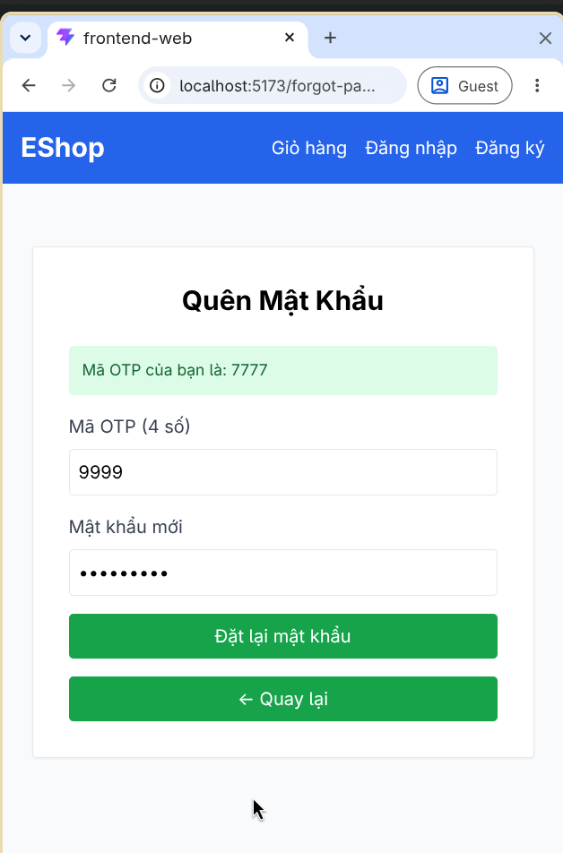

### Bug 2: Hệ thống từ chối mật khẩu hợp lệ (Lỗi False Negative)
- **Feature:** Quên mật khẩu & Đặt lại mật khẩu
- **Mô tả:** Khi người dùng nhập mật khẩu mới thỏa mãn toàn bộ yêu cầu về độ phức tạp (tối thiểu 8 ký tự, có đủ chữ hoa, chữ thường, số, ký tự đặc biệt), hệ thống vẫn báo lỗi sai: "Mật khẩu quá yếu! Phải dài tối thiểu 8 ký tự, gồm chữ hoa, chữ thường, số và KÝ TỰ ĐẶC BIỆT." (Ghi nhận từ TC5 - TC14).
- **GitHub Issue Link:** [Link](https://github.com/HCMUS-software-testing/HW02/issues/38)
- **Screenshot:**
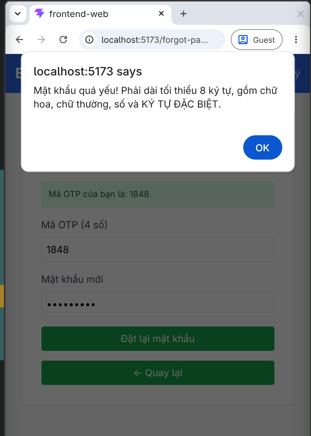

### Bug 3: Không bắt lỗi nhập sai mã OTP
- **Feature:** Quên mật khẩu & Đặt lại mật khẩu
- **Mô tả:** Khi người dùng nhập sai mã OTP nhưng nhập đúng định dạng mật khẩu, hệ thống không hiển thị thông báo lỗi mã OTP không hợp lệ mà lại hiển thị lỗi độ mạnh mật khẩu yếu. (Ghi nhận từ TC15).
- **GitHub Issue Link:** [Link](https://github.com/HCMUS-software-testing/HW02/issues/39)
- **Screenshot:**
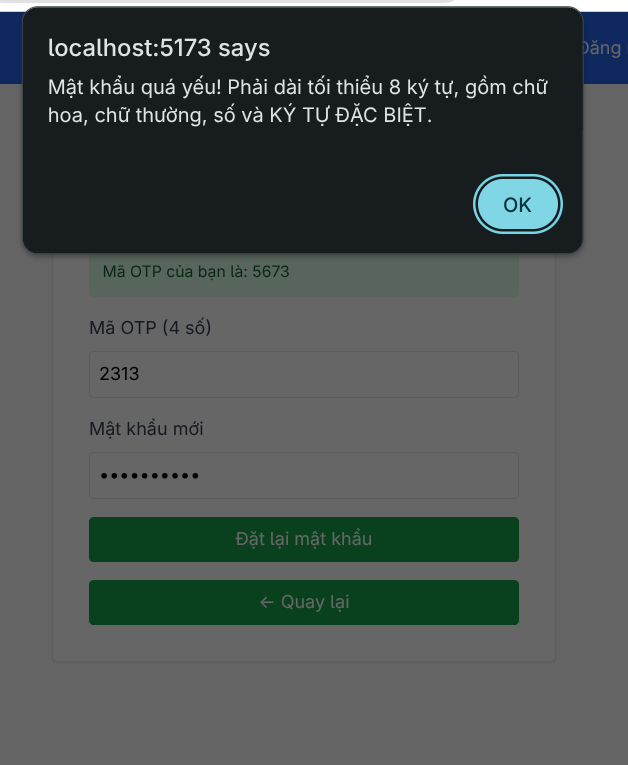

### Bug 4: Hệ thống sinh mã OTP sai định dạng độ dài (4 số thay vì 6 số)
- **Feature:** Quên mật khẩu & Đặt lại mật khẩu
- **Mô tả:** Theo tài liệu FR-03, hệ thống cần sinh mã OTP gồm 6 chữ số ngẫu nhiên. Tuy nhiên, khi người dùng yêu cầu OTP, hệ thống lại khởi tạo và trả về mã OTP chỉ có 4 chữ số.
- **GitHub Issue Link:** [Link](https://github.com/HCMUS-software-testing/HW02/issues/40)
- **Screenshot:**
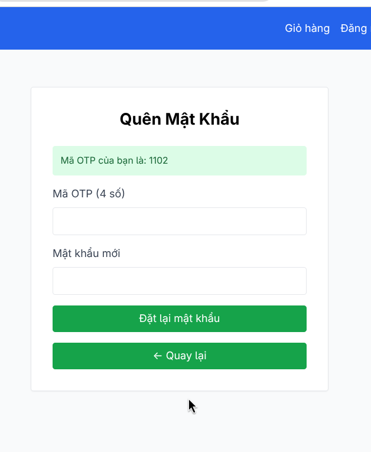

## Tính năng 10 - Pool B: Trạng thái Đơn hàng

### Bug 5: Lỗ hổng phân quyền nghiêm trọng - User có thể tự ý thay đổi mọi trạng thái của đơn hàng
- **Feature:** Trạng thái Đơn hàng
- **Mô tả:** Hệ thống không kiểm soát quyền (Authorization) đối với tài khoản User thông thường khi gọi API cập nhật trạng thái đơn. Cụ thể, User có thể gọi API thành công để thực hiện các thao tác vốn chỉ dành cho Admin:
  - Xác nhận đơn hàng từ `pending` sang `confirmed` (Ghi nhận từ TC2)
  - Giao hàng từ `confirmed` sang `shipping` (Ghi nhận từ TC4)
  - Hoàn tất đơn hàng từ `shipping` sang `delivered` (Ghi nhận từ TC6)
  - Hủy đơn hàng đang trong trạng thái `shipping` (Ghi nhận từ TC10)
- **GitHub Issue Link:** [Link](https://github.com/HCMUS-software-testing/HW02/issues/42)
- **Screenshot:**
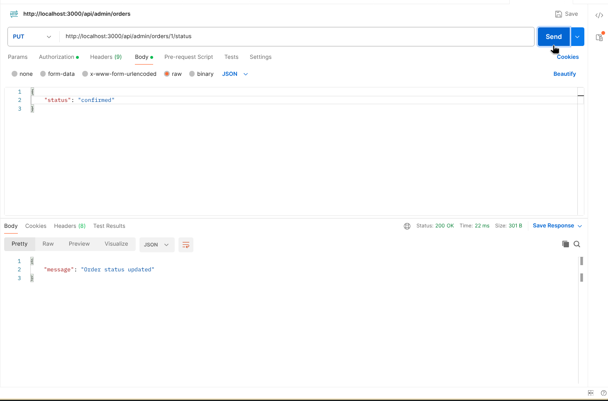
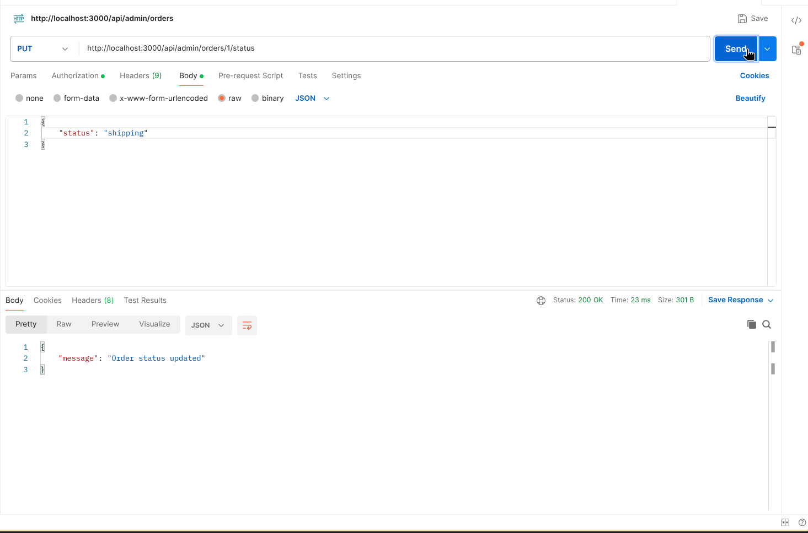

### Bug 6: Thiếu chức năng hủy đơn hàng (shipping) cho Admin
- **Feature:** Trạng thái Đơn hàng
- **Mô tả:** Admin không thể thực hiện thao tác hủy đơn hàng khi đơn hàng đang ở trạng thái `shipping` do hệ thống không có nút hoặc không hỗ trợ chức năng này, mặc dù theo sơ đồ thiết kế Admin phải có quyền hủy đơn hàng ở trạng thái này. (Ghi nhận từ TC9).
- **GitHub Issue Link:** [Link](https://github.com/HCMUS-software-testing/HW02/issues/43)
- **Screenshot:**
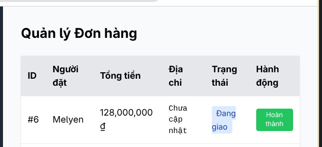

## Tính năng 14 - Pool C: Quản lý Danh mục (Category CRUD)

### Bug 7: Lỗ hổng phân quyền nghiêm trọng - User có quyền thực hiện CRUD danh mục
- **Feature:** Quản lý Danh mục
- **Mô tả:** Người dùng có vai trò User thông thường có thể gọi API thành công để Thêm, Xem và Xóa danh mục, trong khi các chức năng này yêu cầu đặc quyền truy cập của Admin. (Ghi nhận từ TC2, TC6, TC9).
- **GitHub Issue Link:** [Link](https://github.com/HCMUS-software-testing/HW02/issues/44)
- **Screenshot:**
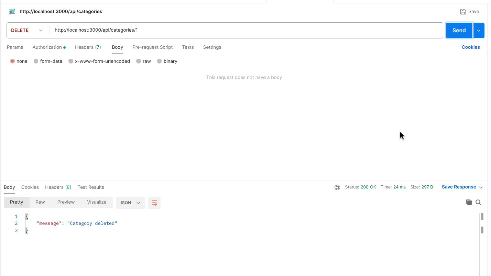
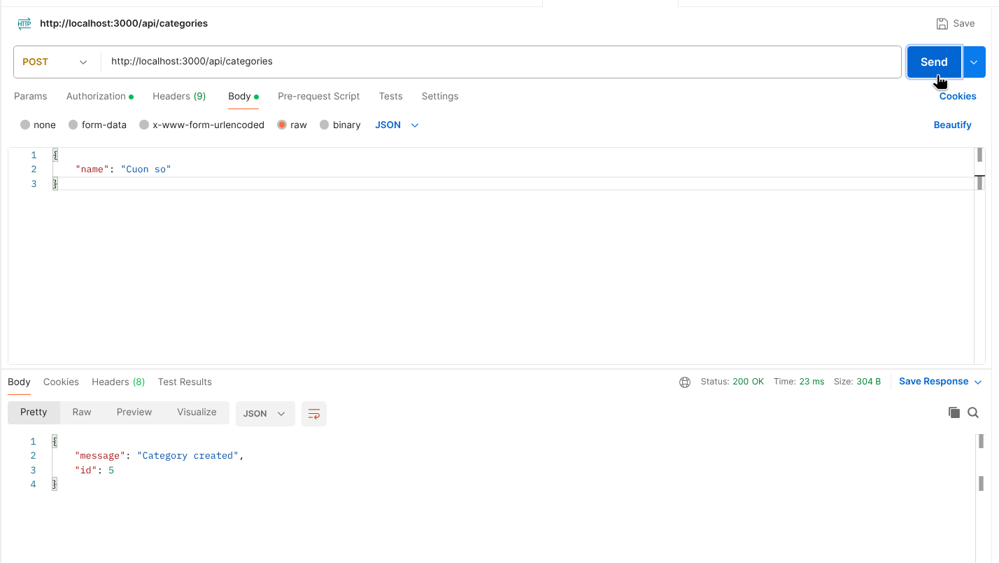

### Bug 8: Thiếu kiểm tra ràng buộc - Cho phép thêm danh mục có tên trống
- **Feature:** Quản lý Danh mục
- **Mô tả:** Khi Admin thêm một danh mục mới nhưng để trống trường "Tên danh mục", hệ thống vẫn chấp nhận và thêm mới thành công thay vì báo lỗi trường bắt buộc. (Ghi nhận từ TC3).
- **GitHub Issue Link:** [Link](https://github.com/HCMUS-software-testing/HW02/issues/45)
- **Screenshot:**
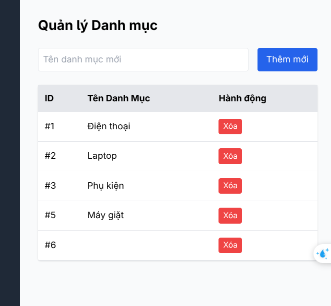

### Bug 9: Thiếu kiểm tra trùng lặp - Cho phép thêm danh mục với tên đã tồn tại
- **Feature:** Quản lý Danh mục
- **Mô tả:** Khi Admin thêm một danh mục mới với tên đã có sẵn trong hệ thống, hệ thống vẫn tạo một danh mục mới thành công thay vì báo lỗi trùng lặp dữ liệu. (Ghi nhận từ TC4).
- **GitHub Issue Link:** [Link](https://github.com/HCMUS-software-testing/HW02/issues/46)
- **Screenshot:**
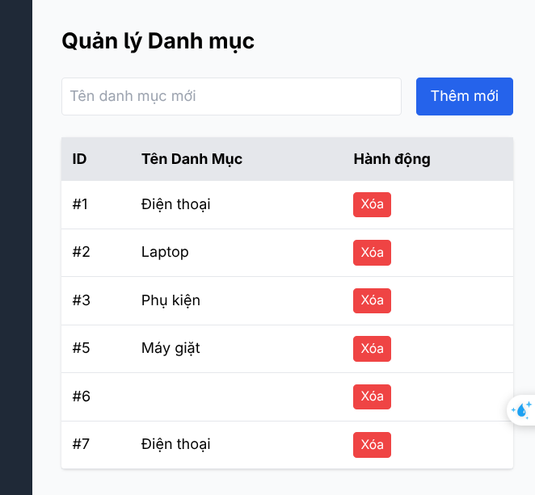

### Bug 10: Trả về kết quả sai khi xóa danh mục không tồn tại
- **Feature:** Quản lý Danh mục
- **Mô tả:** Khi Admin thực hiện xóa một danh mục không tồn tại trong hệ thống (VD: Gửi ID không có thật), API vẫn trả về thông báo xóa danh mục thành công thay vì báo lỗi không tìm thấy dữ liệu (404 Not Found). (Ghi nhận từ TC7).
- **GitHub Issue Link:** [Link](https://github.com/HCMUS-software-testing/HW02/issues/48)
- **Screenshot:**
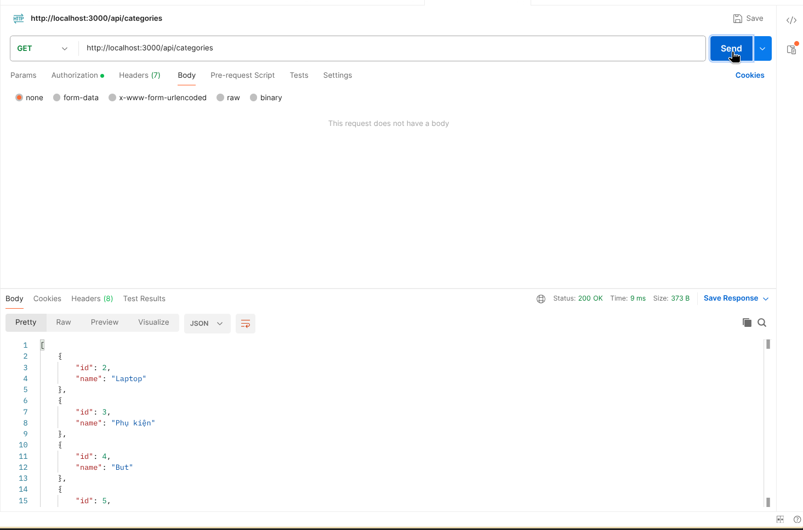
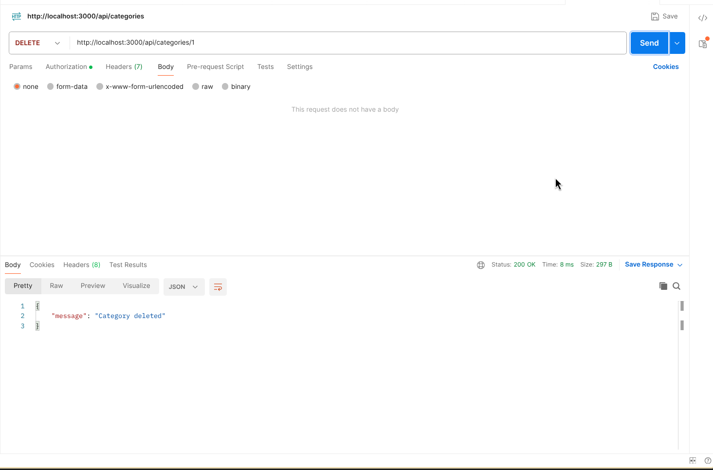

## Tính năng 1 - Pool D (Mobile): Đăng ký tài khoản

### Bug 11: Giao diện đăng ký thiếu trường "Xác nhận mật khẩu"
- **Feature:** Đăng ký tài khoản
- **Mô tả:** Tại màn hình Đăng ký, hệ thống không hiển thị trường "Xác nhận mật khẩu", làm cho người dùng không thể kiểm tra đối chiếu mật khẩu và dẫn đến chức năng này không hoạt động như mong đợi thiết kế. (Ghi nhận từ TC11 - TC14).
- **GitHub Issue Link:** [Link](https://github.com/HCMUS-software-testing/HW02/issues/49)
- **Screenshot:**
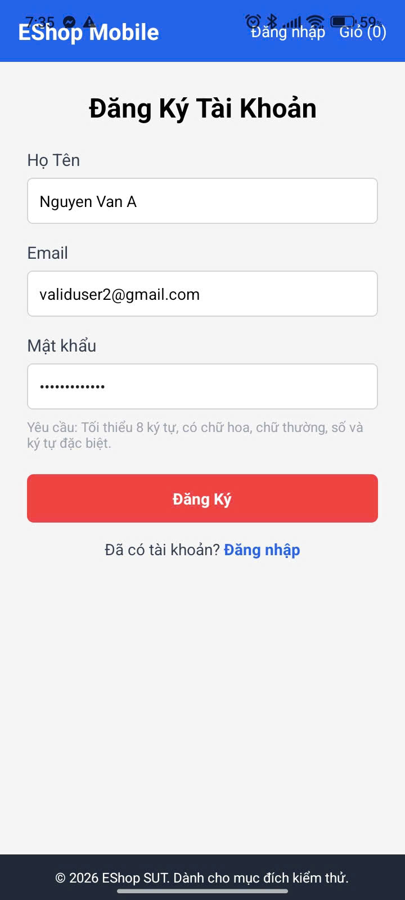

### Bug 12: Cho phép đăng ký thành công khi để trống "Họ tên"
- **Feature:** Đăng ký tài khoản
- **Mô tả:** Hệ thống không validate bắt buộc với trường "Họ tên". Khi để trống "Họ tên" và nhập hợp lệ các trường khác, tài khoản vẫn được đăng ký thành công. (Ghi nhận từ TC11).
- **GitHub Issue Link:** [Link](https://github.com/HCMUS-software-testing/HW02/issues/51)
- **Screenshot:**
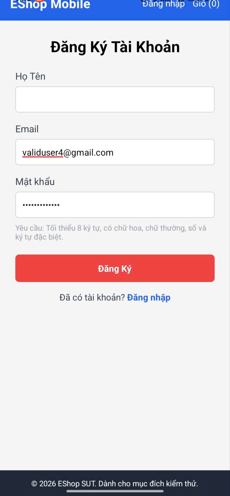
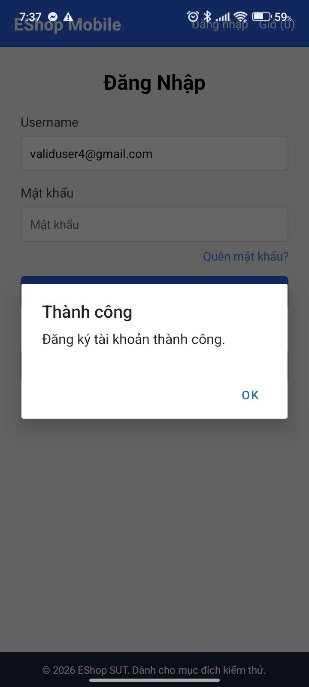

### Bug 13: Đăng ký thành công với Email sai định dạng
- **Feature:** Đăng ký tài khoản
- **Mô tả:** Hệ thống không kiểm tra định dạng chuẩn của Email. Khi nhập Email sai định dạng (VD: `newusergmail.com`), tài khoản vẫn được tạo thành công thay vì bị từ chối. (Ghi nhận từ TC12).
- **GitHub Issue Link:** [Link](https://github.com/HCMUS-software-testing/HW02/issues/52)
- **Screenshot:**

### Bug 14: Đăng ký thành công với Email đã tồn tại
- **Feature:** Đăng ký tài khoản
- **Mô tả:** Khi người dùng đăng ký tài khoản bằng một địa chỉ Email đã tồn tại trong hệ thống, hệ thống vẫn chấp nhận và báo đăng ký thành công thay vì báo lỗi Email đã được sử dụng. (Ghi nhận từ TC13).
- **GitHub Issue Link:** [Link](https://github.com/HCMUS-software-testing/HW02/issues/53)
- **Screenshot:**
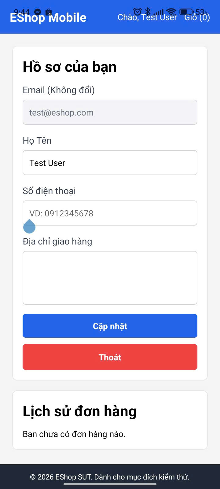
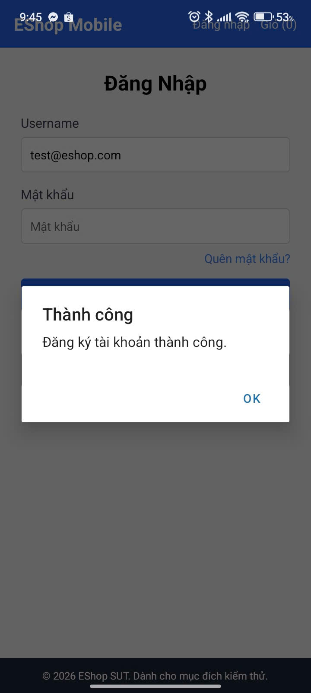
