# Báo cáo Lỗi (Bug Report) - HW02

## Thông tin sinh viên
- **Họ và tên:** Lê Mai Hoài Bảo
- **MSSV:** 23127326

---

## 1. Danh sách lỗi tổng hợp (Bug List)

Dưới đây là danh sách các lỗi phát hiện được đối với các tính năng **FR-02**, **FR-09** và **FR-17** dựa trên việc chạy thực tế và đối chiếu hành vi của hệ thống (ở mức Giao diện UI và API phản hồi) với tài liệu đặc tả yêu cầu (Kiểm thử hộp đen - Black-box testing):

### 1.1. Pool A: FR-02: Đăng nhập & Khóa tài khoản

|     Mã Bug      | Tên lỗi (Bug Name)                                                                    |         Mã TC phát hiện          | Mô tả hành vi lỗi quan sát                                                                                                                                              | Độ nghiêm trọng (Severity) | Trạng thái |
| :-------------: | :------------------------------------------------------------------------------------ | :------------------------------: | :---------------------------------------------------------------------------------------------------------------------------------------------------------------------- | :------------------------: | :--------: |
| **BUG-FR02-01** | Tài khoản bị tạm khóa sớm sau 2 lần đăng nhập sai liên tiếp (lần thứ 3 bị chặn)       | `TC05`, `TC-BVA-02`, `TC-BVA-03` | Tài khoản bị khóa ngay sau 2 lần đăng nhập sai liên tiếp (lần thứ 3 bị chặn 403), trong khi đặc tả yêu cầu sai từ 3 lần liên tiếp mới khóa (lần thứ 4 mới bị chặn 403). |          **High**          |    Open    |
| **BUG-FR02-02** | Tài khoản không tự động mở khóa sau 30 giây như đặc tả                                |           `TC-BVA-07`            | Khi tài khoản bị tạm khóa, tài khoản vẫn tiếp tục bị khóa và không tự động mở khóa sau thời hạn 30 giây như quy định của đặc tả.                                        |          **High**          |    Open    |
| **BUG-FR02-03** | API đăng nhập thành công trả về trường mật khẩu dưới dạng văn bản rõ (plaintext)      |       `TC01`, `TC-BVA-01`        | Payload phản hồi của API khi đăng nhập thành công chứa thuộc tính mật khẩu người dùng, gây nguy cơ rò rỉ dữ liệu nhạy cảm.                                              |        **Critical**        |    Open    |
| **BUG-FR02-04** | Trường Email trên giao diện Web và Admin không kiểm tra định dạng HTML5 ở client      |              `TC03`              | Trường Email đăng nhập sử dụng thẻ input có type="text" thay vì type="email", cho phép gửi dữ liệu email sai định dạng lên backend.                                     |          **High**          |    Open    |
| **BUG-FR02-05** | Hệ thống không vô hiệu hóa phiên làm việc (JWT Token) cũ khi tài khoản bị tạm khóa    |              `TC09`              | JWT Token cũ đã cấp từ trước vẫn có quyền gọi API lấy dữ liệu nhạy cảm bình thường ngay cả khi tài khoản đã bị khóa ở session khác.                                     |        **Critical**        |    Open    |
| **BUG-FR02-06** | API đăng nhập không phản hồi rõ ràng cho email sai định dạng khi gọi trực tiếp |              `TC10`              | Khi gửi trực tiếp email sai định dạng tới `/api/login`, API vẫn trả lỗi đăng nhập chung thay vì lỗi validation định dạng email theo yêu cầu kiểm tra input.               |         **Low**            |    Open    |
| **BUG-FR02-07** | Lỗ hổng Race Condition cho phép gửi song song nhiều request vượt cơ chế khóa          |              `TC08`              | Khi gửi 5 request đăng nhập sai đồng thời qua API trong 1ms, tất cả đều được xử lý thành công (trả về 401) thay vì bị chặn từ lần 3.                                    |          **High**          |    Open    |

### 1.2. Pool B: FR-09: Mã Giảm Giá (Coupon)

|     Mã Bug      | Tên lỗi (Bug Name)                                                                                           |         Mã TC phát hiện          | Mô tả hành vi lỗi quan sát                                                                                                                                           | Độ nghiêm trọng (Severity) | Trạng thái |
| :-------------: | :----------------------------------------------------------------------------------------------------------- | :------------------------------: | :------------------------------------------------------------------------------------------------------------------------------------------------------------------- | :------------------------: | :--------: |
| **BUG-FR09-01** | Lỗi tính toán sai số tiền được giảm cho coupon loại phần trăm (percent)                                      | `TC01`, `TC-BVA-03`, `TC-BVA-06` | Coupon phần trăm (ví dụ giảm 10% cho đơn 500,000 ₫) bị tính sai công thức khiến giá trị discount bị âm (-4,500,000 ₫) và tổng tiền cuối cùng tăng vọt (5,000,000 ₫). |          **High**          |    Open    |
| **BUG-FR09-02** | So sánh sai biên tối thiểu khiến đơn hàng bằng đúng ngưỡng tối thiểu bị từ chối                              |           `TC-BVA-01`            | Đơn hàng có tổng tiền đúng bằng ngưỡng tối thiểu áp dụng mã (300,000 ₫) vẫn bị hệ thống báo lỗi không đủ điều kiện tối thiểu.                                        |          **High**          |    Open    |
| **BUG-FR09-03** | Lỗ hổng API kiểm tra mã giảm giá (`/api/apply-coupon`) không xác thực Token JWT                              |              `TC11`              | API `/api/apply-coupon` không yêu cầu xác thực JWT, cho phép bất kỳ ai (kể cả chưa đăng nhập) gọi API thành công.                                                    |        **Critical**        |    Open    |
| **BUG-FR09-04** | Hệ thống cho phép giả mạo `user_id` (ID Spoofing) hoặc bỏ trống `user_id` khi áp dụng mã giảm giá            |          `TC09`, `TC10`          | API vẫn chấp nhận request khi `user_id` trong body không khớp người dùng đang đăng nhập, hoặc khi thiếu `user_id`, thay vì ràng buộc theo JWT hợp lệ.               |        **Critical**        |    Open    |
| **BUG-FR09-05** | Lỗ hổng Checkout Bypass - API thanh toán (`/api/checkout`) không xác thực lại các điều kiện mã giảm giá      |              `TC15`              | API `/api/checkout` nhận trực tiếp tổng số tiền đã giảm từ body mà không kiểm tra hay validate lại tính hợp lệ của mã giảm giá trên backend.                         |        **Critical**        |    Open    |
| **BUG-FR09-06** | Lỗi xử lý thông điệp phản hồi không khớp cho dữ liệu đầu vào không hợp lệ (số tiền âm hoặc sai kiểu dữ liệu) |          `TC07`, `TC08`          | Khi gửi số tiền âm (-50k) hoặc sai kiểu chữ, hệ thống báo lỗi sai nghiệp vụ: "Đơn hàng chưa đủ giá trị tối thiểu..." thay vì báo lỗi định dạng/số tiền không hợp lệ. |         **Medium**         |    Open    |
| **BUG-FR09-07** | Lỗ hổng Race Condition (Double Apply) cho phép áp dụng mã giới hạn 1 lần nhiều lần                          |              `TC14`              | Gửi đồng thời các request áp dụng mã qua endpoint công khai `/api/apply-coupon` trong cùng 1ms đều được chấp nhận, thay vì chỉ cho phép một request thành công.        |          **High**          |    Open    |

### 1.3. Pool C: FR-17: Quản lý Mã Giảm Giá (Coupon CRUD)

|     Mã Bug      | Tên lỗi (Bug Name)                                   |           Mã TC phát hiện           | Mô tả hành vi lỗi quan sát                                                                                                                          | Độ nghiêm trọng (Severity) | Trạng thái |
| :-------------: | :--------------------------------------------------- | :---------------------------------: | :-------------------------------------------------------------------------------------------------------------------------------------------------- | :------------------------: | :--------: |
| **BUG-FR17-01** | API Admin tạo coupon không kiểm tra role Admin       |               `TC05`                | Token của user thường vẫn gọi `POST /api/admin/coupons` thành công và tạo coupon mới với HTTP 200.                                                  |        **Critical**        |    Open    |
| **BUG-FR17-02** | API tạo coupon không validate trường `code` bắt buộc |         `TC06`, `TC-BVA-01`         | Backend vẫn tạo coupon khi `code` rỗng, trong khi mã giảm giá là trường bắt buộc và phải định danh được coupon.                                     |          **High**          |    Open    |
| **BUG-FR17-03** | API tạo coupon không validate miền giá trị `type`    |           `TC08`, `TC09`            | Backend vẫn tạo coupon khi `type` ngoài tập cho phép hoặc thiếu `type`, thay vì chỉ chấp nhận `percent` hoặc `fixed`.                               |          **High**          |    Open    |
| **BUG-FR17-04** | API tạo coupon không validate `discount_value`       | `TC10`, `TC11`, `TC12`, `TC-BVA-03` | Backend vẫn tạo coupon khi `discount_value` bằng 0, âm hoặc sai kiểu dữ liệu.                                                                       |          **High**          |    Open    |
| **BUG-FR17-05** | API tạo coupon không validate `expired_at`           |           `TC13`, `TC14`            | Backend vẫn tạo coupon khi thiếu ngày hết hạn hoặc ngày hết hạn sai định dạng.                                                                      |          **High**          |    Open    |
| **BUG-FR17-06** | API tạo coupon không validate `min_order_amount`     |     `TC15`, `TC16`, `TC-BVA-05`     | Backend vẫn tạo coupon khi giá trị đơn tối thiểu âm hoặc sai kiểu dữ liệu.                                                                          |          **High**          |    Open    |
| **BUG-FR17-07** | API tạo coupon không validate `max_uses_per_user`    |         `TC17`, `TC-BVA-07`         | Backend vẫn tạo coupon khi số lượt dùng tối đa mỗi user bằng 0, vi phạm miền hợp lệ tối thiểu 1.                                                    |          **High**          |    Open    |
| **BUG-FR17-08** | Tạo coupon trùng mã trả lỗi 500 và lộ lỗi SQLite     |           `TC07`, `TC19`            | Khi `code` bị trùng, API trả HTTP 500 kèm thông báo `SQLITE_CONSTRAINT`, thay vì lỗi nghiệp vụ/validation về mã đã tồn tại.                         |         **Medium**         |    Open    |
| **BUG-FR17-09** | Xóa coupon không tồn tại vẫn báo thành công          |         `TC18`, `TC-BVA-09`         | `DELETE /api/admin/coupons/999999` và `DELETE /api/admin/coupons/0` đều trả HTTP 200 với thông báo xóa thành công dù không có coupon hợp lệ bị xóa. |          **High**          |    Open    |

---

## 2. Chi tiết các lỗi (Detailed Bug Descriptions)

## Pool A: FR-02: Đăng nhập & Khóa tài khoản

### BUG-FR02-01: Tài khoản bị tạm khóa sớm sau 2 lần đăng nhập sai liên tiếp (lần thứ 3 bị chặn)

*   **Mô tả lỗi:** Theo đặc tả yêu cầu, tài khoản chỉ bị tạm khóa khi đăng nhập sai từ 3 lần trở lên liên tiếp (tức lần nhập sai thứ 3 vẫn trả về lỗi đăng nhập thường, và lần đăng nhập thứ 4 mới bị chặn). Tuy nhiên trên thực tế, người dùng bị chặn đăng nhập ngay từ lần đăng nhập thứ 3 (chỉ mới đăng nhập sai 2 lần trước đó).
*   **Các bước tái hiện (Steps to Reproduce):**
    1.  Nhập đúng email đăng ký và mật khẩu **sai**, bấm nút Đăng nhập $\rightarrow$ Hệ thống báo lỗi *"Invalid email or password"*. (Lần sai thứ 1)
    2.  Nhập đúng email đăng ký và mật khẩu **sai**, bấm nút Đăng nhập $\rightarrow$ Hệ thống báo lỗi *"Invalid email or password"*. (Lần sai thứ 2)
    3.  Nhập đúng email đăng ký và mật khẩu **đúng/sai**, bấm nút Đăng nhập $\rightarrow$ Hệ thống lập tức trả về lỗi *"Tài khoản đã bị khóa. Vui lòng thử lại sau."* và mã HTTP 403. (Lần thứ 3)
*   **Kết quả mong đợi (Expected Output):** 
    *   Lần thứ 1 và 2: Trả về mã lỗi đăng nhập không chính xác `401 Unauthorized`.
    *   Lần thứ 3: Tiếp tục trả về mã lỗi đăng nhập không chính xác `401 Unauthorized` (vì đây là lần sai thứ 3, chưa bị chặn trước đó).
    *   Lần thứ 4: Hệ thống mới chặn đăng nhập với mã `403 Forbidden` do tài khoản đã bị tạm khóa.
*   **Kết quả thực tế (Actual Output):** Tài khoản đã bị khóa ngay sau lần nhập sai thứ 2. Do đó, đến lần thứ 3 (khi bấm Đăng nhập), hệ thống đã chặn ngay lập tức và trả về mã lỗi `403 Forbidden` cùng thông báo khóa tài khoản.
*   **Đường dẫn GitHub Issue:** [GitHub Issue #1](https://github.com/HCMUS-software-testing/HW02/issues/1)
*   **Ảnh chụp minh họa (Bug Screenshot):** 

---
 
### BUG-FR02-02: Tài khoản không tự động mở khóa sau 30 giây như đặc tả
 
*   **Mô tả lỗi:** Đặc tả quy định trong môi trường demo, thời gian tạm khóa tài khoản khi nhập sai là 30 giây. Nhưng khi bị khóa, tài khoản vẫn tiếp tục bị giữ ở trạng thái khóa và không tự động mở lại sau 30 giây.
*   **Các bước tái hiện (Steps to Reproduce):**
    1.  Thực hiện đăng nhập sai liên tiếp cho đến khi tài khoản kích hoạt trạng thái bị khóa.
    2.  Chờ 40 giây (lớn hơn thời gian khóa 30 giây quy định).
    3.  Nhập địa chỉ email và mật khẩu **chính xác**, bấm nút Đăng nhập.
*   **Kết quả mong đợi (Expected Output):** Đăng nhập thành công và nhận JWT Token phía client vì đã hết thời gian khóa 30 giây theo đặc tả.
*   **Kết quả thực tế (Actual Output):** Đăng nhập thất bại, hệ thống vẫn trả về thông báo lỗi báo tài khoản đang bị khóa (tài khoản không tự động mở khóa sau 30 giây).
*   **Đường dẫn GitHub Issue:** [GitHub Issue #2](https://github.com/HCMUS-software-testing/HW02/issues/2)
*   **Ảnh chụp minh họa (Bug Screenshot):**  

---

### BUG-FR02-03: API đăng nhập thành công trả về trường mật khẩu dưới dạng văn bản rõ (plaintext)

*   **Mô tả lỗi:** Khi người dùng gửi yêu cầu đăng nhập thành công, dữ liệu phản hồi (JSON response) trả về từ backend API chứa cả thông tin mật khẩu của tài khoản ở định dạng văn bản thô rõ ràng, vi phạm nguyên tắc an toàn thông tin cơ bản.
*   **Các bước tái hiện (Steps to Reproduce):**
    1.  Sử dụng công cụ Postman/cURL hoặc kiểm tra tab Network trên trình duyệt, gửi request POST tới `/api/login` với email và mật khẩu chính xác.
    2.  Quan sát cấu trúc dữ liệu JSON phản hồi ở body của response `200 OK`.
*   **Kết quả mong đợi (Expected Output):** JSON phản hồi chứa JWT token và thông tin cơ bản của user như `id`, `name`, `email`, `role`. Tuyệt đối không được chứa trường `password` hoặc `reset_token`.
*   **Kết quả thực tế (Actual Output):** Dữ liệu JSON phản hồi chứa thuộc tính `"password": "Test1234!"` hiển thị rõ ràng mật khẩu plaintext của tài khoản.
*   **Đường dẫn GitHub Issue:** [GitHub Issue #3](https://github.com/HCMUS-software-testing/HW02/issues/3)
*   **Ảnh chụp minh họa (Bug Screenshot):** 

---

### BUG-FR02-04: Trường Email trên giao diện Web và Admin không kiểm tra định dạng HTML5 ở client

*   **Mô tả lỗi:** Theo đặc tả nghiệp vụ, trường email của biểu mẫu đăng nhập bắt buộc phải dùng `type="email"` để thực hiện kiểm tra (validate) định dạng email theo chuẩn HTML5. Tuy nhiên, trên giao diện Web và Admin, trường Email sử dụng `type="text"`, cho phép người dùng bấm gửi dữ liệu sai định dạng (thiếu ký tự `@`, tên miền...) lên server mà không bị chặn lại ở trình duyệt.
*   **Các bước tái hiện (Steps to Reproduce):**
    1.  Mở màn hình Đăng nhập của Web (hoặc Admin).
    2.  Nhập địa chỉ email sai định dạng: `invalid-email.com` vào trường Email.
    3.  Nhập mật khẩu bất kỳ và nhấn Đăng nhập.
*   **Kết quả mong đợi (Expected Output):** Trình duyệt tự động chặn lại và hiển thị cảnh báo lỗi định dạng của trường email (HTML5 validation), không gửi request lên backend API.
*   **Kết quả thực tế (Actual Output):** Form đăng nhập cho phép submit thành công, gửi thẳng request POST `/api/login` có email sai định dạng lên backend và nhận về phản hồi lỗi `401 Unauthorized` từ server.
*   **Đường dẫn GitHub Issue:** [GitHub Issue #4](https://github.com/HCMUS-software-testing/HW02/issues/4)
*   **Ảnh chụp minh họa (Bug Screenshot):** 

---

### BUG-FR02-05: Hệ thống không vô hiệu hóa phiên làm việc (JWT Token) cũ khi tài khoản bị tạm khóa

*   **Mô tả lỗi:** Khi tài khoản bị tạm khóa (do có các hoạt động đăng nhập sai liên tiếp ở session khác), hệ thống không thực hiện thu hồi hoặc vô hiệu hóa các JWT Token cũ đã cấp từ trước của tài khoản đó. Người dùng/kẻ tấn công đang nắm giữ token cũ này vẫn có thể thực hiện thành công các truy vấn có xác thực để lấy thông tin nhạy cảm.
*   **Các bước tái hiện (Steps to Reproduce):**
    1.  Đăng ký tài khoản mới và thực hiện đăng nhập thành công ở Thiết bị A để lấy JWT Token hợp lệ.
    2.  Ở Thiết bị B, thực hiện đăng nhập sai 2 lần liên tiếp để đưa tài khoản vào trạng thái tạm khóa.
    3.  Ở Thiết bị A, sử dụng JWT Token đã lấy ở bước 1 để gửi request `GET /api/users/me` (đây là endpoint yêu cầu xác thực).
*   **Kết quả mong đợi (Expected Output):** Server từ chối request và trả về mã lỗi `401 Unauthorized` hoặc `403 Forbidden` vì tài khoản tương ứng đang bị khóa.
*   **Kết quả thực tế (Actual Output):** API vẫn trả về `200 OK` kèm theo toàn bộ thông tin cá nhân và mật khẩu chưa mã hóa của tài khoản, bất chấp trạng thái tài khoản đang bị khóa theo luồng kiểm thử.
*   **Đường dẫn GitHub Issue:** [GitHub Issue #5](https://github.com/HCMUS-software-testing/HW02/issues/5)
*   **Ảnh chụp minh họa (Bug Screenshot):**  

---

### BUG-FR02-06: API đăng nhập không phản hồi rõ ràng cho email sai định dạng khi gọi trực tiếp

*   **Mô tả lỗi:** Khi gọi trực tiếp endpoint `/api/login` với email sai định dạng, API không trả lỗi validation định dạng email. Hệ thống phản hồi lỗi đăng nhập chung, khiến phía API không thể hiện rõ ràng yêu cầu kiểm tra email hợp lệ như đặc tả.
*   **Các bước tái hiện (Steps to Reproduce):**
    1.  Dùng Postman hoặc cURL gửi trực tiếp request POST tới `http://localhost:3000/api/login` với body: `{"email": "notanemail", "password": "Test1234!"}`.
    2.  Kiểm tra response trả về từ server.
*   **Kết quả mong đợi (Expected Output):** Server từ chối input sai định dạng và trả về mã lỗi `400 Bad Request` hoặc `401 Unauthorized` kèm thông báo phù hợp về email không hợp lệ.
*   **Kết quả thực tế (Actual Output):** Server trả lỗi đăng nhập chung `401 Unauthorized` cho chuỗi `'notanemail'`, không có phản hồi validation riêng cho định dạng email sai.
*   **Đường dẫn GitHub Issue:** [GitHub Issue #6](https://github.com/HCMUS-software-testing/HW02/issues/6)
*   **Ảnh chụp minh họa (Bug Screenshot):** 

---

### BUG-FR02-07: Lỗ hổng Race Condition cho phép gửi song song nhiều request vượt cơ chế khóa

*   **Mô tả lỗi:** Khi gửi nhiều request đăng nhập sai song song trong thời gian rất ngắn, hệ thống không chặn kịp theo ngưỡng khóa tài khoản. Đây là hành vi quan sát được qua API công khai và cho thấy cơ chế xử lý đồng thời của luồng đăng nhập chưa đáp ứng đặc tả khóa sau 3 lần sai liên tiếp.
*   **Các bước tái hiện (Steps to Reproduce):**
    1.  Sử dụng kịch bản Node.js `scratch_test_race.js` gửi đồng thời 5 request đăng nhập sai mật khẩu của cùng 1 tài khoản trong cùng 1 mili giây.
    2.  Quan sát mã phản hồi HTTP trả về từ server cho cả 5 request.
*   **Kết quả mong đợi (Expected Output):** Hệ thống chỉ cho phép tối đa 2 request đầu tiên trả về `401 Unauthorized` (vì ngưỡng khóa là 3 lần sai). Các request thứ 3, 4, 5 phải bị chặn và trả về `403 Forbidden`.
*   **Kết quả thực tế (Actual Output):** Cả 5 request song song đều trả về mã lỗi `401 Unauthorized` cùng lúc và không có request nào bị chặn bằng mã `403 Forbidden` trong loạt gửi song song đó. Tài khoản chỉ bị khóa sau khi loạt request này đã thực thi xong.
*   **Đường dẫn GitHub Issue:** [GitHub Issue #7](https://github.com/HCMUS-software-testing/HW02/issues/7)
*   **Ảnh chụp minh họa (Bug Screenshot):**  

---

## Pool B: FR-09: Mã Giảm Giá (Coupon)

### BUG-FR09-01: Lỗi tính toán sai số tiền được giảm cho coupon loại phần trăm (percent)

*   **Mô tả lỗi:** Khi áp dụng coupon giảm giá theo tỷ lệ phần trăm (percent), backend tính toán sai công thức chiết khấu dẫn đến việc số tiền giảm bị âm (ví dụ: giảm `-4,500,000` ₫ cho đơn hàng `500,000` ₫ với mã `SAVE10` giảm 10%) và tổng tiền thanh toán cuối cùng bị tăng vọt (lên `5,000,000` ₫).
*   **Các bước tái hiện (Steps to Reproduce):**
    1. Đăng nhập vào hệ thống bằng tài khoản khách hàng hợp lệ (ví dụ: `test@eshop.com`).
    2. Đi tới màn hình **Checkout** (hoặc thêm sản phẩm vào giỏ hàng rồi tới trang thanh toán).
    3. Tại trường **"Tổng tiền thanh toán (VND)"**, điền giá trị `500000`.
    4. Tại ô nhập **"Mã Giảm Giá"**, điền mã `SAVE10`.
    5. Nhấn nút **"Áp dụng"**.
    6. Quan sát số tiền giảm giá và tổng tiền thanh toán hiển thị trên màn hình.
*   **Kết quả mong đợi (Expected Output):**
    *   Hệ thống áp dụng coupon thành công.
    *   Hiển thị số tiền tiết kiệm: `50,000 ₫`.
    *   Hiển thị tổng thanh toán sau giảm giá: `450,000 ₫`.
*   **Kết quả thực tế (Actual Output):**
    *   Hệ thống báo áp dụng thành công nhưng hiển thị số tiền tiết kiệm bị âm: `-4,500,000 ₫`.
    *   Tổng thanh toán hiển thị bị tăng vọt lên: `5,000,000 ₫`.
*   **Đường dẫn GitHub Issue:** [GitHub Issue #8](https://github.com/HCMUS-software-testing/HW02/issues/8)
*   **Ảnh chụp minh họa (Bug Screenshot):** 

---

### BUG-FR09-02: So sánh sai biên tối thiểu khiến đơn hàng bằng đúng ngưỡng tối thiểu bị từ chối

*   **Mô tả lỗi:** Theo đặc tả yêu cầu, coupon chỉ được áp dụng khi đơn hàng có tổng trị giá tối thiểu từ `min_order_amount` trở lên (tức là `>=`). Tuy nhiên, khi giá trị đơn hàng bằng đúng ngưỡng tối thiểu (ví dụ `300,000` ₫ đối với mã `SAVE10`), hệ thống vẫn từ chối áp dụng và trả về lỗi không đủ điều kiện đơn hàng tối thiểu.
*   **Các bước tái hiện (Steps to Reproduce):**
    1. Mở màn hình **Checkout** của ứng dụng Web.
    2. Tại ô **"Tổng tiền thanh toán (VND)"**, nhập giá trị `300000` (bằng đúng ngưỡng tối thiểu của mã `SAVE10`).
    3. Nhập mã `SAVE10` vào ô **"Mã Giảm Giá"**.
    4. Nhấn nút **"Áp dụng"**.
*   **Kết quả mong đợi (Expected Output):**
    *   Hệ thống áp dụng coupon thành công, không báo lỗi.
*   **Kết quả thực tế (Actual Output):**
    *   Hệ thống từ chối áp dụng và hiển thị thông báo lỗi màu đỏ: `"Đơn hàng chưa đủ giá trị tối thiểu 300,000 ₫ để áp dụng mã này"`.
*   **Đường dẫn GitHub Issue:** [GitHub Issue #9](https://github.com/HCMUS-software-testing/HW02/issues/9)
*   **Ảnh chụp minh họa (Bug Screenshot):** 

---

### BUG-FR09-03: Lỗ hổng API kiểm tra mã giảm giá (/api/apply-coupon) không xác thực Token JWT

*   **Mô tả lỗi:** API `/api/apply-coupon` vẫn trả kết quả tính toán coupon thành công khi request không có JWT hợp lệ. Người dùng chưa đăng nhập (hoặc đã đăng xuất) vẫn có thể gửi yêu cầu và nhận thông tin giảm giá, trái với điều kiện C4 của đặc tả.
*   **Các bước tái hiện (Steps to Reproduce):**
    1. Không tiến hành đăng nhập tài khoản (hoặc đăng xuất khỏi hệ thống).
    2. Truy cập trực tiếp trang **Checkout** (`/checkout`).
    3. Nhập giá trị `500000` vào ô **"Tổng tiền thanh toán (VND)"**.
    4. Nhập mã `SAVE10` vào ô **"Mã Giảm Giá"** và nhấn **"Áp dụng"**.
*   **Kết quả mong đợi (Expected Output):**
    *   Hệ thống chặn hành động và thông báo yêu cầu người dùng đăng nhập (hoặc trả về mã lỗi `401 Unauthorized` / `403 Forbidden`).
*   **Kết quả thực tế (Actual Output):**
    *   Giao diện vẫn gửi yêu cầu thành công (không kèm Authorization header) và hiển thị kết quả tính toán giảm giá của coupon bình thường.
*   **Đường dẫn GitHub Issue:** [GitHub Issue #10](https://github.com/HCMUS-software-testing/HW02/issues/10)
*   **Ảnh chụp minh họa (Bug Screenshot):** 

---

### BUG-FR09-04: Hệ thống cho phép giả mạo user_id (ID Spoofing) hoặc bỏ trống user_id khi áp dụng mã giảm giá

*   **Mô tả lỗi:** API `/api/apply-coupon` vẫn áp dụng coupon thành công khi `user_id` trong request body không khớp với người dùng đang đăng nhập, hoặc khi thiếu `user_id`. Từ góc nhìn hộp đen, API chưa ràng buộc chặt điều kiện sử dụng coupon với JWT hợp lệ của chính người dùng.
*   **Các bước tái hiện (Steps to Reproduce):**
    1. Chạy file script tự động [scratch_test_bug_fr09_04.js](./scratch_test_bug_fr09_04.js) bằng cách chạy lệnh sau trong terminal tại thư mục gốc của dự án:
       ```bash
       node scratch_test_bug_fr09_04.js
       ```
    2. Quan sát kết quả phản hồi in ra trên màn hình terminal của cả 2 kịch bản:
       * **Trường hợp 1 (Bỏ trống user_id):** Gửi yêu cầu không có `user_id`.
       * **Trường hợp 2 (Giả mạo user_id):** Đăng nhập User A nhưng truyền `user_id` của User B vào request body.
*   **Kết quả mong đợi (Expected Output):**
    *   Hệ thống từ chối áp dụng mã giảm giá, yêu cầu xác thực khớp ID (trả về lỗi `403 Forbidden` hoặc `400 Bad Request`).
*   **Kết quả thực tế (Actual Output):**
    *   Hệ thống phản hồi `200 OK` và áp dụng coupon thành công.
*   **Đường dẫn GitHub Issue:** [GitHub Issue #11](https://github.com/HCMUS-software-testing/HW02/issues/11)
*   **Ảnh chụp minh họa (Bug Screenshot):**  

---

### BUG-FR09-05: Lỗ hổng Checkout Bypass - API thanh toán (/api/checkout) không xác thực lại các điều kiện mã giảm giá

*   **Mô tả lỗi:** API `/api/checkout` vẫn tạo đơn thành công với `total_amount` do client gửi lên sau khi người dùng sửa tổng tiền/giỏ hàng, thay vì từ chối hoặc tự tính lại theo giỏ hàng và điều kiện coupon hiện tại như đặc tả FR-08/FR-09. Giao diện Checkout cũng cho phép người dùng sửa trực tiếp ô số tiền thanh toán.
*   **Các bước tái hiện (Steps to Reproduce):**
    1. Đăng nhập hệ thống, thêm sản phẩm vào giỏ hàng và đi tới trang **Checkout**.
    2. Tại ô nhập liệu **"Tổng tiền thanh toán (VND)"**, xóa giá trị cũ của giỏ hàng và nhập vào một con số cực nhỏ tùy ý (ví dụ: `50000` ₫).
    3. Nhấn nút **"Xác Nhận Thanh Toán"**.
    4. Kiểm tra thông báo kết quả và giá trị đơn hàng mới tạo trong trang Lịch sử đơn hàng.
*   **Kết quả mong đợi (Expected Output):**
    *   Hệ thống từ chối thanh toán do số tiền gửi lên không khớp với tổng tiền thực tế của giỏ hàng (hoặc không đủ điều kiện tối thiểu của mã giảm giá).
*   **Kết quả thực tế (Actual Output):**
    *   Giao diện báo thanh toán thành công và đơn hàng mới được tạo trên hệ thống với đúng giá trị `50,000` ₫ mà không gặp lỗi validation.
*   **Đường dẫn GitHub Issue:** [GitHub Issue #12](https://github.com/HCMUS-software-testing/HW02/issues/12)
*   **Ảnh chụp minh họa (Bug Screenshot):**  

---

### BUG-FR09-06: Lỗi xử lý thông điệp phản hồi không khớp cho dữ liệu đầu vào không hợp lệ (số tiền âm hoặc sai kiểu dữ liệu)

*   **Mô tả lỗi:** Khi người dùng gửi yêu cầu áp dụng mã giảm giá với các dữ liệu sai định dạng nghiêm trọng ở biến `total_amount` như số tiền âm (`-50000`) hoặc chuỗi ký tự chữ không hợp lệ, hệ thống phản hồi lỗi logic nghiệp vụ gây hiểu lầm là đơn hàng không đủ ngưỡng tối thiểu, thay vì phản hồi lỗi định dạng dữ liệu đầu vào.
*   **Các bước tái hiện (Steps to Reproduce):**
    1. Mở trang **Checkout** của ứng dụng Web.
    2. Tại ô **"Tổng tiền thanh toán (VND)"**, điền giá trị âm `-50000` (hoặc nhập chuỗi ký tự chữ không phải số).
    3. Nhập mã giảm giá `SAVE10` vào ô **"Mã Giảm Giá"**.
    4. Nhấn nút **"Áp dụng"**.
*   **Kết quả mong đợi (Expected Output):**
    *   Hệ thống báo lỗi định dạng dữ liệu đầu vào hoặc tổng số tiền đơn hàng không hợp lệ.
*   **Kết quả thực tế (Actual Output):**
    *   Hệ thống báo lỗi nghiệp vụ không liên quan: `"Đơn hàng chưa đủ giá trị tối thiểu 300,000 ₫ để áp dụng mã này"`.
*   **Đường dẫn GitHub Issue:** [GitHub Issue #13](https://github.com/HCMUS-software-testing/HW02/issues/13)
*   **Ảnh chụp minh họa (Bug Screenshot):** 

---

### BUG-FR09-07: Lỗ hổng Race Condition (Double Apply) cho phép áp dụng mã giới hạn 1 lần nhiều lần

*   **Mô tả lỗi:** Khi gửi đồng thời nhiều request áp dụng mã giảm giá qua endpoint công khai `POST /api/apply-coupon` trong cùng 1 mili giây, hệ thống chấp nhận nhiều request thành công cho cùng một mã giới hạn 1 lần. Hành vi này cho phép người dùng vượt qua ràng buộc số lần sử dụng tối đa theo đặc tả.
*   **Các bước tái hiện (Steps to Reproduce):**
    *   *Do Race Condition diễn ra trong mili giây nên cần thực hiện qua script tự động gửi request API đồng thời:*
    1. Sử dụng script kiểm thử `scratch_test_coupon.js` (hoặc các công cụ gửi request đồng thời như JMeter/k6).
    2. Thực hiện đăng nhập và lấy JWT token hợp lệ của một tài khoản chưa từng sử dụng coupon `SAVE10` (giới hạn 1 lần dùng).
    3. Gửi đồng thời 2 request `POST /api/apply-coupon` trong cùng 1 mili giây với body hợp lệ: `{"code":"SAVE10","total_amount":500000,"user_id":1}`.
    4. Kiểm tra mã trạng thái HTTP và response body trả về của cả 2 request.
*   **Kết quả mong đợi (Expected Output):**
    *   Chỉ có duy nhất 1 request thành công (`200 OK`). Request còn lại phải trả về mã lỗi (`400 Bad Request` hoặc `500 Internal Server Error`).
*   **Kết quả thực tế (Actual Output):**
    *   Cả 2 request gửi đồng thời đều thành công (`200 OK`), cùng trả về kết quả áp dụng mã giảm giá thành công cho mã giới hạn 1 lần.
*   **Đường dẫn GitHub Issue:** [GitHub Issue #14](https://github.com/HCMUS-software-testing/HW02/issues/14)
*   **Ảnh chụp minh họa (Bug Screenshot):**  

---

## Pool C: FR-17: Quản lý Mã Giảm Giá (Coupon CRUD)

### BUG-FR17-01: API Admin tạo coupon không kiểm tra role Admin

*   **Mô tả lỗi:** Theo FR-12, các API Admin hoặc API có tác động dữ liệu phải yêu cầu token hợp lệ và role Admin. Tuy nhiên endpoint tạo coupon chấp nhận token của user thường và tạo bản ghi coupon mới.
*   **Các bước tái hiện (Steps to Reproduce):**
    1. Đăng nhập bằng tài khoản user thường `test@eshop.com` để lấy token hợp lệ.
    2. Do giao diện Admin chặn user thường ở màn hình đăng nhập, gửi trực tiếp request `POST /api/admin/coupons` với header `Authorization: Bearer <user_token>`.
    3. Dùng body coupon hợp lệ, ví dụ `code = "TET2025"`, `type = "percent"`, `discount_value = 15`, `expired_at = "2027-01-31"`, `min_order_amount = 200000`, `max_uses_per_user = 1`.
    4. Quan sát response.
*   **Kết quả mong đợi (Expected Output):** Server từ chối request với lỗi không đủ quyền (`403 Forbidden` hoặc lỗi phân quyền tương đương) và không tạo coupon.
*   **Kết quả thực tế (Actual Output):** Server trả HTTP 200 với body `{"message":"Coupon created","id":5}`.
*   **Bằng chứng thực thi:** Test case `TC05`.
*   **Đường dẫn GitHub Issue:** [GitHub Issue #15](https://github.com/HCMUS-software-testing/HW02/issues/15)
*   **Ảnh chụp minh họa (Bug Screenshot):** 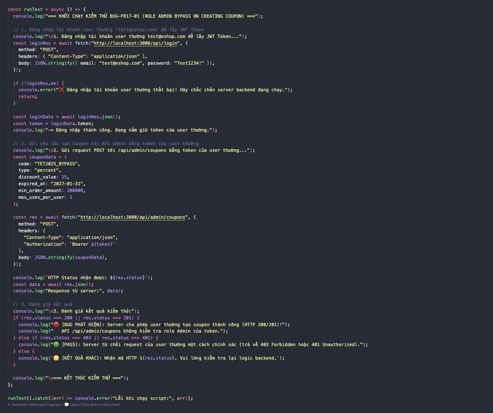 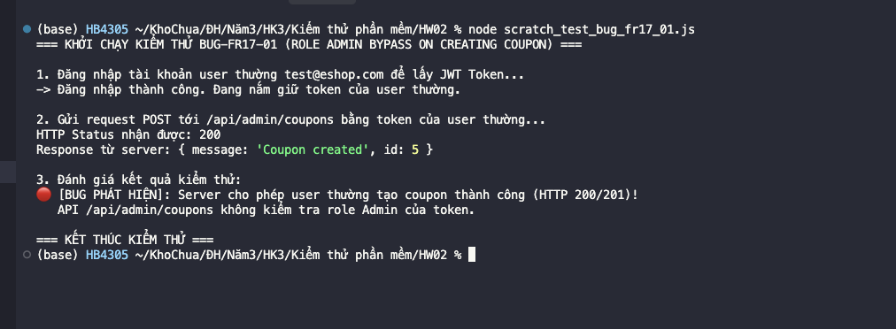

---

### BUG-FR17-02: API tạo coupon không validate trường `code` bắt buộc

*   **Mô tả lỗi:** Endpoint `POST /api/admin/coupons` không chặn `code` rỗng. Vì vậy hệ thống vẫn tạo coupon mới dù mã giảm giá không có giá trị định danh hợp lệ.
*   **Các bước tái hiện (Steps to Reproduce):**
    1. Đăng nhập bằng tài khoản Admin `admin@eshop.com`.
    2. Vì form UI có thuộc tính `required` cho ô mã coupon, gửi trực tiếp request `POST /api/admin/coupons` để kiểm tra validation phía backend.
    3. Dùng body có `code = ""`, các trường còn lại hợp lệ.
    4. Quan sát status code và body response.
*   **Kết quả mong đợi (Expected Output):** Server trả lỗi validation, không tạo coupon mới, và thông báo `code` là trường bắt buộc.
*   **Kết quả thực tế (Actual Output):** Server trả HTTP 200 với body `{"message":"Coupon created","id":5}`.
*   **Bằng chứng thực thi:** Test case `TC06` và `TC-BVA-01`.
*   **Đường dẫn GitHub Issue:** [GitHub Issue #16](https://github.com/HCMUS-software-testing/HW02/issues/16)
*   **Ảnh chụp minh họa (Bug Screenshot):** 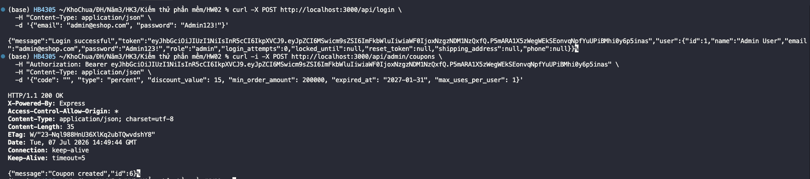

---

### BUG-FR17-03: API tạo coupon không validate miền giá trị `type`

*   **Mô tả lỗi:** Endpoint tạo coupon không kiểm tra `type` thuộc tập hợp hợp lệ `percent` hoặc `fixed`, đồng thời vẫn chấp nhận request thiếu `type`.
*   **Các bước tái hiện (Steps to Reproduce):**
    1. Đăng nhập bằng tài khoản Admin.
    2. Vì giao diện Admin chỉ cho chọn `percent` hoặc `fixed`, gửi trực tiếp request `POST /api/admin/coupons` để kiểm tra validation phía backend.
    3. Gửi một request với `type = "cashback"`.
    4. Gửi một request khác với body thiếu trường `type`.
    5. Quan sát response của từng request.
*   **Kết quả mong đợi (Expected Output):** Server trả lỗi validation và không tạo coupon vì loại coupon không hợp lệ hoặc bị thiếu.
*   **Kết quả thực tế (Actual Output):** Cả hai payload invalid đều được tạo coupon thành công với HTTP 200 và body `{"message":"Coupon created","id":5}`.
*   **Bằng chứng thực thi:** Test case `TC08` và `TC09`.
*   **Đường dẫn GitHub Issue:** [GitHub Issue #17](https://github.com/HCMUS-software-testing/HW02/issues/17)
*   **Ảnh chụp minh họa (Bug Screenshot):** 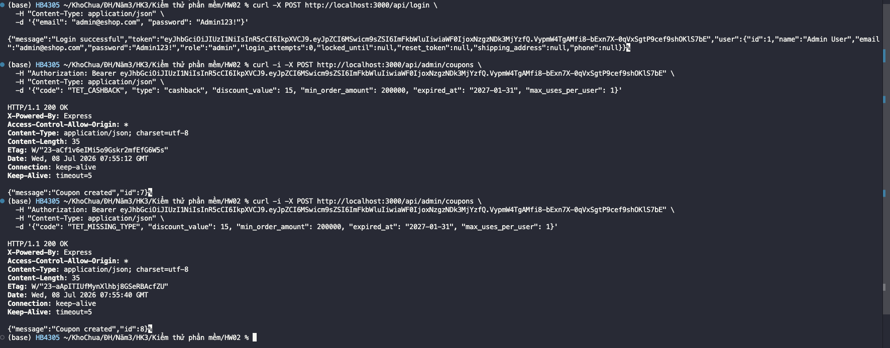 

---

### BUG-FR17-04: API tạo coupon không validate `discount_value`

*   **Mô tả lỗi:** Endpoint tạo coupon không kiểm tra giá trị giảm là số dương. Hệ thống vẫn tạo coupon khi `discount_value` bằng 0, âm hoặc là chuỗi sai kiểu dữ liệu.
*   **Các bước tái hiện (Steps to Reproduce):**
    1. Đăng nhập bằng tài khoản Admin.
    2. Trên tab **Mã Giảm Giá**, nhập một coupon mới với các trường hợp lệ, nhưng đặt **Giá trị** bằng `0`, sau đó bấm **Tạo mã**.
    3. Lặp lại thao tác trên với **Giá trị** bằng `-5`.
    4. Với trường hợp sai kiểu dữ liệu (`discount_value = "abc"`), gửi trực tiếp API vì input số trên UI không cho nhập chữ.
    5. Quan sát coupon có được tạo hay không và response của từng request.
*   **Kết quả mong đợi (Expected Output):** Server trả lỗi validation và không tạo coupon vì giá trị giảm phải là số dương hợp lệ.
*   **Kết quả thực tế (Actual Output):** Các payload invalid vẫn được tạo coupon thành công với HTTP 200 và body `{"message":"Coupon created","id":5}`.
*   **Bằng chứng thực thi:** Test case `TC10`, `TC11`, `TC12` và `TC-BVA-03`.
*   **Đường dẫn GitHub Issue:** [GitHub Issue #18](https://github.com/HCMUS-software-testing/HW02/issues/18)
*   **Ảnh chụp minh họa (Bug Screenshot):** 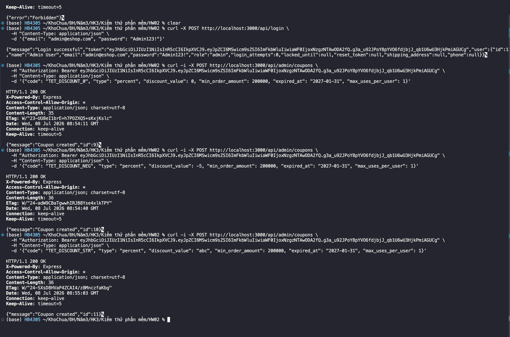

---

### BUG-FR17-05: API tạo coupon không validate `expired_at`

*   **Mô tả lỗi:** Endpoint tạo coupon không kiểm tra ngày hết hạn là trường bắt buộc và có định dạng ngày hợp lệ. Hệ thống vẫn tạo coupon khi thiếu `expired_at` hoặc truyền giá trị không phải ngày.
*   **Các bước tái hiện (Steps to Reproduce):**
    1. Đăng nhập bằng tài khoản Admin.
    2. Vì form UI dùng input ngày bắt buộc, gửi trực tiếp request `POST /api/admin/coupons` để kiểm tra validation phía backend.
    3. Gửi một request với body thiếu `expired_at`.
    4. Gửi một request khác với `expired_at = "not-a-date"`.
    5. Quan sát response của từng request.
*   **Kết quả mong đợi (Expected Output):** Server trả lỗi validation và không tạo coupon vì ngày hết hạn bị thiếu hoặc sai định dạng.
*   **Kết quả thực tế (Actual Output):** Các payload invalid vẫn được tạo coupon thành công với HTTP 200 và body `{"message":"Coupon created","id":5}`.
*   **Bằng chứng thực thi:** Test case `TC13` và `TC14`.
*   **Đường dẫn GitHub Issue:** [GitHub Issue #19](https://github.com/HCMUS-software-testing/HW02/issues/19)
*   **Ảnh chụp minh họa (Bug Screenshot):** 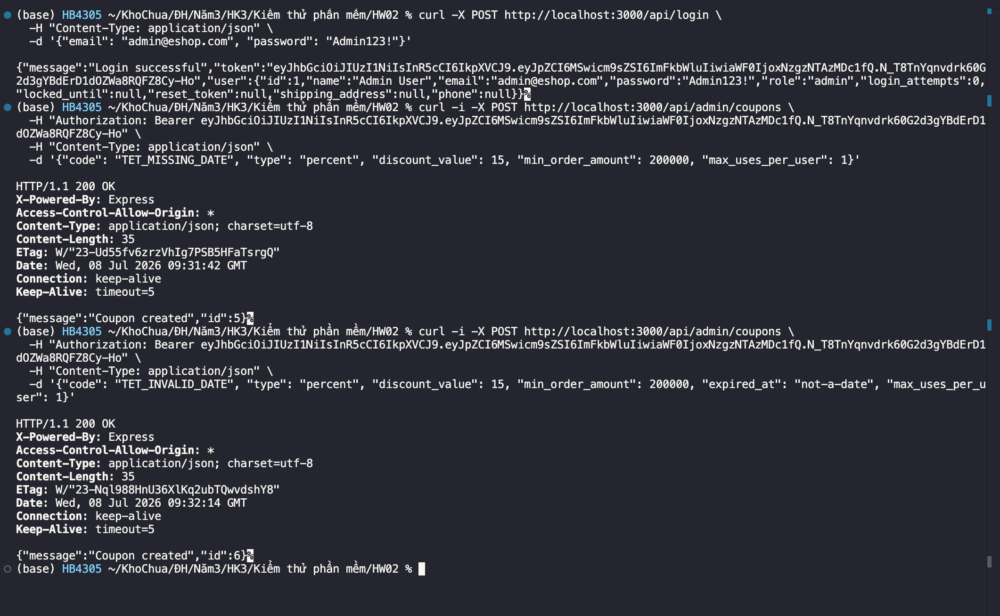

---

### BUG-FR17-06: API tạo coupon không validate `min_order_amount`

*   **Mô tả lỗi:** Endpoint tạo coupon không kiểm tra giá trị đơn tối thiểu phải là số không âm. Hệ thống vẫn tạo coupon khi `min_order_amount` âm hoặc sai kiểu dữ liệu.
*   **Các bước tái hiện (Steps to Reproduce):**
    1. Đăng nhập bằng tài khoản Admin.
    2. Trên tab **Mã Giảm Giá**, nhập một coupon mới với các trường hợp lệ, nhưng đặt **Đơn tối thiểu** bằng `-1`, sau đó bấm **Tạo mã**.
    3. Với trường hợp sai kiểu dữ liệu (`min_order_amount = "two hundred"`), gửi trực tiếp API vì input số trên UI không cho nhập chữ.
    4. Quan sát coupon có được tạo hay không và response của từng request.
*   **Kết quả mong đợi (Expected Output):** Server trả lỗi validation và không tạo coupon vì giá trị đơn tối thiểu không hợp lệ.
*   **Kết quả thực tế (Actual Output):** Các payload invalid vẫn được tạo coupon thành công với HTTP 200 và body `{"message":"Coupon created","id":5}`.
*   **Bằng chứng thực thi:** Test case `TC15`, `TC16` và `TC-BVA-05`.
*   **Đường dẫn GitHub Issue:** [GitHub Issue #20](https://github.com/HCMUS-software-testing/HW02/issues/20)
*   **Ảnh chụp minh họa (Bug Screenshot):** 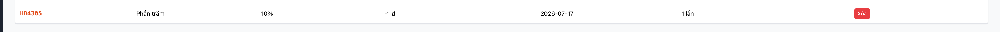 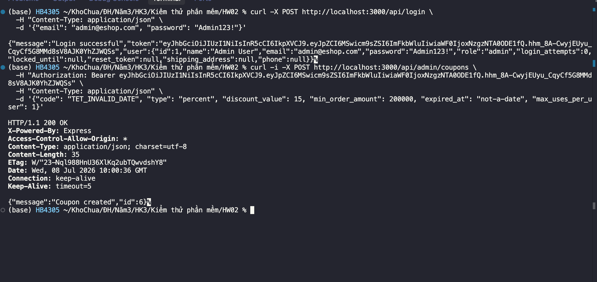

---

### BUG-FR17-07: API tạo coupon không validate `max_uses_per_user`

*   **Mô tả lỗi:** Endpoint tạo coupon không kiểm tra số lượt dùng tối đa mỗi người phải là số nguyên tối thiểu 1. Hệ thống vẫn tạo coupon khi `max_uses_per_user = 0`.
*   **Các bước tái hiện (Steps to Reproduce):**
    1. Đăng nhập bằng tài khoản Admin.
    2. Vì form UI đặt `min = 1` cho ô số lần dùng tối đa/người, gửi trực tiếp request `POST /api/admin/coupons` để kiểm tra validation phía backend.
    3. Dùng body có `max_uses_per_user = 0`, các trường còn lại hợp lệ.
    4. Quan sát response.
*   **Kết quả mong đợi (Expected Output):** Server trả lỗi validation và không tạo coupon vì số lượt dùng tối đa mỗi user phải tối thiểu 1.
*   **Kết quả thực tế (Actual Output):** Payload invalid vẫn được tạo coupon thành công với HTTP 200 và body `{"message":"Coupon created","id":5}`.
*   **Bằng chứng thực thi:** Test case `TC17` và `TC-BVA-07`.
*   **Đường dẫn GitHub Issue:** [GitHub Issue #21](https://github.com/HCMUS-software-testing/HW02/issues/21)
*   **Ảnh chụp minh họa (Bug Screenshot):** 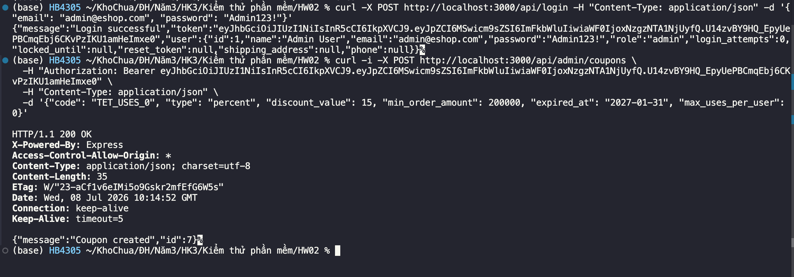
---

### BUG-FR17-08: Tạo coupon trùng mã trả lỗi 500 và lộ lỗi SQLite

*   **Mô tả lỗi:** Ràng buộc unique của `code` có tồn tại, nhưng khi tạo coupon trùng mã hệ thống để lỗi tầng cơ sở dữ liệu trồi thẳng ra response dưới dạng HTTP 500, thay vì trả lỗi nghiệp vụ thân thiện như mã giảm giá đã tồn tại.
*   **Các bước tái hiện (Steps to Reproduce):**
    1. Đăng nhập bằng tài khoản Admin.
    2. Mở tab **Mã Giảm Giá**.
    3. Nhập mã coupon đã tồn tại trong danh sách, ví dụ `SAVE10`, cùng các trường còn lại hợp lệ.
    4. Bấm **Tạo mã** và quan sát thông báo lỗi/response.
*   **Kết quả mong đợi (Expected Output):** Server trả lỗi xung đột/validation và thông báo nghiệp vụ rằng mã giảm giá đã tồn tại.
*   **Kết quả thực tế (Actual Output):** Server trả HTTP 500 với body chứa lỗi `SQLITE_CONSTRAINT: UNIQUE constraint failed: coupons.code`.
*   **Bằng chứng thực thi:** Test case `TC07`; `TC19` cũng quan sát lỗi tương tự ở một request đồng thời.
*   **Đường dẫn GitHub Issue:** [GitHub Issue #22](https://github.com/HCMUS-software-testing/HW02/issues/22)
*   **Ảnh chụp minh họa (Bug Screenshot):** 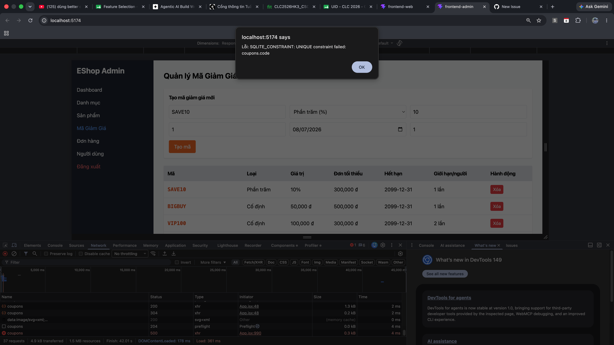

---

### BUG-FR17-09: Xóa coupon không tồn tại vẫn báo thành công

*   **Mô tả lỗi:** Endpoint xóa coupon phản hồi thành công ngay cả khi ID không tồn tại hoặc ID nằm ngoài miền hợp lệ. Từ góc nhìn API client, hệ thống không phân biệt thao tác xóa thật với thao tác xóa không tác động dữ liệu.
*   **Các bước tái hiện (Steps to Reproduce):**
    1. Đăng nhập bằng tài khoản Admin.
    2. Vì giao diện chỉ hiển thị nút xóa cho coupon đang tồn tại trong danh sách, gửi trực tiếp request `DELETE /api/admin/coupons/999999`.
    3. Gửi thêm request `DELETE /api/admin/coupons/0` để kiểm tra biên ID không hợp lệ.
    4. Quan sát response.
*   **Kết quả mong đợi (Expected Output):** Server trả lỗi không tìm thấy hoặc lỗi validation ID, và UI/client giữ nguyên danh sách coupon.
*   **Kết quả thực tế (Actual Output):** Cả hai request đều trả HTTP 200 với body `{"message":"Coupon deleted"}`.
*   **Bằng chứng thực thi:** Test case `TC18` và `TC-BVA-09`.
    *   **Đường dẫn GitHub Issue:** [GitHub Issue #23](https://github.com/HCMUS-software-testing/HW02/issues/23)
*   **Ảnh chụp minh họa (Bug Screenshot):** 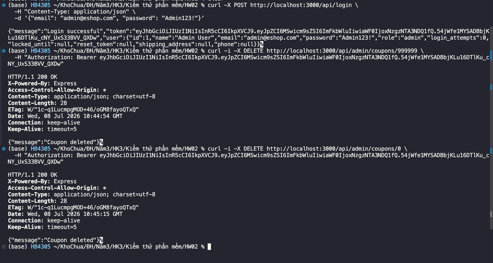

---

## Danh sách lỗi tổng hợp - FR-07: Giỏ hàng (Shopping Cart)


|     Mã Bug      | Tên lỗi (Bug Name)                                                         |                 Mã TC phát hiện                  | Mô tả hành vi lỗi quan sát                                                                                                                     | Độ nghiêm trọng (Severity) | Trạng thái |
| :-------------: | :------------------------------------------------------------------------- | :----------------------------------------------: | :--------------------------------------------------------------------------------------------------------------------------------------------- | :------------------------: | :--------: |
| **BUG-FR07-01** | API giỏ hàng không gộp sản phẩm trùng                                      |                      `TC02`                      | Khi thêm cùng một sản phẩm hai lần, `GET /api/cart` trả 2 dòng trùng `id` thay vì tăng số lượng của dòng hiện có.                              |          **High**          |    Open    |
| **BUG-FR07-02** | API giỏ hàng không validate `quantity`                                     |   `TC04`, `TC05`, `TC06`, `TC07`, `TC-BVA-01`    | API vẫn thêm sản phẩm khi thiếu `quantity`, `quantity` sai kiểu, bằng `0` hoặc âm.                                                             |          **High**          |    Open    |
| **BUG-FR07-03** | API giỏ hàng không validate dữ liệu sản phẩm bắt buộc                      |              `TC08`, `TC09`, `TC10`              | API vẫn thêm item khi thiếu `id`, `name` rỗng hoặc `price` âm, làm giỏ có dữ liệu không hợp lệ.                                                |          **High**          |    Open    |
| **BUG-FR07-04** | API giỏ hàng trả HTML 404 cho phương thức ngoài hợp đồng API |                      `TC19`                      | Khi kiểm tra robust API với các phương thức ngoài spec (`PUT/PATCH/DELETE /api/cart`), hệ thống trả trang HTML mặc định thay vì phản hồi lỗi API nhất quán.              |         **Low**            |    Open    |
| **BUG-FR07-05** | Mobile cart dùng sai nhãn tổng tiền                                        |     `TC01`, `TC18`, `TC-BVA-07`, `TC-BVA-08`     | UI mobile hiển thị `Tổng tạm tính` thay vì nhãn yêu cầu `"Tổng cộng"`.                                                                         |         **Medium**         |    Open    |
| **BUG-FR07-06** | Mobile cart thiếu control tăng/giảm số lượng bằng `+`/`-`                  | `TC11`, `TC12`, `TC13`, `TC-BVA-04`, `TC-BVA-05` | Màn giỏ chỉ có input số lượng, không có nút `+`/`-` như luồng test yêu cầu; thao tác giảm bằng nút không thể thực hiện.                        |         **Medium**         |    Open    |
| **BUG-FR07-07** | Xóa sản phẩm trong mobile cart không có dialog xác nhận                    |           `TC14`, `TC15`, `TC-BVA-04`            | Bấm **Xóa** xóa item ngay, không hiển thị dialog nên không có lựa chọn Confirm/Cancel.                                                         |          **High**          |    Open    |
| **BUG-FR07-08** | Empty cart mobile thiếu hình minh họa                                      |               `TC17`, `TC-BVA-06`                | Khi giỏ trống, UI chỉ hiển thị text `Giỏ hàng của bạn đang trống` và nút tiếp tục mua sắm, không quan sát thấy illustration.                   |          **Low**           |    Open    |

---

### BUG-FR07-01: API giỏ hàng không gộp sản phẩm trùng

*   **Mã TC liên quan:** `TC02`
*   **Steps to Reproduce:**
    1. Đăng nhập bằng tài khoản user hợp lệ để lấy JWT.
    2. Gửi `POST /api/cart` với sản phẩm hợp lệ `id=6`, `quantity=1`.
    3. Gửi lại `POST /api/cart` với cùng `id=6`, `quantity=1`.
    4. Gửi `GET /api/cart`.
*   **Expected Output:** Giỏ hàng chỉ có một dòng sản phẩm `id=6`, số lượng tăng thành `2`.
*   **Actual Output:** API trả `200 OK` cho cả hai lần thêm, nhưng `GET /api/cart` trả 2 dòng trùng `id=6`, mỗi dòng `quantity=1`.
*   **Severity:** High
*   **GitHub Issue:** [BUG-FR07-01](https://github.com/HCMUS-software-testing/HW02/issues/29)
*   **Screenshot:** 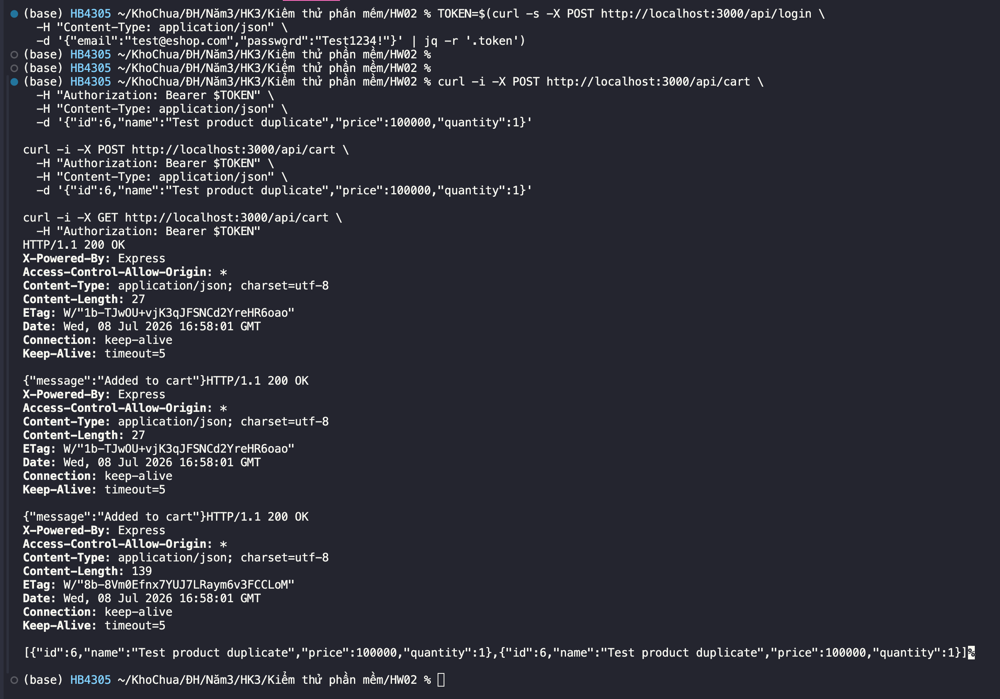

### BUG-FR07-02: API giỏ hàng không validate `quantity`

*   **Mã TC liên quan:** `TC04`, `TC05`, `TC06`, `TC07`, `TC-BVA-01`
*   **Steps to Reproduce:**
    1. Đăng nhập bằng tài khoản user hợp lệ để lấy JWT.
    2. Gửi `POST /api/cart` với lần lượt các payload: thiếu `quantity`, `quantity="abc"`, `quantity=0`, `quantity=-1`.
    3. Gửi `GET /api/cart`.
*   **Expected Output:** API trả lỗi validation và giỏ hàng không thay đổi.
*   **Actual Output:** API đều trả `200 OK` với body `{"message":"Added to cart"}`; `GET /api/cart` cho thấy item thiếu `quantity`, item `quantity:"abc"`, item `quantity:0` và item `quantity:-1` đều được lưu.
*   **Severity:** High
*   **GitHub Issue:** [BUG-FR07-02](https://github.com/HCMUS-software-testing/HW02/issues/30)
*   **Screenshot:** 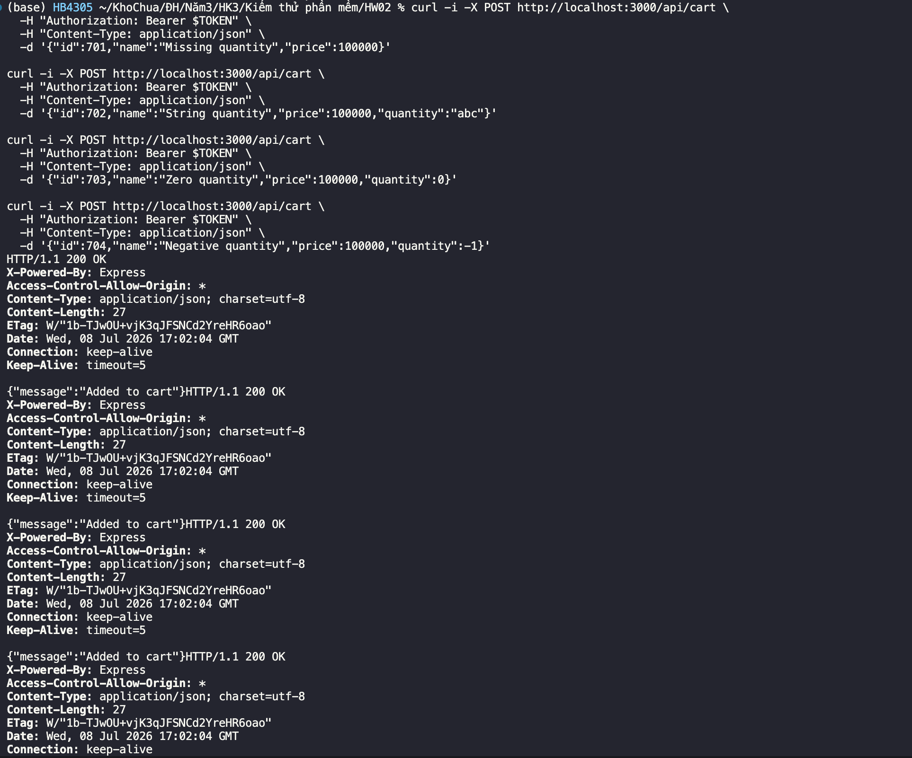

### BUG-FR07-03: API giỏ hàng không validate dữ liệu sản phẩm bắt buộc

*   **Mã TC liên quan:** `TC08`, `TC09`, `TC10`
*   **Steps to Reproduce:**
    1. Đăng nhập bằng tài khoản user hợp lệ để lấy JWT.
    2. Gửi `POST /api/cart` với payload thiếu `id`.
    3. Gửi `POST /api/cart` với `price=-100000`.
    4. Gửi `POST /api/cart` với `name=""`.
    5. Gửi `GET /api/cart`.
*   **Expected Output:** API trả lỗi validation và không thêm các item thiếu/sai dữ liệu bắt buộc.
*   **Actual Output:** API đều trả `200 OK` với body `{"message":"Added to cart"}`; giỏ hàng lưu item không có `id`, item có giá âm và item có tên rỗng.
*   **Severity:** High
*   **GitHub Issue:** [BUG-FR07-03](https://github.com/HCMUS-software-testing/HW02/issues/31)
*   **Screenshot:** 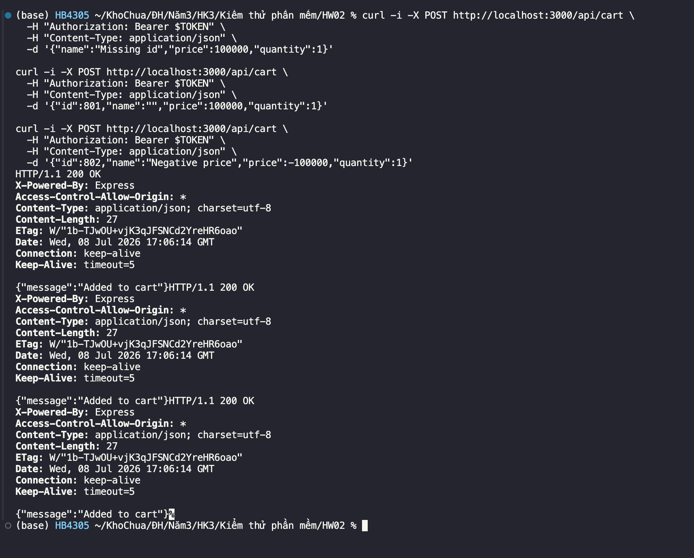

### BUG-FR07-04: API giỏ hàng trả HTML 404 cho phương thức ngoài hợp đồng API

*   **Mã TC liên quan:** `TC19`
*   **Steps to Reproduce:**
    1. Đăng nhập bằng tài khoản user hợp lệ để lấy JWT.
    2. Gửi các request không hỗ trợ: `PUT /api/cart`, `PATCH /api/cart`, `DELETE /api/cart/6`.
*   **Expected Output:** Vì các phương thức này không nằm trong API spec chính thức, hệ thống nên từ chối nhất quán và không thay đổi giỏ hàng; phản hồi lỗi nên phù hợp với API client.
*   **Actual Output:** API trả HTTP `404 Not Found` với trang HTML mặc định như `Cannot PUT /api/cart`, `Cannot PATCH /api/cart`, `Cannot DELETE /api/cart/6`.
*   **Severity:** Low
*   **GitHub Issue:** [BUG-FR07-04](https://github.com/HCMUS-software-testing/HW02/issues/32)
*   **Screenshot:** 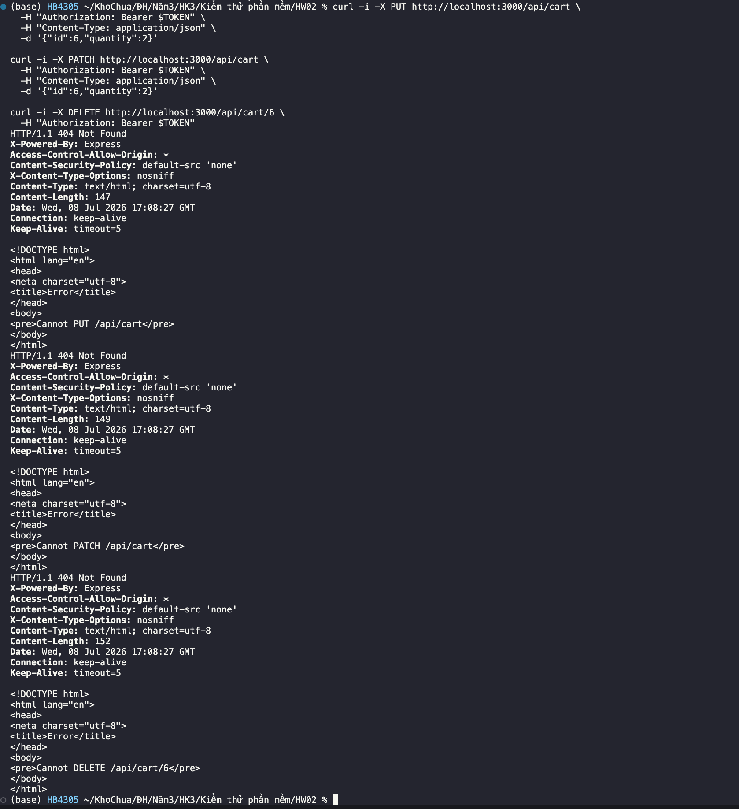

### BUG-FR07-05: Mobile cart dùng sai nhãn tổng tiền

*   **Mã TC liên quan:** `TC01`, `TC18`, `TC-BVA-07`, `TC-BVA-08`
*   **Steps to Reproduce:**
    1. Mở mobile UI qua Expo.
    2. Thêm một hoặc nhiều sản phẩm vào giỏ.
    3. Mở màn hình giỏ hàng.
*   **Expected Output:** Khu vực tổng tiền hiển thị nhãn `"Tổng cộng"`.
*   **Actual Output:** UI mobile hiển thị `Tổng tạm tính: ...` cho cả giỏ có một item và nhiều item.
*   **Severity:** Medium
*   **GitHub Issue:** [BUG-FR07-05](https://github.com/HCMUS-software-testing/HW02/issues/33)
*   **Screenshot:** 

### BUG-FR07-06: Mobile cart thiếu control tăng/giảm số lượng bằng `+`/`-`

*   **Mã TC liên quan:** `TC11`, `TC12`, `TC13`, `TC-BVA-04`, `TC-BVA-05`
*   **Steps to Reproduce:**
    1. Mở mobile UI qua Expo.
    2. Thêm sản phẩm vào giỏ.
    3. Mở màn hình giỏ hàng và quan sát khu vực số lượng.
*   **Expected Output:** Người dùng có thể tăng/giảm số lượng bằng control `+`/`-`, và hệ thống không cho giảm dưới `1`.
*   **Actual Output:** Màn giỏ chỉ hiển thị input số lượng, không có nút `+` hoặc `-`; không thể thực hiện thao tác giảm số lượng bằng nút như yêu cầu trong test case.
*   **Severity:** Medium
*   **GitHub Issue:** [BUG-FR07-06](https://github.com/HCMUS-software-testing/HW02/issues/34)
*   **Screenshot:** 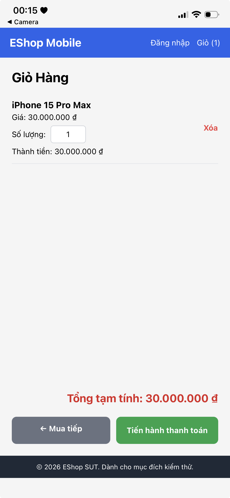

### BUG-FR07-07: Xóa sản phẩm trong mobile cart không có dialog xác nhận

*   **Mã TC liên quan:** `TC14`, `TC15`, `TC-BVA-04`
*   **Steps to Reproduce:**
    1. Mở mobile UI qua Expo.
    2. Thêm một sản phẩm vào giỏ.
    3. Mở màn hình giỏ hàng.
    4. Bấm **Xóa** trên dòng sản phẩm.
*   **Expected Output:** UI hiển thị dialog xác nhận trước khi xóa, cho phép người dùng Confirm hoặc Cancel.
*   **Actual Output:** Không có dialog xác nhận; item bị xóa ngay, badge chuyển về `Giỏ (0)` và màn hình hiển thị giỏ trống.
*   **Severity:** High
*   **GitHub Issue:** [BUG-FR07-07](https://github.com/HCMUS-software-testing/HW02/issues/35)
*   **Screenshot:** 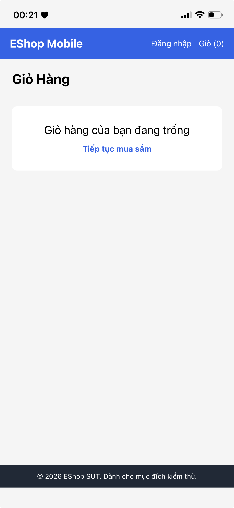

### BUG-FR07-08: Empty cart mobile thiếu hình minh họa

*   **Mã TC liên quan:** `TC17`, `TC-BVA-06`
*   **Steps to Reproduce:**
    1. Mở mobile UI qua Expo.
    2. Đảm bảo giỏ hàng trống.
    3. Mở màn hình giỏ hàng.
*   **Expected Output:** UI hiển thị hình minh họa và thông báo rõ ràng rằng giỏ hàng đang trống.
*   **Actual Output:** UI chỉ hiển thị text `Giỏ hàng của bạn đang trống` và nút `Tiếp tục mua sắm`; không quan sát thấy hình minh họa.
*   **Severity:** Low
*   **GitHub Issue:** [BUG-FR07-08](https://github.com/HCMUS-software-testing/HW02/issues/36)
*   **Screenshot:** 
