# Báo cáo Lỗi (Bug Report) - HW02

## Thông tin sinh viên
- **Họ và tên:** Lê Mai Hoài Bảo
- **MSSV:** 23127326

---

## 1. Danh sách lỗi tổng hợp (Bug List)

Dưới đây là danh sách các lỗi phát hiện được đối với các tính năng **FR-02** và **FR-09** dựa trên việc chạy thực tế và đối chiếu hành vi của hệ thống (ở mức Giao diện UI và API phản hồi) với tài liệu đặc tả yêu cầu (Kiểm thử hộp đen - Black-box testing):

### 1.1. Pool A: FR-02: Đăng nhập & Khóa tài khoản

| Mã Bug | Tên lỗi (Bug Name) | Mã TC phát hiện | Mô tả hành vi lỗi quan sát | Độ nghiêm trọng (Severity) | Trạng thái |
| :---: | :--- | :---: | :--- | :---: | :---: |
| **BUG-FR02-01** | Tài khoản bị tạm khóa sớm sau 2 lần đăng nhập sai liên tiếp (lần thứ 3 bị chặn) | `TC05`, `TC-BVA-02`, `TC-BVA-03` | Tài khoản bị khóa ngay sau 2 lần đăng nhập sai liên tiếp (lần thứ 3 bị chặn 403), trong khi đặc tả yêu cầu sai từ 3 lần liên tiếp mới khóa (lần thứ 4 mới bị chặn 403). | **High** | Open |
| **BUG-FR02-02** | Tài khoản không tự động mở khóa sau 30 giây như đặc tả | `TC-BVA-07` | Khi tài khoản bị tạm khóa, tài khoản vẫn tiếp tục bị khóa và không tự động mở khóa sau thời hạn 30 giây như quy định của đặc tả. | **High** | Open |
| **BUG-FR02-03** | API đăng nhập thành công trả về trường mật khẩu dưới dạng văn bản rõ (plaintext) | `TC01`, `TC-BVA-01` | Payload phản hồi của API khi đăng nhập thành công chứa thuộc tính mật khẩu người dùng, gây nguy cơ rò rỉ dữ liệu nhạy cảm. | **Critical** | Open |
| **BUG-FR02-04** | Trường Email trên giao diện Web và Admin không kiểm tra định dạng HTML5 ở client | `TC03` | Trường Email đăng nhập sử dụng thẻ input có type="text" thay vì type="email", cho phép gửi dữ liệu email sai định dạng lên backend. | **High** | Open |
| **BUG-FR02-05** | Hệ thống không vô hiệu hóa phiên làm việc (JWT Token) cũ khi tài khoản bị tạm khóa | `TC09` | JWT Token cũ đã cấp từ trước vẫn có quyền gọi API lấy dữ liệu nhạy cảm bình thường ngay cả khi tài khoản đã bị khóa ở session khác. | **Critical** | Open |
| **BUG-FR02-06** | Backend API đăng nhập không kiểm tra định dạng email trước khi truy vấn cơ sở dữ liệu | `TC10` | API `/api/login` cho phép gửi định dạng email sai bất kỳ lên server và thực hiện câu lệnh SQL SELECT trực tiếp mà không chặn sớm. | **Medium** | Open |
| **BUG-FR02-07** | Lỗ hổng Race Condition cho phép gửi song song nhiều request vượt cơ chế khóa | `TC08` | Khi gửi 5 request đăng nhập sai đồng thời qua API trong 1ms, tất cả đều được xử lý thành công (trả về 401) thay vì bị chặn từ lần 3. | **High** | Open |

### 1.2. Pool B: FR-09: Mã Giảm Giá (Coupon)

| Mã Bug | Tên lỗi (Bug Name) | Mã TC phát hiện | Mô tả hành vi lỗi quan sát | Độ nghiêm trọng (Severity) | Trạng thái |
| :---: | :--- | :---: | :--- | :---: | :---: |
| **BUG-FR09-01** | Lỗi tính toán sai số tiền được giảm cho coupon loại phần trăm (percent) | `TC01`, `TC-BVA-03`, `TC-BVA-06` | Coupon phần trăm (ví dụ giảm 10% cho đơn 500,000 ₫) bị tính sai công thức khiến giá trị discount bị âm (-4,500,000 ₫) và tổng tiền cuối cùng tăng vọt (5,000,000 ₫). | **High** | Open |
| **BUG-FR09-02** | So sánh sai biên tối thiểu khiến đơn hàng bằng đúng ngưỡng tối thiểu bị từ chối | `TC-BVA-01` | Đơn hàng có tổng tiền đúng bằng ngưỡng tối thiểu áp dụng mã (300,000 ₫) vẫn bị hệ thống báo lỗi không đủ điều kiện tối thiểu. | **High** | Open |
| **BUG-FR09-03** | Lỗ hổng API kiểm tra mã giảm giá (`/api/apply-coupon`) không xác thực Token JWT | `TC11` | API `/api/apply-coupon` không yêu cầu xác thực JWT, cho phép bất kỳ ai (kể cả chưa đăng nhập) gọi API thành công. | **Critical** | Open |
| **BUG-FR09-04** | Hệ thống cho phép giả mạo `user_id` (ID Spoofing) hoặc bỏ trống `user_id` khi áp dụng mã giảm giá | `TC09`, `TC10` | Backend lấy `user_id` trực tiếp từ request body để kiểm tra số lần dùng mà không đối chiếu với token, hoặc bỏ qua kiểm tra nếu bỏ trống `user_id`. | **Critical** | Open |
| **BUG-FR09-05** | Lỗ hổng Checkout Bypass - API thanh toán (`/api/checkout`) không xác thực lại các điều kiện mã giảm giá | `TC15` | API `/api/checkout` nhận trực tiếp tổng số tiền đã giảm từ body mà không kiểm tra hay validate lại tính hợp lệ của mã giảm giá trên backend. | **Critical** | Open |
| **BUG-FR09-06** | Lỗi xử lý thông điệp phản hồi không khớp cho dữ liệu đầu vào không hợp lệ (số tiền âm hoặc sai kiểu dữ liệu) | `TC07`, `TC08` | Khi gửi số tiền âm (-50k) hoặc sai kiểu chữ, hệ thống báo lỗi sai nghiệp vụ: "Đơn hàng chưa đủ giá trị tối thiểu..." thay vì báo lỗi định dạng/số tiền không hợp lệ. | **Medium** | Open |
| **BUG-FR09-07** | Lỗ hổng Race Condition (Double Use) cho phép ghi nhận sử dụng mã giảm giá nhiều lần | `TC14` | Gửi đồng thời các request ghi nhận sử dụng mã (`/api/coupon-usage`) trong cùng 1ms cho phép ghi nhận vượt quá số lần tối đa quy định của coupon. | **High** | Open |

---

## 2. Chi tiết các lỗi (Detailed Bug Descriptions)

## Pool A: FR-02: Đăng nhập & Khóa tài khoản

### BUG-FR02-01: Tài khoản bị tạm khóa sớm sau 2 lần đăng nhập sai liên tiếp (lần thứ 3 bị chặn)

*   **Mô tả lỗi:** Theo đặc tả yêu cầu, tài khoản chỉ bị tạm khóa khi đăng nhập sai từ 3 lần trở lên liên tiếp (tức lần nhập sai thứ 3 vẫn trả về lỗi đăng nhập thường, và lần đăng nhập thứ 4 mới bị chặn). Tuy nhiên trên thực tế, người dùng bị chặn đăng nhập ngay từ lần đăng nhập thứ 3 (chỉ mới đăng nhập sai 2 lần trước đó).
*   **Các bước tái hiện (Steps to Reproduce):**
    1.  Nhập đúng email đăng ký và mật khẩu **sai**, bấm nút Đăng nhập $\rightarrow$ Hệ thống báo lỗi *"Invalid email or password"*. (Lần sai thứ 1)
    2.  Nhập đúng email đăng ký và mật khẩu **sai**, bấm nút Đăng nhập $\rightarrow$ Hệ thống báo lỗi *"Invalid email or password"*. (Lần sai thứ 2)
    3.  Nhập đúng email đăng ký và mật khẩu **đúng/sai**, bấm nút Đăng nhập $\rightarrow$ Hệ thống lập tức trả về lỗi *"Tài khoản đã bị khóa. Vui lòng thử lại sau."* và mã HTTP 403. (Lần thứ 3)
*   **Kết quả mong đợi (Expected Output):** 
    *   Lần thứ 1 và 2: Trả về mã lỗi đăng nhập không chính xác `401 Unauthorized`.
    *   Lần thứ 3: Tiếp tục trả về mã lỗi đăng nhập không chính xác `401 Unauthorized` (vì đây là lần sai thứ 3, chưa bị chặn trước đó).
    *   Lần thứ 4: Hệ thống mới chặn đăng nhập với mã `403 Forbidden` do tài khoản đã bị tạm khóa.
*   **Kết quả thực tế (Actual Output):** Tài khoản đã bị khóa ngay sau lần nhập sai thứ 2. Do đó, đến lần thứ 3 (khi bấm Đăng nhập), hệ thống đã chặn ngay lập tức và trả về mã lỗi `403 Forbidden` cùng thông báo khóa tài khoản.
*   **Đường dẫn GitHub Issue:** [GitHub Issue #1](https://github.com/HCMUS-software-testing/HW02/issues/1)
*   **Ảnh chụp minh họa (Bug Screenshot):** 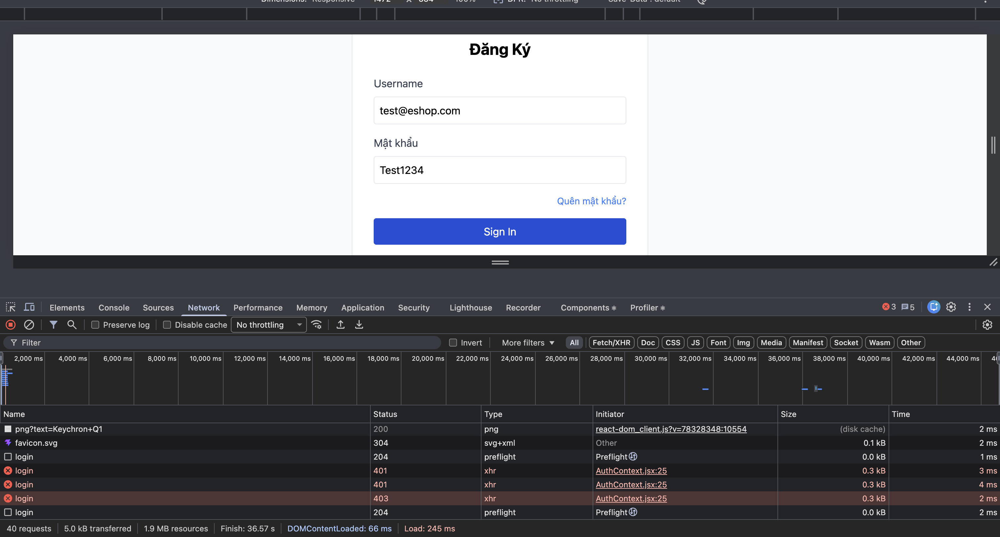

---
 
### BUG-FR02-02: Tài khoản không tự động mở khóa sau 30 giây như đặc tả
 
*   **Mô tả lỗi:** Đặc tả quy định trong môi trường demo, thời gian tạm khóa tài khoản khi nhập sai là 30 giây. Nhưng khi bị khóa, tài khoản vẫn tiếp tục bị giữ ở trạng thái khóa và không tự động mở lại sau 30 giây.
*   **Các bước tái hiện (Steps to Reproduce):**
    1.  Thực hiện đăng nhập sai liên tiếp cho đến khi tài khoản kích hoạt trạng thái bị khóa.
    2.  Chờ 40 giây (lớn hơn thời gian khóa 30 giây quy định).
    3.  Nhập địa chỉ email và mật khẩu **chính xác**, bấm nút Đăng nhập.
*   **Kết quả mong đợi (Expected Output):** Đăng nhập thành công và nhận JWT Token phía client vì đã hết thời gian khóa 30 giây theo đặc tả.
*   **Kết quả thực tế (Actual Output):** Đăng nhập thất bại, hệ thống vẫn trả về thông báo lỗi báo tài khoản đang bị khóa (tài khoản không tự động mở khóa sau 30 giây).
*   **Đường dẫn GitHub Issue:** [GitHub Issue #2](https://github.com/HCMUS-software-testing/HW02/issues/2)
*   **Ảnh chụp minh họa (Bug Screenshot):** 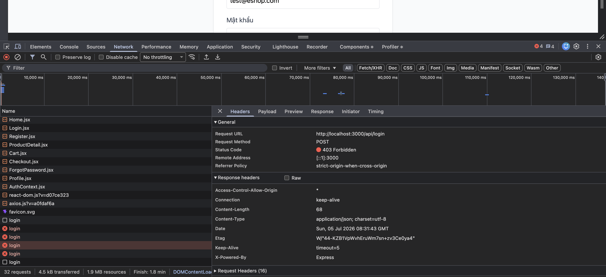 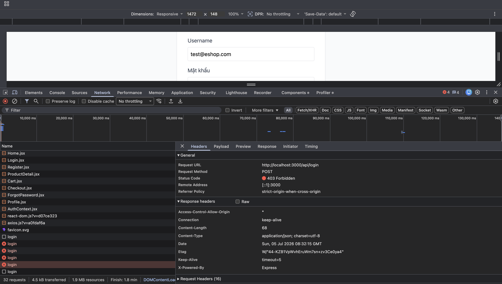

---

### BUG-FR02-03: API đăng nhập thành công trả về trường mật khẩu dưới dạng văn bản rõ (plaintext)

*   **Mô tả lỗi:** Khi người dùng gửi yêu cầu đăng nhập thành công, dữ liệu phản hồi (JSON response) trả về từ backend API chứa cả thông tin mật khẩu của tài khoản ở định dạng văn bản thô rõ ràng, vi phạm nguyên tắc an toàn thông tin cơ bản.
*   **Các bước tái hiện (Steps to Reproduce):**
    1.  Sử dụng công cụ Postman/cURL hoặc kiểm tra tab Network trên trình duyệt, gửi request POST tới `/api/login` với email và mật khẩu chính xác.
    2.  Quan sát cấu trúc dữ liệu JSON phản hồi ở body của response `200 OK`.
*   **Kết quả mong đợi (Expected Output):** JSON phản hồi chứa JWT token và thông tin cơ bản của user như `id`, `name`, `email`, `role`. Tuyệt đối không được chứa trường `password` hoặc `reset_token`.
*   **Kết quả thực tế (Actual Output):** Dữ liệu JSON phản hồi chứa thuộc tính `"password": "Test1234!"` hiển thị rõ ràng mật khẩu plaintext của tài khoản.
*   **Đường dẫn GitHub Issue:** [GitHub Issue #3](https://github.com/HCMUS-software-testing/HW02/issues/3)
*   **Ảnh chụp minh họa (Bug Screenshot):** 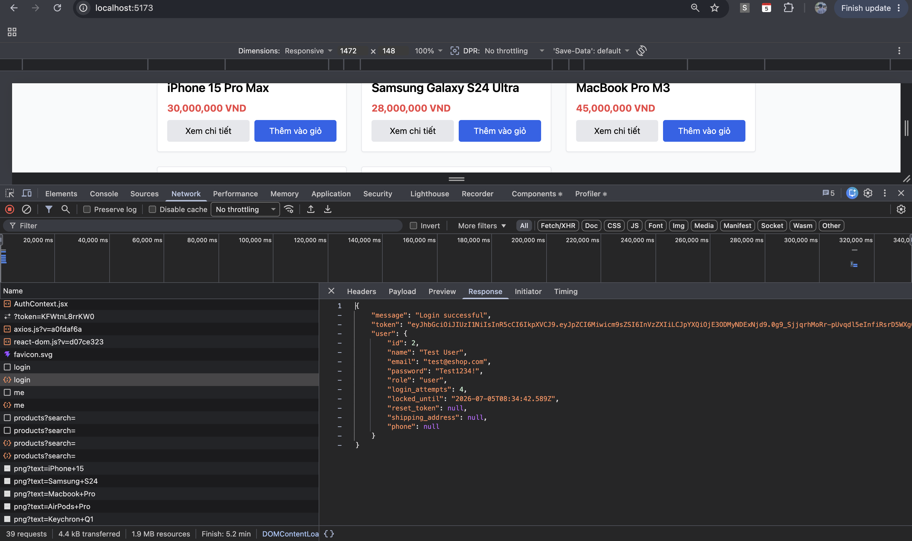

---

### BUG-FR02-04: Trường Email trên giao diện Web và Admin không kiểm tra định dạng HTML5 ở client

*   **Mô tả lỗi:** Theo đặc tả nghiệp vụ, trường email của biểu mẫu đăng nhập bắt buộc phải dùng `type="email"` để thực hiện kiểm tra (validate) định dạng email theo chuẩn HTML5. Tuy nhiên, trên giao diện Web và Admin, trường Email sử dụng `type="text"`, cho phép người dùng bấm gửi dữ liệu sai định dạng (thiếu ký tự `@`, tên miền...) lên server mà không bị chặn lại ở trình duyệt.
*   **Các bước tái hiện (Steps to Reproduce):**
    1.  Mở màn hình Đăng nhập của Web (hoặc Admin).
    2.  Nhập địa chỉ email sai định dạng: `invalid-email.com` vào trường Email.
    3.  Nhập mật khẩu bất kỳ và nhấn Đăng nhập.
*   **Kết quả mong đợi (Expected Output):** Trình duyệt tự động chặn lại và hiển thị cảnh báo lỗi định dạng của trường email (HTML5 validation), không gửi request lên backend API.
*   **Kết quả thực tế (Actual Output):** Form đăng nhập cho phép submit thành công, gửi thẳng request POST `/api/login` có email sai định dạng lên backend và nhận về phản hồi lỗi `401 Unauthorized` từ server.
*   **Đường dẫn GitHub Issue:** [GitHub Issue #4](https://github.com/HCMUS-software-testing/HW02/issues/4)
*   **Ảnh chụp minh họa (Bug Screenshot):** 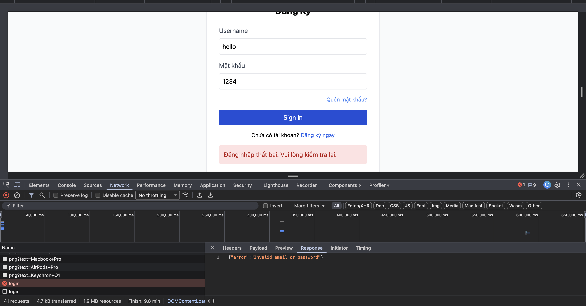

---

### BUG-FR02-05: Hệ thống không vô hiệu hóa phiên làm việc (JWT Token) cũ khi tài khoản bị tạm khóa

*   **Mô tả lỗi:** Khi tài khoản bị tạm khóa (do có các hoạt động đăng nhập sai liên tiếp ở session khác), hệ thống không thực hiện thu hồi hoặc vô hiệu hóa các JWT Token cũ đã cấp từ trước của tài khoản đó. Người dùng/kẻ tấn công đang nắm giữ token cũ này vẫn có thể thực hiện thành công các truy vấn có xác thực để lấy thông tin nhạy cảm.
*   **Các bước tái hiện (Steps to Reproduce):**
    1.  Đăng ký tài khoản mới và thực hiện đăng nhập thành công ở Thiết bị A để lấy JWT Token hợp lệ.
    2.  Ở Thiết bị B, thực hiện đăng nhập sai 2 lần liên tiếp để đưa tài khoản vào trạng thái tạm khóa.
    3.  Ở Thiết bị A, sử dụng JWT Token đã lấy ở bước 1 để gửi request `GET /api/users/me` (đây là endpoint yêu cầu xác thực).
*   **Kết quả mong đợi (Expected Output):** Server từ chối request và trả về mã lỗi `401 Unauthorized` hoặc `403 Forbidden` vì tài khoản tương ứng đang bị khóa.
*   **Kết quả thực tế (Actual Output):** Backend API vẫn trả về `200 OK` kèm theo toàn bộ thông tin cá nhân và mật khẩu chưa mã hóa của tài khoản, bất chấp việc tài khoản này đang bị khóa trong CSDL.
*   **Đường dẫn GitHub Issue:** [GitHub Issue #5](https://github.com/HCMUS-software-testing/HW02/issues/5)
*   **Ảnh chụp minh họa (Bug Screenshot):** 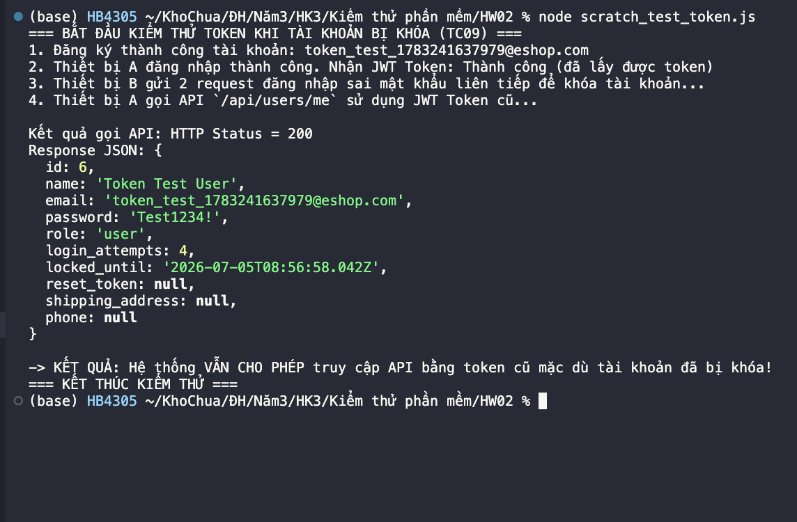 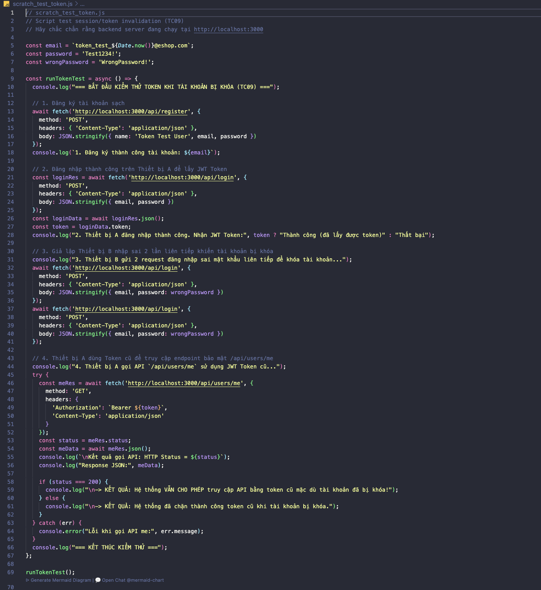

---

### BUG-FR02-06: Backend API đăng nhập không kiểm tra định dạng email trước khi truy vấn cơ sở dữ liệu

*   **Mô tả lỗi:** Endpoint `/api/login` ở backend không kiểm tra tính hợp lệ của định dạng email đầu vào mà trực tiếp sử dụng chuỗi nhận được để thực hiện câu lệnh SQL tìm kiếm tài khoản. Điều này làm lãng phí tài nguyên xử lý của cơ sở dữ liệu đối với các truy vấn rác hoặc sai định dạng.
*   **Các bước tái hiện (Steps to Reproduce):**
    1.  Dùng Postman hoặc cURL gửi trực tiếp request POST tới `http://localhost:3000/api/login` với body: `{"email": "notanemail", "password": "Test1234!"}`.
    2.  Kiểm tra response trả về từ server.
*   **Kết quả mong đợi (Expected Output):** Server từ chối nhanh và trả về mã lỗi `400 Bad Request` hoặc `401 Unauthorized` kèm mô tả lỗi email sai định dạng, không cần thực hiện truy vấn xuống CSDL SQLite.
*   **Kết quả thực tế (Actual Output):** Server không validate định dạng email, vẫn cho chạy câu lệnh truy vấn SQL SELECT để tìm chuỗi `'notanemail'`, sau đó trả về lỗi đăng nhập sai thông tin chung `401 Unauthorized`.
*   **Đường dẫn GitHub Issue:** [GitHub Issue #6](https://github.com/HCMUS-software-testing/HW02/issues/6)
*   **Ảnh chụp minh họa (Bug Screenshot):** 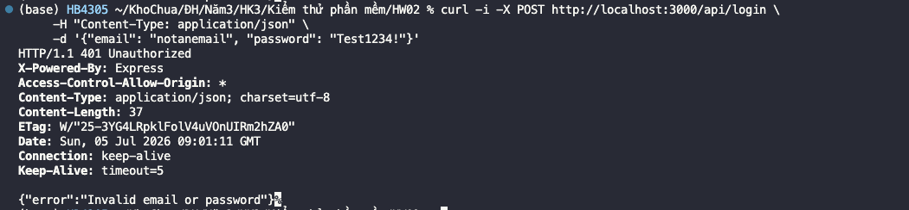

---

### BUG-FR02-07: Lỗ hổng Race Condition cho phép gửi song song nhiều request vượt cơ chế khóa

*   **Mô tả lỗi:** Do backend không thực hiện cơ chế khóa bản ghi (row locking) hoặc xử lý giao dịch đồng thời (atomic transactions) khi kiểm tra và cập nhật trạng thái đăng nhập sai của tài khoản trong CSDL SQLite. Người dùng/kẻ tấn công có thể gửi song song nhiều request đăng nhập cùng lúc để bypass (vượt qua) bộ lọc kiểm tra khóa.
*   **Các bước tái hiện (Steps to Reproduce):**
    1.  Sử dụng kịch bản Node.js `scratch_test_race.js` gửi đồng thời 5 request đăng nhập sai mật khẩu của cùng 1 tài khoản trong cùng 1 mili giây.
    2.  Quan sát mã phản hồi HTTP trả về từ server cho cả 5 request.
*   **Kết quả mong đợi (Expected Output):** Hệ thống chỉ cho phép tối đa 2 request đầu tiên trả về `401 Unauthorized` (vì ngưỡng khóa là 3 lần sai). Các request thứ 3, 4, 5 phải bị chặn và trả về `403 Forbidden`.
*   **Kết quả thực tế (Actual Output):** Cả 5 request song song đều trả về mã lỗi `401 Unauthorized` cùng lúc và không có request nào bị chặn bằng mã `403 Forbidden` trong loạt gửi song song đó. Tài khoản chỉ bị khóa sau khi loạt request này đã thực thi xong.
*   **Đường dẫn GitHub Issue:** [GitHub Issue #7](https://github.com/HCMUS-software-testing/HW02/issues/7)
*   **Ảnh chụp minh họa (Bug Screenshot):** 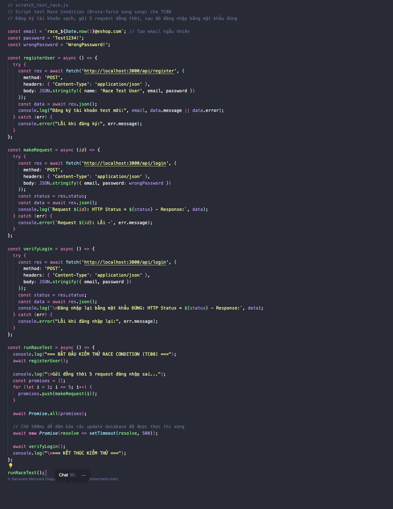 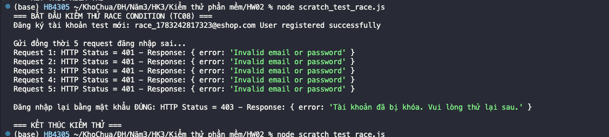

---

## Pool B: FR-09: Mã Giảm Giá (Coupon)

### BUG-FR09-01: Lỗi tính toán sai số tiền được giảm cho coupon loại phần trăm (percent)

*   **Mô tả lỗi:** Khi áp dụng coupon giảm giá theo tỷ lệ phần trăm (percent), backend tính toán sai công thức chiết khấu dẫn đến việc số tiền giảm bị âm (ví dụ: giảm `-4,500,000` ₫ cho đơn hàng `500,000` ₫ với mã `SAVE10` giảm 10%) và tổng tiền thanh toán cuối cùng bị tăng vọt (lên `5,000,000` ₫).
*   **Các bước tái hiện (Steps to Reproduce):**
    1. Đăng nhập vào hệ thống bằng tài khoản khách hàng hợp lệ (ví dụ: `test@eshop.com`).
    2. Đi tới màn hình **Checkout** (hoặc thêm sản phẩm vào giỏ hàng rồi tới trang thanh toán).
    3. Tại trường **"Tổng tiền thanh toán (VND)"**, điền giá trị `500000`.
    4. Tại ô nhập **"Mã Giảm Giá"**, điền mã `SAVE10`.
    5. Nhấn nút **"Áp dụng"**.
    6. Quan sát số tiền giảm giá và tổng tiền thanh toán hiển thị trên màn hình.
*   **Kết quả mong đợi (Expected Output):**
    *   Hệ thống áp dụng coupon thành công.
    *   Hiển thị số tiền tiết kiệm: `50,000 ₫`.
    *   Hiển thị tổng thanh toán sau giảm giá: `450,000 ₫`.
*   **Kết quả thực tế (Actual Output):**
    *   Hệ thống báo áp dụng thành công nhưng hiển thị số tiền tiết kiệm bị âm: `-4,500,000 ₫`.
    *   Tổng thanh toán hiển thị bị tăng vọt lên: `5,000,000 ₫`.
*   **Đường dẫn GitHub Issue:** [GitHub Issue #8](https://github.com/HCMUS-software-testing/HW02/issues/8)
*   **Ảnh chụp minh họa (Bug Screenshot):** 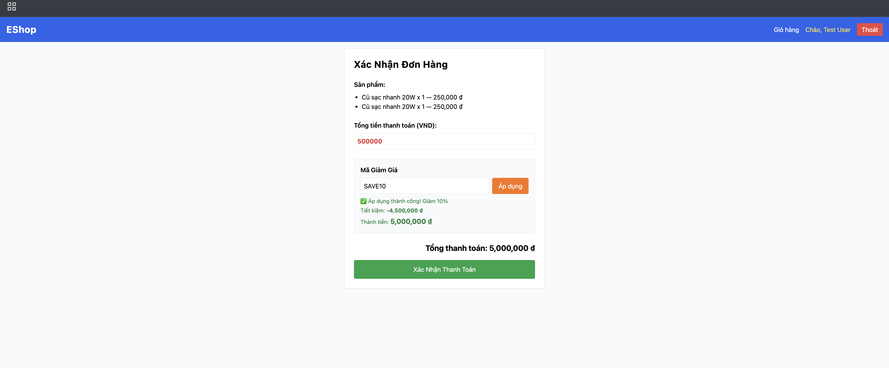

---

### BUG-FR09-02: So sánh sai biên tối thiểu khiến đơn hàng bằng đúng ngưỡng tối thiểu bị từ chối

*   **Mô tả lỗi:** Theo đặc tả yêu cầu, coupon chỉ được áp dụng khi đơn hàng có tổng trị giá tối thiểu từ `min_order_amount` trở lên (tức là `>=`). Tuy nhiên, khi giá trị đơn hàng bằng đúng ngưỡng tối thiểu (ví dụ `300,000` ₫ đối với mã `SAVE10`), hệ thống vẫn từ chối áp dụng và trả về lỗi không đủ điều kiện đơn hàng tối thiểu.
*   **Các bước tái hiện (Steps to Reproduce):**
    1. Mở màn hình **Checkout** của ứng dụng Web.
    2. Tại ô **"Tổng tiền thanh toán (VND)"**, nhập giá trị `300000` (bằng đúng ngưỡng tối thiểu của mã `SAVE10`).
    3. Nhập mã `SAVE10` vào ô **"Mã Giảm Giá"**.
    4. Nhấn nút **"Áp dụng"**.
*   **Kết quả mong đợi (Expected Output):**
    *   Hệ thống áp dụng coupon thành công, không báo lỗi.
*   **Kết quả thực tế (Actual Output):**
    *   Hệ thống từ chối áp dụng và hiển thị thông báo lỗi màu đỏ: `"Đơn hàng chưa đủ giá trị tối thiểu 300,000 ₫ để áp dụng mã này"`.
*   **Đường dẫn GitHub Issue:** [GitHub Issue #9](https://github.com/HCMUS-software-testing/HW02/issues/9)
*   **Ảnh chụp minh họa (Bug Screenshot):** 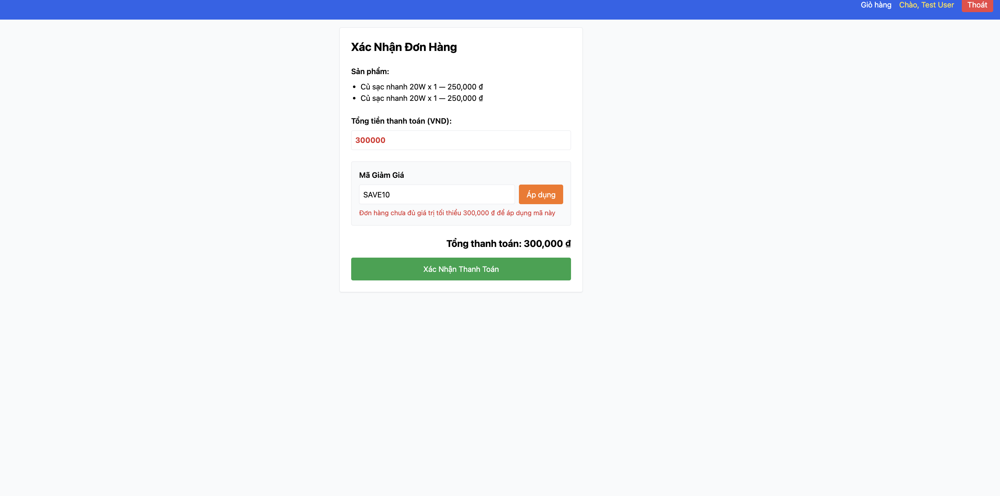

---

### BUG-FR09-03: Lỗ hổng API kiểm tra mã giảm giá (/api/apply-coupon) không xác thực Token JWT

*   **Mô tả lỗi:** API `/api/apply-coupon` ở backend hoàn toàn không sử dụng middleware xác thực `authenticateToken`. Người dùng chưa đăng nhập (hoặc đã đăng xuất) vẫn có thể gửi yêu cầu và nhận thông tin tính toán coupon thành công trên giao diện.
*   **Các bước tái hiện (Steps to Reproduce):**
    1. Không tiến hành đăng nhập tài khoản (hoặc đăng xuất khỏi hệ thống).
    2. Truy cập trực tiếp trang **Checkout** (`/checkout`).
    3. Nhập giá trị `500000` vào ô **"Tổng tiền thanh toán (VND)"**.
    4. Nhập mã `SAVE10` vào ô **"Mã Giảm Giá"** và nhấn **"Áp dụng"**.
*   **Kết quả mong đợi (Expected Output):**
    *   Hệ thống chặn hành động và thông báo yêu cầu người dùng đăng nhập (hoặc trả về mã lỗi `401 Unauthorized` / `403 Forbidden`).
*   **Kết quả thực tế (Actual Output):**
    *   Giao diện vẫn gửi yêu cầu thành công (không kèm Authorization header) và hiển thị kết quả tính toán giảm giá của coupon bình thường.
*   **Đường dẫn GitHub Issue:** [GitHub Issue #10](https://github.com/HCMUS-software-testing/HW02/issues/10)
*   **Ảnh chụp minh họa (Bug Screenshot):** 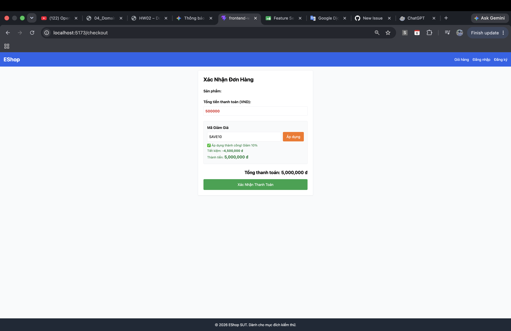

---

### BUG-FR09-04: Hệ thống cho phép giả mạo user_id (ID Spoofing) hoặc bỏ trống user_id khi áp dụng mã giảm giá

*   **Mô tả lỗi:** Backend API `/api/apply-coupon` lấy tham số `user_id` từ request body để truy vấn số lần sử dụng coupon mà không kiểm tra xem ID này có khớp với ID đã mã hóa trong token JWT của user đang đăng nhập hay không. Ngoài ra, nếu người dùng bỏ trống hoặc không truyền `user_id` (ví dụ khi không đăng nhập), backend tự động rẽ nhánh bỏ qua kiểm tra số lần sử dụng tối đa, cho phép một khách hàng áp dụng coupon vô hạn lần.
*   **Các bước tái hiện (Steps to Reproduce):**
    1. Chạy file script tự động [scratch_test_bug_fr09_04.js](./scratch_test_bug_fr09_04.js) bằng cách chạy lệnh sau trong terminal tại thư mục gốc của dự án:
       ```bash
       node scratch_test_bug_fr09_04.js
       ```
    2. Quan sát kết quả phản hồi in ra trên màn hình terminal của cả 2 kịch bản:
       * **Trường hợp 1 (Bỏ trống user_id):** Backend gửi yêu cầu không có `user_id` để bypass kiểm tra giới hạn sử dụng.
       * **Trường hợp 2 (Giả mạo user_id):** Đăng nhập User A nhưng truyền `user_id` của User B vào request body.
*   **Kết quả mong đợi (Expected Output):**
    *   Hệ thống từ chối áp dụng mã giảm giá, yêu cầu xác thực khớp ID (trả về lỗi `403 Forbidden` hoặc `400 Bad Request`).
*   **Kết quả thực tế (Actual Output):**
    *   Hệ thống phản hồi `200 OK` và áp dụng coupon thành công.
*   **Đường dẫn GitHub Issue:** [GitHub Issue #11](https://github.com/HCMUS-software-testing/HW02/issues/11)
*   **Ảnh chụp minh họa (Bug Screenshot):** 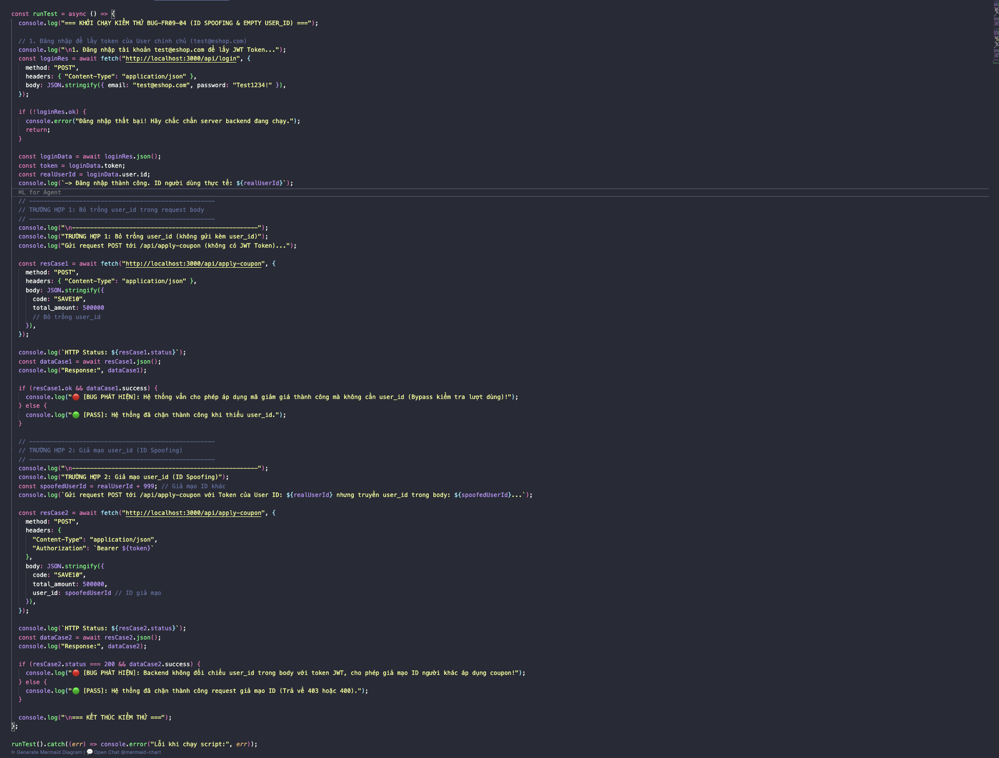 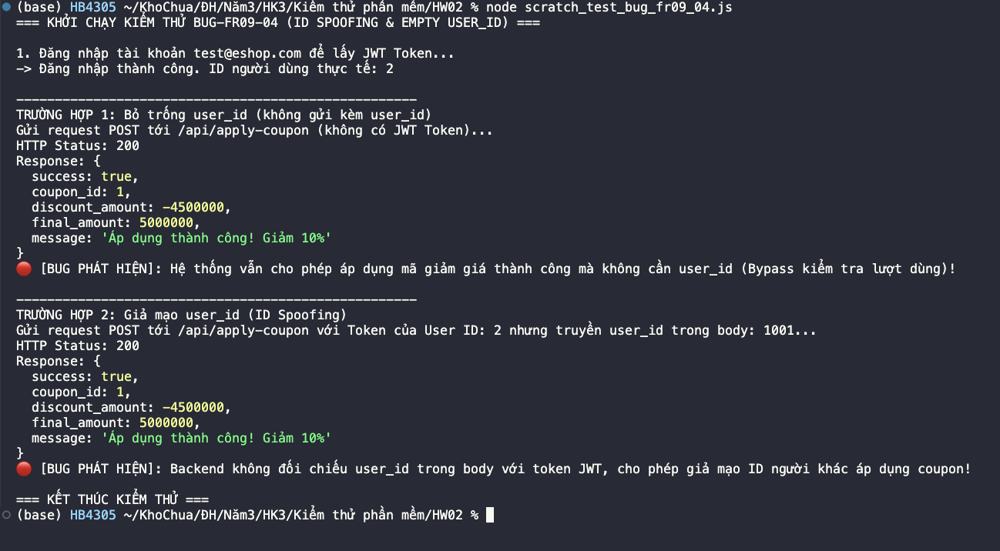

---

### BUG-FR09-05: Lỗ hổng Checkout Bypass - API thanh toán (/api/checkout) không xác thực lại các điều kiện mã giảm giá

*   **Mô tả lỗi:** API `/api/checkout` nhận trực tiếp tham số tổng tiền đơn hàng đã giảm (`total_amount`) từ client gửi lên mà hoàn toàn không thực hiện kiểm tra chéo (re-validate) lại tính đúng đắn của giỏ hàng và coupon đã áp dụng ở backend. Ngoài ra, giao diện Checkout cho phép người dùng tự do sửa đổi trực tiếp ô số tiền thanh toán, cho phép tạo đơn hàng thành công với giá trị cực rẻ do người dùng tự nhập mà backend vẫn chấp nhận.
*   **Các bước tái hiện (Steps to Reproduce):**
    1. Đăng nhập hệ thống, thêm sản phẩm vào giỏ hàng và đi tới trang **Checkout**.
    2. Tại ô nhập liệu **"Tổng tiền thanh toán (VND)"**, xóa giá trị cũ của giỏ hàng và nhập vào một con số cực nhỏ tùy ý (ví dụ: `50000` ₫).
    3. Nhấn nút **"Xác Nhận Thanh Toán"**.
    4. Kiểm tra thông báo kết quả và giá trị đơn hàng mới tạo trong trang Lịch sử đơn hàng.
*   **Kết quả mong đợi (Expected Output):**
    *   Hệ thống từ chối thanh toán do số tiền gửi lên không khớp với tổng tiền thực tế của giỏ hàng (hoặc không đủ điều kiện tối thiểu của mã giảm giá).
*   **Kết quả thực tế (Actual Output):**
    *   Giao diện báo thanh toán thành công và đơn hàng mới được tạo trên hệ thống với đúng giá trị `50,000` ₫ mà không gặp bất kỳ sự cản trở nào từ backend.
*   **Đường dẫn GitHub Issue:** [GitHub Issue #12](https://github.com/HCMUS-software-testing/HW02/issues/12)
*   **Ảnh chụp minh họa (Bug Screenshot):** 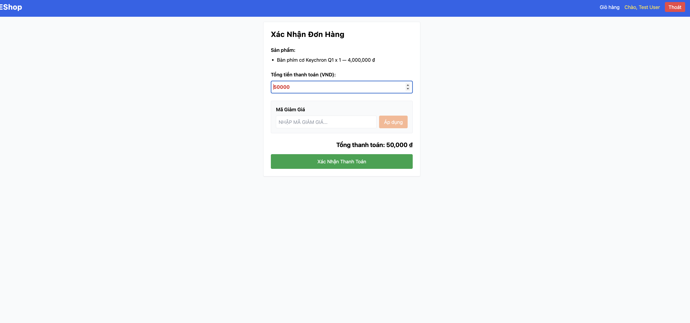 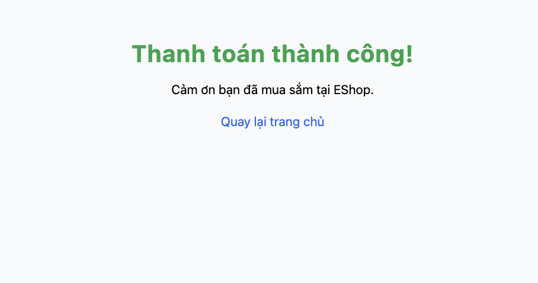

---

### BUG-FR09-06: Lỗi xử lý thông điệp phản hồi không khớp cho dữ liệu đầu vào không hợp lệ (số tiền âm hoặc sai kiểu dữ liệu)

*   **Mô tả lỗi:** Khi người dùng gửi yêu cầu áp dụng mã giảm giá với các dữ liệu sai định dạng nghiêm trọng ở biến `total_amount` như số tiền âm (`-50000`) hoặc chuỗi ký tự chữ không hợp lệ, hệ thống phản hồi lỗi logic nghiệp vụ gây hiểu lầm là đơn hàng không đủ ngưỡng tối thiểu, thay vì phản hồi lỗi định dạng dữ liệu đầu vào.
*   **Các bước tái hiện (Steps to Reproduce):**
    1. Mở trang **Checkout** của ứng dụng Web.
    2. Tại ô **"Tổng tiền thanh toán (VND)"**, điền giá trị âm `-50000` (hoặc nhập chuỗi ký tự chữ không phải số).
    3. Nhập mã giảm giá `SAVE10` vào ô **"Mã Giảm Giá"**.
    4. Nhấn nút **"Áp dụng"**.
*   **Kết quả mong đợi (Expected Output):**
    *   Hệ thống báo lỗi định dạng dữ liệu đầu vào hoặc tổng số tiền đơn hàng không hợp lệ.
*   **Kết quả thực tế (Actual Output):**
    *   Hệ thống báo lỗi nghiệp vụ không liên quan: `"Đơn hàng chưa đủ giá trị tối thiểu 300,000 ₫ để áp dụng mã này"`.
*   **Đường dẫn GitHub Issue:** [GitHub Issue #13](https://github.com/HCMUS-software-testing/HW02/issues/13)
*   **Ảnh chụp minh họa (Bug Screenshot):** 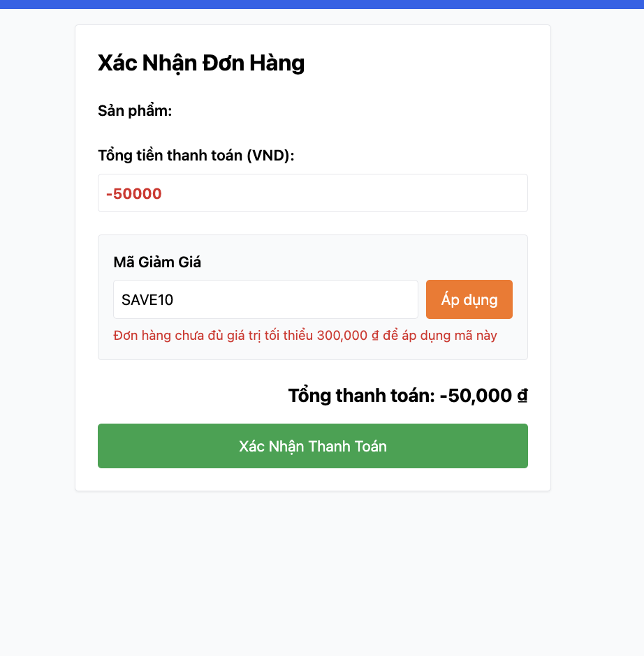

---

### BUG-FR09-07: Lỗ hổng Race Condition (Double Use) cho phép ghi nhận sử dụng mã giảm giá nhiều lần

*   **Mô tả lỗi:** Khi gửi đồng thời nhiều request ghi nhận sử dụng mã giảm giá (`POST /api/coupon-usage`) trong cùng 1 mili giây, backend xử lý bất đồng bộ (non-atomic) mà không sử dụng cơ chế transaction khóa bản ghi hoặc unique constraint trên bảng `coupon_usage` ở SQLite. Điều này dẫn đến hệ thống chấp nhận tất cả các yêu cầu và lưu vào database, cho phép người dùng bypass giới hạn sử dụng tối đa của mã giảm giá (ví dụ mã giới hạn dùng 1 lần vẫn bị lưu thành 2 dòng sử dụng).
*   **Các bước tái hiện (Steps to Reproduce):**
    *   *Do Race Condition diễn ra trong mili giây nên cần thực hiện qua script tự động gửi request API đồng thời:*
    1. Sử dụng script kiểm thử `scratch_test_coupon.js` (hoặc các công cụ gửi request đồng thời như JMeter/k6).
    2. Thực hiện đăng nhập và lấy JWT token hợp lệ của một tài khoản chưa từng sử dụng coupon `SAVE10` (giới hạn 1 lần dùng).
    3. Gửi đồng thời 2 request POST tới `/api/coupon-usage` trong cùng 1 mili giây với body: `{"coupon_id": 1}`.
    4. Kiểm tra mã trạng thái HTTP trả về của cả 2 request và truy vấn bảng `coupon_usage` trong cơ sở dữ liệu.
*   **Kết quả mong đợi (Expected Output):**
    *   Chỉ có duy nhất 1 request thành công (`200 OK`). Request còn lại phải trả về mã lỗi (`400 Bad Request` hoặc `500 Internal Server Error`).
*   **Kết quả thực tế (Actual Output):**
    *   Cả 2 request gửi đồng thời đều thành công (`200 OK`) và CSDL ghi nhận 2 bản ghi sử dụng cho cùng một mã giảm giá của cùng một người dùng.
*   **Đường dẫn GitHub Issue:** [GitHub Issue #14](https://github.com/HCMUS-software-testing/HW02/issues/14)
*   **Ảnh chụp minh họa (Bug Screenshot):** 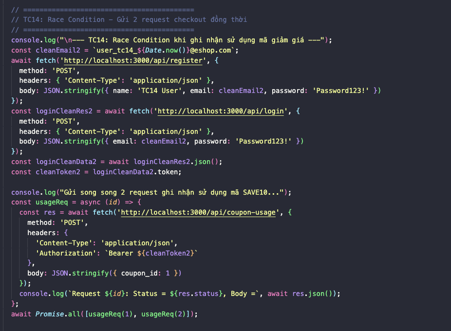 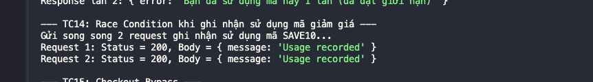

