# Danh sách báo cáo lỗi - EShop SUT (HW02)

Tài liệu này tổng hợp các lỗi (bug) phát hiện được trong quá trình kiểm thử các tính năng đã thực thi trên hệ thống EShop SUT. Phần đầu là bảng tổng hợp danh sách lỗi, phần sau cung cấp chi tiết từng lỗi để đối chiếu. Chi tiết và bằng chứng hình ảnh/API cụ thể của từng lỗi cũng được quản lý trên mục GitHub Issues nếu đã tạo.

---

## 1. Bảng tổng hợp danh sách lỗi

### 1.1 FR-04 - Personal Profile Management

| Mã lỗi                                                                                    | Tính năng | Tiêu đề lỗi                                                                                       | Độ nghiêm trọng | Độ ưu tiên | Trạng thái | Test Case đối chiếu                                   | GitHub Issue Link                                               |
| :---------------------------------------------------------------------------------------- | :-------- | :------------------------------------------------------------------------------------------------ | :-------------- | :--------- | :--------- | :---------------------------------------------------- | :-------------------------------------------------------------- |
| [BUG-FR04-01](#bug-fr04-01-leo-thang-dac-quyen-qua-mass-assignment)                       | FR-04     | Leo thang đặc quyền qua thuộc tính role khi cập nhật thông tin cá nhân                            | Critical        | High       | Open       | FR04-DOM-TC08                                         | [#24](https://github.com/HCMUS-software-testing/HW02/issues/24) |
| [BUG-FR04-02](#bug-fr04-02-mat-du-lieu-khi-cap-nhat-mot-phan-data-loss-on-partial-update) | FR-04     | Mất dữ liệu - Cập nhật thiếu trường khi cập nhật thông tin cá nhân sẽ ghi đè giá trị cũ bằng NULL | High            | High       | Open       | FR04-DOM-TC07                                         | [#25](https://github.com/HCMUS-software-testing/HW02/issues/25) |
| [BUG-FR04-03](#bug-fr04-03-thieu-kiem-tra-du-lieu-dau-vao-lack-of-input-validation)       | FR-04     | Thiếu kiểm duyệt dữ liệu đầu vào khi cập nhật thông tin cá nhân                                   | Medium          | Medium     | Open       | FR04-DOM-TC09, TC10, TC11, TC12, BVA-TC04, TC05, TC06 | [#26](https://github.com/HCMUS-software-testing/HW02/issues/26) |
| [BUG-FR04-04](#bug-fr04-04-lo-lot-thong-tin-nhay-cam-sensitive-data-exposure)             | FR-04     | Lộ lọt thông tin người dùng nhạy cảm khi lấy thông tin cá nhân                                    | High            | High       | Open       | FR04-DOM-TC01                                         | [#27](https://github.com/HCMUS-software-testing/HW02/issues/27) |
| [BUG-FR04-05](#bug-fr04-05-loi-dinh-dang-regex-o-frontend-chan-so-dien-thoai-hop-le)      | FR-04     | Giao diện người dùng chặn cập nhật các số điện thoại Việt Nam hợp lệ bắt đầu bằng số 0            | High            | High       | Open       | FR04-DOM-TC02, BVA-TC03                               | [#28](https://github.com/HCMUS-software-testing/HW02/issues/28) |

### 1.2 FR-08 - Checkout

| Mã lỗi                                                                                                              | Tính năng | Tiêu đề lỗi                                                                             | Độ nghiêm trọng | Độ ưu tiên | Trạng thái | Test Case đối chiếu                   | GitHub Issue Link                                               |
| :------------------------------------------------------------------------------------------------------------------ | :-------- | :-------------------------------------------------------------------------------------- | :-------------- | :--------- | :--------- | :------------------------------------ | :-------------------------------------------------------------- |
| [BUG-FR08-01](#bug-fr08-01-checkout-khong-xoa-gio-hang-sau-khi-thanh-toan-thanh-cong)                               | FR-08     | Checkout không xóa giỏ hàng sau khi thanh toán thành công                               | High            | High       | Open       | FR08-DOM-TC01, TC13, TC14             | [#41](https://github.com/HCMUS-software-testing/HW02/issues/41) |
| [BUG-FR08-02](#bug-fr08-02-backend-tin-total_amount-tu-client-va-tao-order-voi-tong-tien-khong-hop-le)              | FR-08     | Backend tin `total_amount` từ client và tạo order với tổng tiền không hợp lệ            | Critical        | High       | Open       | FR08-DOM-TC05, TC06, TC07, TC08, TC09 | [#47](https://github.com/HCMUS-software-testing/HW02/issues/47) |
| [BUG-FR08-03](#bug-fr08-03-backend-khong-kiem-tra-shipping_address-khi-checkout)                                    | FR-08     | Backend không kiểm tra `shipping_address` khi checkout                                  | Medium          | Medium     | Open       | FR08-DOM-TC10, TC11, TC12             | [#50](https://github.com/HCMUS-software-testing/HW02/issues/50) |
| [BUG-FR08-04](#bug-fr08-04-o-nhap-tong-tien-thanh-toan-tren-giao-dien-checkout-cho-phep-nguoi-dung-tu-do-chinh-sua) | FR-08     | Ô nhập Tổng tiền thanh toán trên giao diện Checkout cho phép người dùng tự do chỉnh sửa | High            | High       | Open       | FR08-DOM-TC06                         | [#54](https://github.com/HCMUS-software-testing/HW02/issues/54) |
| [BUG-FR08-05](#bug-fr08-05-backend-api-cart-va-checkout-chap-nhan-san-pham-co-so-luong-hoac-don-gia-bang-0)         | FR-08     | Backend API cart và checkout chấp nhận sản phẩm có số lượng hoặc đơn giá bằng 0         | High            | High       | Open       | FR08-BVA-TC10, FR08-BVA-TC16          | [#55](https://github.com/HCMUS-software-testing/HW02/issues/55) |
| [BUG-FR08-06](#bug-fr08-06-he-thong-cho-phep-dat-hang-checkout-voi-gio-hang-rong)                                   | FR-08     | Hệ thống cho phép đặt hàng (checkout) với giỏ hàng rỗng                                 | High            | High       | Open       | FR08-DOM-TC04, FR08-BVA-TC13          | [#56](https://github.com/HCMUS-software-testing/HW02/issues/56) |

### 1.3 FR-15 - Product Management CRUD

| Mã lỗi                                                                                                   | Tính năng | Tiêu đề lỗi                                                                          | Độ nghiêm trọng | Độ ưu tiên | Trạng thái | Test Case đối chiếu                             | GitHub Issue Link                                               |
| :------------------------------------------------------------------------------------------------------- | :-------- | :----------------------------------------------------------------------------------- | :-------------- | :--------- | :--------- | :---------------------------------------------- | :-------------------------------------------------------------- |
| [BUG-FR15-01](#bug-fr15-01-api-products-thieu-xac-thuc-phan-quyen-va-cho-phep-guest-truy-cap-crud)       | FR-15     | API /api/products hoàn toàn thiếu xác thực và phân quyền cho các thao tác CRUD       | Critical        | High       | Open       | FR15-DOM-TC04, TC05, TC06                       | [#78](https://github.com/HCMUS-software-testing/HW02/issues/78) |
| [BUG-FR15-02](#bug-fr15-02-api-products-backend-khong-validate-du-lieu-dau-vao-khi-them-sua-san-pham)    | FR-15     | API /api/products không thực hiện validate bất kỳ trường dữ liệu nào của sản phẩm    | Critical        | High       | Open       | FR15-DOM-TC10..TC17, BVA-TC03, TC05, TC06, TC07 | [#79](https://github.com/HCMUS-software-testing/HW02/issues/79) |
| [BUG-FR15-03](#bug-fr15-03-backend-chap-nhan-imageUrl-va-category_id-khong-hop-le-khi-them-sua-san-pham) | FR-15     | API chấp nhận category_id không tồn tại và imageUrl không đúng định dạng URL         | High            | High       | Open       | FR15-BVA-TC10                                   | [#80](https://github.com/HCMUS-software-testing/HW02/issues/80) |
| [BUG-FR15-04](#bug-fr15-04-api-productsid-cap-nhat-xoa-id-khong-ton-tai-van-bao-thanh-cong)              | FR-15     | API /api/products/:id cập nhật hoặc xóa ID sản phẩm không tồn tại vẫn báo thành công | High            | High       | Open       | FR15-DOM-TC07, TC08, TC09                       | [#81](https://github.com/HCMUS-software-testing/HW02/issues/81) |
| [BUG-FR15-05](#bug-fr15-05-giao-dien-admin-cap-nhat-mot-san-pham-lam-doi-ten-tat-ca-san-pham-khac)       | FR-15     | Giao diện Admin cập nhật một sản phẩm làm đổi tên tất cả sản phẩm khác               | High            | High       | Open       | FR15-DOM-TC19                                   | [#82](https://github.com/HCMUS-software-testing/HW02/issues/82) |

### 1.4 FR-06 - Mobile Product Detail View

| Mã lỗi                                                                                                         | Tính năng | Tiêu đề lỗi                                                                        | Độ nghiêm trọng | Độ ưu tiên | Trạng thái | Test Case đối chiếu          | GitHub Issue Link                                               |
| :------------------------------------------------------------------------------------------------------------- | :-------- | :--------------------------------------------------------------------------------- | :-------------- | :--------- | :--------- | :--------------------------- | :-------------------------------------------------------------- |
| [BUG-FR06-01](#bug-fr06-01-mobile-product-detail-khong-hien-thi-danh-muc-san-pham)                             | FR-06     | Mobile product detail không hiển thị danh mục sản phẩm                             | Medium          | Medium     | Open       | FR06-DOM-TC01                | [#72](https://github.com/HCMUS-software-testing/HW02/issues/72) |
| [BUG-FR06-02](#bug-fr06-02-mobile-detail-chap-nhan-quantity0-va-van-them-san-pham-vao-gio)                     | FR-06     | Mobile detail chấp nhận quantity=0 và vẫn thêm sản phẩm vào giỏ                    | High            | High       | Open       | FR06-DOM-TC05, FR06-BVA-TC01 | [#73](https://github.com/HCMUS-software-testing/HW02/issues/73) |
| [BUG-FR06-03](#bug-fr06-03-mobile-detail-chap-nhan-quantity-khong-phai-so-nguyen-va-van-them-san-pham-vao-gio) | FR-06     | Mobile detail chấp nhận quantity không phải số nguyên và vẫn thêm sản phẩm vào giỏ | High            | High       | Open       | FR06-DOM-TC06                | [#75](https://github.com/HCMUS-software-testing/HW02/issues/75) |
| [BUG-FR06-04](#bug-fr06-04-mobile-product-detail-thieu-breadcrumb-trang-con)                                   | FR-06     | Mobile product detail thiếu breadcrumb trang con                                   | Medium          | Medium     | Open       | FR06-DOM-TC13                | [#77](https://github.com/HCMUS-software-testing/HW02/issues/77) |

## 2. Chi tiết từng lỗi (Report)

### 2.1 FR-04 - Personal Profile Management

#### BUG-FR04-01: Leo thang đặc quyền qua Mass Assignment

#### Mô tả lỗi

Hệ thống API backend chấp nhận thuộc tính `role: "admin"` truyền lên từ client trong thân hàm request (request body) của phương thức PUT cập nhật hồ sơ, dẫn tới việc một tài khoản khách hàng thông thường có thể tự nâng quyền lên Quản trị viên (admin).

#### Điều kiện tiên quyết

- Người dùng đã đăng ký tài khoản thành công với vai trò ban đầu mặc định là `user`.
- Đã đăng nhập và có JWT Token hợp lệ để gọi API.

#### Các bước tái hiện

1. Gửi request `PUT /api/users/me` với header `Authorization: Bearer <token>` và body request chứa trường `role`:
   ```json
   {
     "name": "Nguyen Van A",
     "shipping_address": "123 Le Loi, Q1, TP.HCM",
     "phone": "0912345678",
     "role": "admin"
   }
   ```
2. Gọi lại request `GET /api/users/me` sử dụng token của tài khoản này để lấy thông tin hồ sơ hiện tại.

#### Kết quả mong đợi

- Hệ thống chỉ cập nhật các thông tin cơ bản được cho phép (`name`, `shipping_address`, `phone`), và bỏ qua trường `role` không hợp lệ hoặc từ chối request.
- Quyền hạn tài khoản trong cơ sở dữ liệu phải được giữ nguyên là `user`.

#### Kết quả thực tế

- API trả về mã trạng thái `200 OK` (thông điệp: `"Profile updated"`).
- Khi gọi GET kiểm tra, trường `role` của tài khoản này đã bị thay đổi thành `"admin"`.

#### Test Case đối chiếu

- **Mã Test Case:** FR04-DOM-TC08
- **Phương pháp thiết kế:** Domain Testing

#### Môi trường

- **Hệ điều hành:** Windows 11
- **Trình duyệt / Công cụ:** Postman / API Client / Node.js
- **Môi trường chạy:** SUT local server (port 3000)

#### Bằng chứng và ảnh chụp màn hình

- Minh chứng 1: Gửi request PUT chứa thuộc tính role admin
  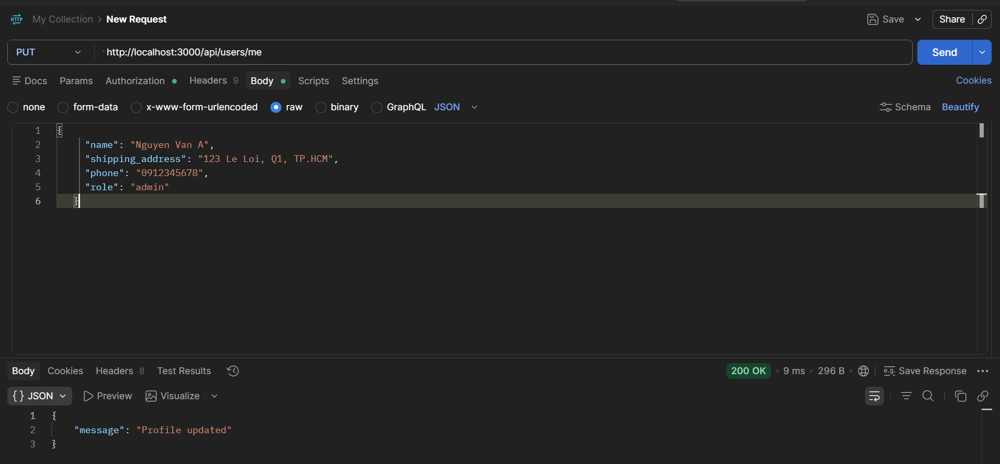
- Minh chứng 2: Kết quả GET profile hiển thị tài khoản đã bị nâng lên admin
  

---

#### BUG-FR04-02: Mất dữ liệu khi cập nhật một phần (Data Loss on Partial Update)

#### Mô tả lỗi

Khi thực hiện cập nhật hồ sơ cá nhân qua phương thức PUT, nếu client không truyền đầy đủ tất cả các trường (ví dụ thiếu trường `phone`), API backend sẽ ghi đè giá trị của trường bị thiếu thành `NULL` trong database, làm mất dữ liệu đã có trước đó của người dùng.

#### Điều kiện tiên quyết

- Tài khoản đã đăng nhập và đã điền đầy đủ dữ liệu thông tin cá nhân ban đầu (`name`, `shipping_address`, `phone`).

#### Các bước tái hiện

1. Gửi request `PUT /api/users/me` chỉ chứa thông tin tên và địa chỉ (bỏ trống/không gửi trường `phone`):
   ```json
   {
     "name": "Nguyen Van A New",
     "shipping_address": "123 Le Loi, Q1, TP.HCM"
   }
   ```
2. Gọi request `GET /api/users/me` để lấy thông tin hồ sơ cá nhân hiện tại.

#### Kết quả mong đợi

- Các trường thông tin không được gửi lên trong body request PUT phải được giữ nguyên giá trị cũ trong cơ sở dữ liệu (Partial Update an sau).

#### Kết quả thực tế

- API trả về mã trạng thái `200 OK` cập nhật thành công.
- Tuy nhiên, dữ liệu trường `phone` trong database đã bị ghi đè thành `null`.

#### Test Case đối chiếu

- **Mã Test Case:** FR04-DOM-TC07
- **Phương pháp thiết kế:** Domain Testing

#### Môi trường

- **Hệ điều hành:** Windows 11
- **Trình duyệt / Công cụ:** Postman / API Client / Node.js
- **Môi trường chạy:** SUT local server (port 3000)

#### Bằng chứng và ảnh chụp màn hình

- Minh chứng 1: Gửi request PUT khuyết trường phone khiến API backend cập nhật thành công
  
- Minh chứng 2: Kết quả GET profile cho thấy trường phone đã bị ghi đè thành null
  

---

#### BUG-FR04-03: Thiếu kiểm tra dữ liệu đầu vào (Lack of Input Validation)

#### Mô tả lỗi

API backend `PUT /api/users/me` hoàn toàn thiếu cơ chế kiểm tra tính hợp lệ dữ liệu đầu vào. Hệ thống chấp nhận lưu chuỗi rỗng cho các trường bắt buộc như `name`, `shipping_address`, `phone` và lưu các giá trị không đúng định dạng số điện thoại (ví dụ: chữ cái `abc-phone`) vào cơ sở dữ liệu.

#### Điều kiện tiên quyết

- Khách hàng đã đăng nhập và có JWT Token hợp lệ để gọi API.

#### Các bước tái hiện

1. Gửi request `PUT /api/users/me` chứa dữ liệu rỗng và sai định dạng:
   ```json
   {
     "name": "",
     "shipping_address": "",
     "phone": "abc-phone"
   }
   ```
2. Thực hiện request `GET /api/users/me` để kiểm tra thông tin hồ sơ vừa lưu.

#### Kết quả mong đợi

- API backend phải kiểm tra dữ liệu đầu vào, từ chối cập nhật và trả về lỗi `400 Bad Request` cùng danh sách thông điệp lỗi cụ thể khi các trường bắt buộc bị rỗng hoặc sai định dạng.

#### Kết quả thực tế

- API vẫn trả về mã trạng thái `200 OK` (thông điệp: `"Profile updated"`).
- Cơ sở dữ liệu ghi nhận thành công chuỗi rỗng cho tên, địa chỉ và lưu chuỗi ký tự chữ `"abc-phone"` làm số điện thoại.

#### Test Case đối chiếu

- **Mã Test Case:** FR04-DOM-TC09, FR04-DOM-TC10, FR04-DOM-TC11, FR04-DOM-TC12, FR04-BVA-TC04, FR04-BVA-TC05, FR04-BVA-TC06
- **Phương pháp thiết kế:** Domain Testing & Boundary Value Analysis

#### Môi trường

- **Hệ điều hành:** Windows 11
- **Trình duyệt / Công cụ:** Postman / API Client / Node.js
- **Môi trường chạy:** SUT local server (port 3000)

#### Bằng chứng và ảnh chụp màn hình

- Minh chứng 1: Gửi request PUT chứa thông tin rỗng và sai định dạng phone
  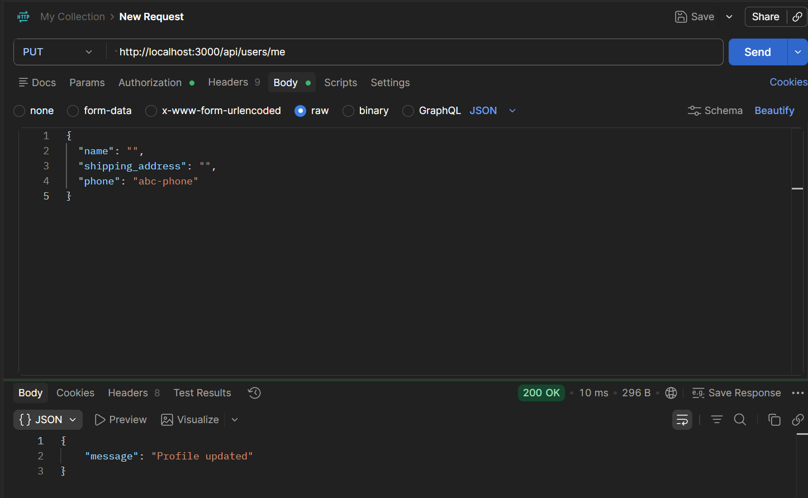
- Minh chứng 2: Kết quả GET profile cho thấy thông tin không hợp lệ được lưu thành công
  

---

#### BUG-FR04-04: Lộ lọt thông tin nhạy cảm (Sensitive Data Exposure)

#### Mô tả lỗi

Khi người dùng xem thông tin cá nhân của mình, API backend trả về cả các trường dữ liệu nhạy cảm hoặc mang tính bảo mật nội bộ trong JSON response, gây rủi ro an toàn thông tin nghiêm trọng.

#### Điều kiện tiên quyết

- Người dùng đã đăng ký và đăng nhập thành công vào hệ thống.

#### Các bước tái hiện

1. Đăng nhập để nhận JWT Token.
2. Gửi request `GET /api/users/me` kèm header authorization.
3. Phân tích cấu trúc JSON response nhận về từ server.

#### Kết quả mong đợi

- Response chỉ trả về các thông tin hồ sơ cơ bản cần thiết: `id`, `name`, `email`, `shipping_address`, `phone`.
- Tuyệt đối không được chứa mật khẩu (bằng mọi hình thức mã hóa/hash) và các thông tin nội bộ của hệ thống như bộ đếm đăng nhập sai, reset token.

#### Kết quả thực tế

- JSON response trả về chứa đầy đủ các trường: `"password"` (chứa mật khẩu mã hóa bcrypt hash của người dùng), `"reset_token"`, `"login_attempts"`, `"locked_until"`.

#### Test Case đối chiếu

- **Mã Test Case:** FR04-DOM-TC01
- **Phương pháp thiết kế:** Domain Testing

#### Môi trường

- **Hệ điều hành:** Windows 11
- **Trình duyệt / Công cụ:** Postman / API Client / Node.js
- **Môi trường chạy:** SUT local server (port 3000)

#### Bằng chứng và ảnh chụp màn hình

- Minh chứng 1: Response của API GET profile để lộ các trường nhạy cảm như password hash và reset token
  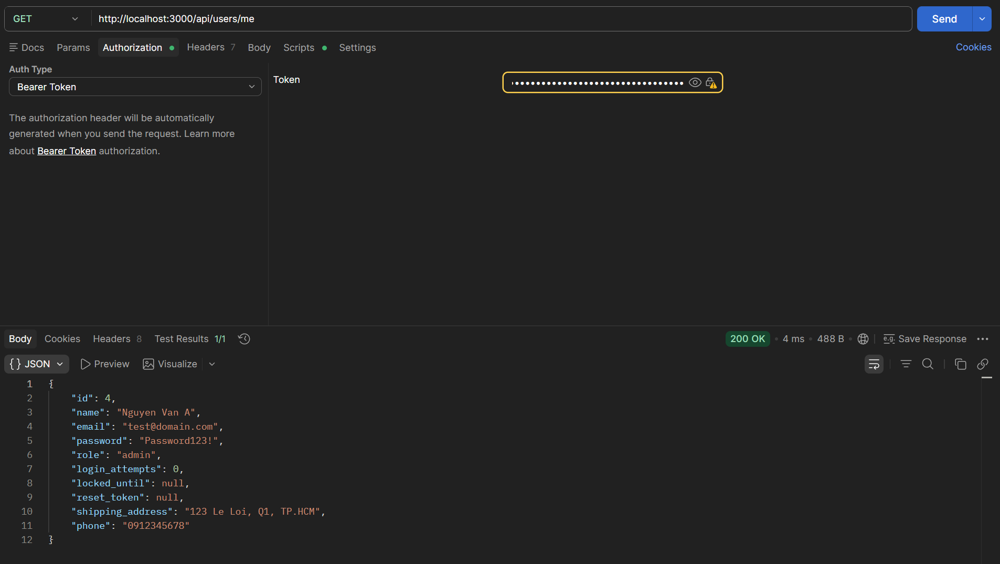

---

#### BUG-FR04-05: Lỗi định dạng Regex ở Frontend chặn số điện thoại hợp lệ

#### Mô tả lỗi

Trên giao diện Frontend (Web Client), biểu thức chính quy (Regex) dùng để kiểm tra tính hợp lệ của số điện thoại được định nghĩa sai quy tắc logic (`/^[1-9][0-9]{8,9}$/`). Điều này dẫn tới việc ngăn chặn toàn bộ số điện thoại Việt Nam bắt đầu bằng số `0` cập nhật hồ sơ cá nhân.

Hành vi này đồng thời làm phát sinh lỗi liên đới:

1. Nếu người dùng chỉ muốn cập nhật tên hoặc địa chỉ (giữ nguyên số điện thoại bắt đầu bằng 0), hệ thống vẫn báo lỗi số điện thoại không hợp lệ và ép người dùng phải sửa số điện thoại mới cho cập nhật.
2. Ép người dùng nhập số điện thoại không bắt đầu bằng số 0 (ví dụ `1234567890`) thì mới cho lưu.

#### Điều kiện tiên quyết

- Người dùng truy cập và cập nhật thông tin cá nhân trên trang Profile của giao diện Web.

#### Các bước tái hiện

1. Đi tới trang cá nhân (Profile) trên giao diện Web.
2. Nhập số điện thoại Việt Nam hợp lệ bắt đầu bằng số 0 (ví dụ: `0912345678`).
3. Click vào nút "Cập nhật".

#### Kết quả mong đợi

- Hệ thống chấp nhận số điện thoại bắt đầu bằng số 0 hợp lệ và cập nhật thành công mà không hiển thị cảnh báo chặn.

#### Kết quả thực tế

- Trình duyệt hiển thị thông báo alert: _"Số điện thoại không hợp lệ. Vui lòng nhập đúng 9-10 chữ số."_ và chặn toàn bộ tiến trình cập nhật tên hoặc địa chỉ của người dùng.

#### Test Case đối chiếu

- **Mã Test Case:** FR04-DOM-TC02, FR04-BVA-TC03
- **Phương pháp thiết kế:** Domain Testing & Boundary Value Analysis (Exploratory)

#### Môi trường

- **Hệ điều hành:** Windows 11
- **Trình duyệt / Công cụ:** Google Chrome / Web Frontend
- **Môi trường chạy:** SUT frontend-web (port 5173)

#### Bằng chứng và ảnh chụp màn hình

- Minh chứng 1: Nhập số điện thoại bắt đầu bằng số 0 hợp lệ và bị Frontend báo lỗi alert
  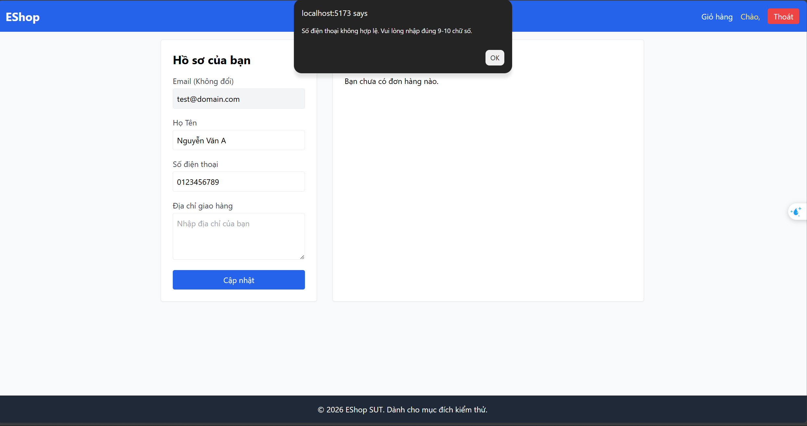
- Minh chứng 2: Hệ thống chỉ chấp nhận lưu khi người dùng nhập số điện thoại không bắt đầu bằng số 0
  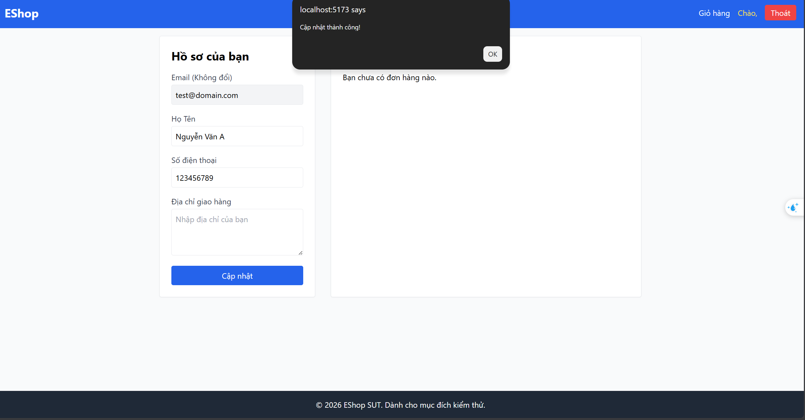

---

### 2.2 FR-08 - Checkout

#### BUG-FR08-01: Checkout không xóa giỏ hàng sau khi thanh toán thành công

#### Mô tả lỗi

Theo đặc tả nghiệp vụ, sau khi người dùng tiến hành thanh toán thành công (checkout), giỏ hàng hiện tại phải được xóa sạch (clear cart) để người dùng có thể mua sắm đơn hàng mới. Tuy nhiên, sau khi nhận phản hồi checkout thành công từ API backend, giỏ hàng của người dùng vẫn giữ nguyên các sản phẩm cũ.

#### Điều kiện tiên quyết

- Người dùng đã đăng nhập và có JWT Token hợp lệ.
- Giỏ hàng hiện tại có sản phẩm nominal `{ id: 1, price: 100000, quantity: 2 }`.

#### Các bước tái hiện

1. Gửi request `POST http://localhost:3000/api/cart` kèm header `Authorization: Bearer <token>` để thêm sản phẩm vào giỏ hàng:
   ```json
   {
     "id": 1,
     "name": "Sample Product",
     "price": 100000,
     "quantity": 2
   }
   ```
2. Gửi request `POST http://localhost:3000/api/checkout` kèm header `Authorization: Bearer <token>` để tiến hành checkout:
   ```json
   {
     "total_amount": 200000,
     "shipping_address": "123 Le Loi, TP.HCM"
   }
   ```
3. Gửi request `GET http://localhost:3000/api/cart` kèm header `Authorization: Bearer <token>` để kiểm tra danh sách sản phẩm trong giỏ hàng.

#### Kết quả mong đợi

- Sau khi checkout thành công, giỏ hàng của người dùng phải được xóa trống (trả về danh sách rỗng `[]` khi gọi GET).

#### Kết quả thực tế

- API trả về mã trạng thái `200 OK` (Checkout thành công và tạo order), nhưng khi gọi GET `/api/cart` danh sách sản phẩm cũ vẫn tồn tại nguyên vẹn.

#### Test Case đối chiếu

- **Mã Test Case:** FR08-DOM-TC01, FR08-DOM-TC13, FR08-DOM-TC14, FR08-BVA-TC02, FR08-BVA-TC05, FR08-BVA-TC06, FR08-BVA-TC08, FR08-BVA-TC09, FR08-BVA-TC11, FR08-BVA-TC12, FR08-BVA-TC14, FR08-BVA-TC15, FR08-BVA-TC17, FR08-BVA-TC18
- **Phương pháp thiết kế:** Domain Testing & Boundary Value Analysis

#### Môi trường

- **Hệ điều hành:** Windows 11
- **Trình duyệt / Công cụ:** Postman / API Client
- **Môi trường chạy:** SUT local server (port 3000)

#### Bằng chứng

- Response trả về thành công `200 OK` cho request checkout, nhưng khi gửi request GET `/api/cart` sau đó, danh sách giỏ hàng vẫn trả về danh sách các sản phẩm trước đó thay vì giỏ hàng trống `[]`.
- Minh chứng 1: Thêm sản phẩm nominal vào giỏ hàng trước checkout
  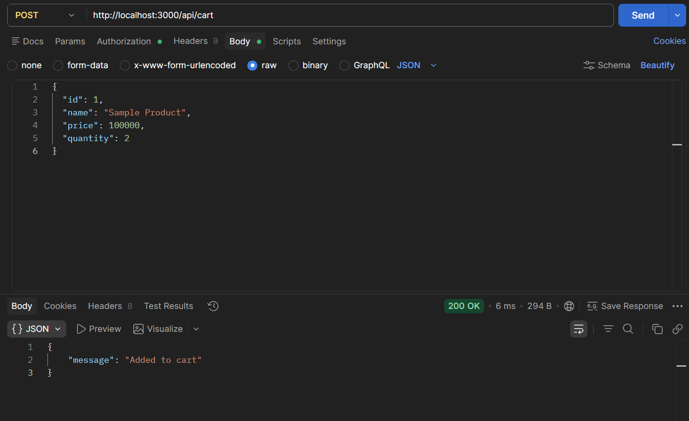
- Minh chứng 2: Checkout trả về thành công
  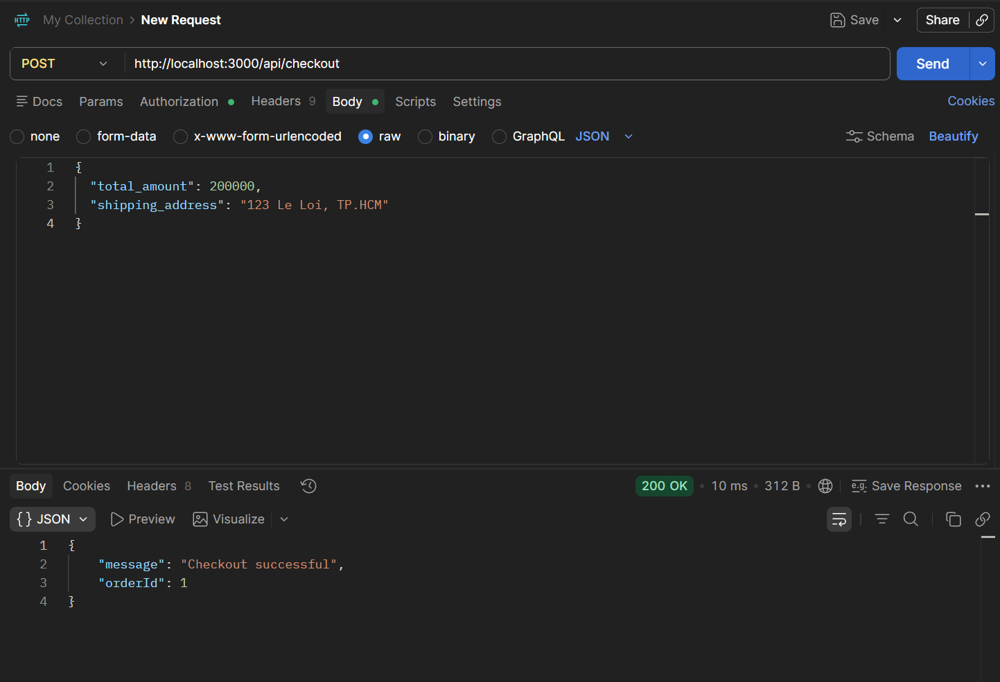
- Minh chứng 3: Giỏ hàng vẫn còn sản phẩm sau checkout
  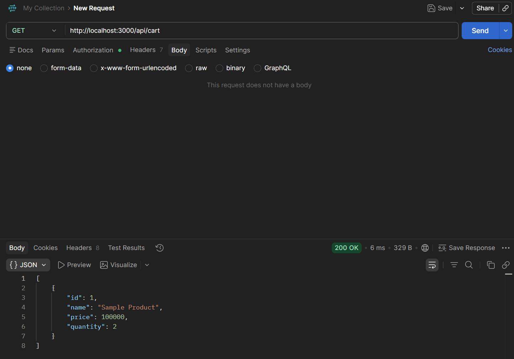

---

#### BUG-FR08-02: Backend tin `total_amount` từ client và tạo order với tổng tiền không hợp lệ

#### Mô tả lỗi

FR-08 yêu cầu backend phải tự tính lại tổng tiền từ giỏ hàng và không chấp nhận `total_amount` do client gửi lên. Thực tế backend lưu trực tiếp mọi giá trị `total_amount` trong request, bao gồm thiếu field, lệch cart total, `0`, số âm và chuỗi không phải số.

#### Điều kiện tiên quyết

- Người dùng đã đăng nhập.
- Cart có sản phẩm nominal `{ price: 100000, quantity: 2 }`, tổng đúng là `200000`.

#### Các bước tái hiện

1. Gửi request `POST http://localhost:3000/api/cart` kèm header `Authorization: Bearer <token>` để thêm sản phẩm nominal vào giỏ hàng:

   ```json
   {
     "id": 1,
     "name": "Sample Product",
     "price": 100000,
     "quantity": 2
   }
   ```

2. Gửi request `POST http://localhost:3000/api/checkout` kèm header `Authorization: Bearer <token>` với một giá trị `total_amount` không hợp lệ (ví dụ gửi số âm `-1` thay vì số tiền đúng `200000`):

   ```json
   {
     "total_amount": -1,
     "shipping_address": "123 Le Loi, TP.HCM"
   }
   ```

   _(Lưu ý: Lỗi tương tự xảy ra khi gửi các giá trị không hợp lệ khác như `0`, `"abc"`, lệch tiền giỏ hàng, hoặc bỏ trống hoàn toàn trường `total_amount`)._

3. Gửi request `GET http://localhost:3000/api/orders/my-orders` kèm header `Authorization: Bearer <token>` để xem thông tin đơn hàng vừa được tạo.

#### Kết quả mong đợi

- Backend phải tự tính lại tổng tiền từ cart hoặc từ chối request không hợp lệ.
- Không được tạo order với tổng tiền `null`, sai lệch, `0`, âm hoặc sai kiểu.

#### Kết quả thực tế

- API đều trả `200 OK` và tạo order.
- Order được lưu với `total_amount=null`, `100000`, `0`, `-1`, hoặc `"abc"` đúng như client gửi.

#### Test Case đối chiếu

- **Mã Test Case:** FR08-DOM-TC05, FR08-DOM-TC06, FR08-DOM-TC07, FR08-DOM-TC08, FR08-DOM-TC09
- **Phương pháp thiết kế:** Domain Testing

#### Môi trường

- **Hệ điều hành:** Windows 11
- **Trình duyệt / Công cụ:** Postman / API Client
- **Môi trường chạy:** SUT local server (port 3000)

#### Bằng chứng

- API trả về `200 OK` cho tất cả các trường hợp gửi giá trị `total_amount` sai lệch. Danh sách đơn hàng (`GET /api/orders/my-orders`) hiển thị đơn hàng đã được lưu thành công với các tổng tiền không hợp lệ tương ứng.
- Minh chứng 1: Checkout vẫn thành công khi `total_amount` không hợp lệ
  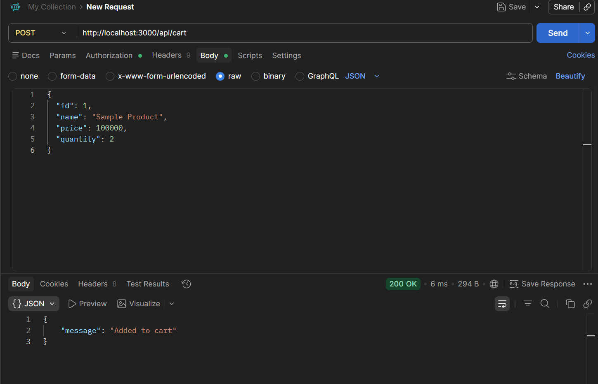
- Minh chứng 2: Order được tạo với tổng tiền sai lệch
  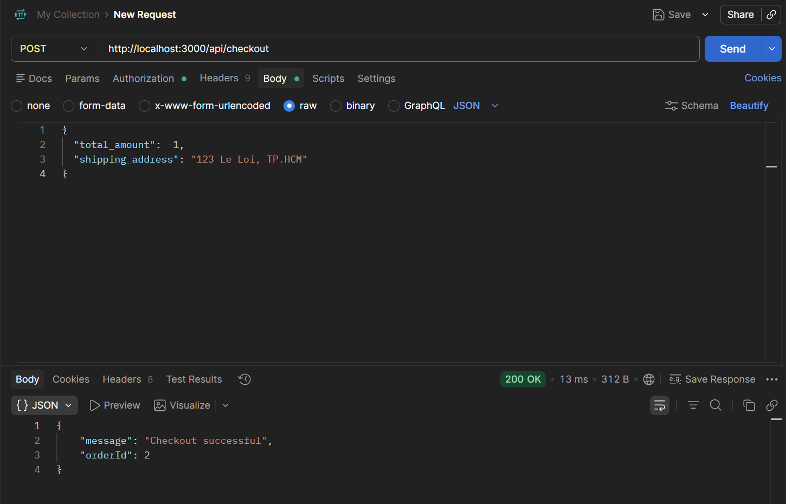
- Minh chứng 3: Danh sách order ghi nhận giá trị `total_amount` từ client
  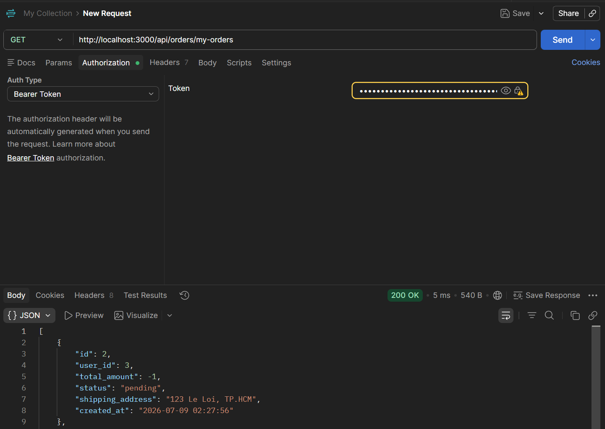

---

#### BUG-FR08-03: Backend không kiểm tra `shipping_address` khi checkout

#### Mô tả lỗi

API checkout không kiểm tra trường địa chỉ giao hàng. Hệ thống vẫn tạo order khi thiếu `shipping_address`, địa chỉ rỗng hoặc chỉ gồm khoảng trắng.

#### Điều kiện tiên quyết

- Người dùng đã đăng nhập.
- Cart có sản phẩm nominal.

#### Các bước tái hiện

1. Gửi request `POST http://localhost:3000/api/cart` kèm header `Authorization: Bearer <token>` để thêm sản phẩm nominal vào giỏ:

   ```json
   {
     "id": 1,
     "name": "Sample Product",
     "price": 100000,
     "quantity": 2
   }
   ```

2. Gửi request `POST http://localhost:3000/api/checkout` kèm header `Authorization: Bearer <token>` với trường `shipping_address` để rỗng `""`:

   ```json
   {
     "total_amount": 200000,
     "shipping_address": ""
   }
   ```

   _(Lưu ý: Lỗi tương tự xảy ra khi gửi địa chỉ chỉ chứa khoảng trắng `"   "` hoặc khuyết hoàn toàn trường `shipping_address`)._

3. Gửi request `GET http://localhost:3000/api/orders/my-orders` kèm header `Authorization: Bearer <token>` để xem thông tin đơn hàng vừa được tạo.

#### Kết quả mong đợi

- Hệ thống phải trả validation error và không tạo order khi địa chỉ giao hàng bị thiếu hoặc không có nội dung.

#### Kết quả thực tế

- API trả `200 OK` và tạo order với `shipping_address=null`, `""`, hoặc `"   "`.

#### Test Case đối chiếu

- **Mã Test Case:** FR08-DOM-TC10, FR08-DOM-TC11, FR08-DOM-TC12
- **Phương pháp thiết kế:** Domain Testing

#### Môi trường

- **Hệ điều hành:** Windows 11
- **Trình duyệt / Công cụ:** Postman / API Client
- **Môi trường chạy:** SUT local server (port 3000)

#### Bằng chứng

- API chấp nhận tạo đơn hàng thành công với mã `200 OK`. Khi truy vấn lại thông tin đơn hàng, trường `shipping_address` lưu các giá trị `null`, `""` hoặc `"   "`.
- Minh chứng 1: Checkout với `shipping_address` rỗng vẫn thành công
  
- Minh chứng 2: Checkout với `shipping_address` không hợp lệ vẫn tạo order
  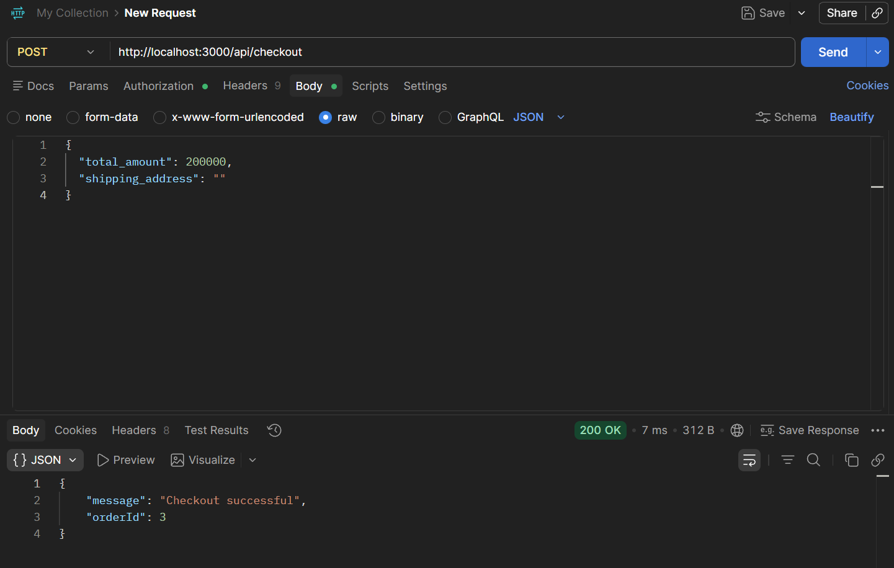
- Minh chứng 3: Order lưu địa chỉ giao hàng không hợp lệ
  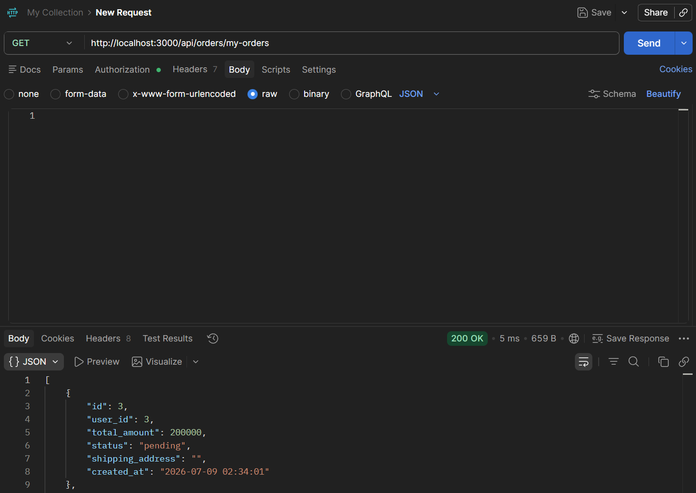

---

#### BUG-FR08-04: Ô nhập Tổng tiền thanh toán trên giao diện Checkout cho phép người dùng tự do chỉnh sửa

#### Mô tả lỗi

Trên màn hình xác nhận thanh toán (Checkout), số tiền "Tổng tiền thanh toán" hiển thị dưới dạng ô nhập dữ liệu cho phép người dùng tự do thay đổi (chỉnh sửa số tiền). Điều này vi phạm quy tắc nghiệp vụ vì tổng tiền thanh toán phải là giá trị cố định được tính toán tự động từ giỏ hàng và chỉ hiển thị dưới dạng chỉ đọc (read-only).

#### Điều kiện tiên quyết

- Người dùng truy cập trang Checkout trên Web Frontend.
- Giỏ hàng hiện đang có sản phẩm.

#### Các bước tái hiện

1. Truy cập trang giỏ hàng `http://localhost:5173/cart`, thêm sản phẩm bất kỳ vào giỏ hàng.
2. Bấm nút "Tiến hành thanh toán" để chuyển hướng tới màn hình Checkout (`http://localhost:5173/checkout`).
3. Tại trường "Tổng tiền thanh toán (VND)", click chuột vào ô nhập và thử thay đổi số tiền (ví dụ nhập số tiền bất kỳ như `100` thay vì giá trị mặc định của giỏ hàng).

#### Kết quả mong đợi

- Tổng tiền thanh toán phải được hiển thị dưới dạng văn bản tĩnh hoặc ô nhập chỉ đọc (read-only), người dùng không thể chỉnh sửa hay nhập số khác.

#### Kết quả thực tế

- Ô nhập tiền cho phép người dùng tự do thay đổi, xóa, hoặc gõ một số tiền bất kỳ.

#### Test Case đối chiếu

- **Mã Test Case:** FR08-DOM-TC06
- **Phương pháp thiết kế:** Giao diện Web / Domain Testing

#### Môi trường

- **Hệ điều hành:** Windows 11
- **Trình duyệt / Công cụ:** Google Chrome / Firefox
- **Môi trường chạy:** SUT frontend-web (port 5173)

#### Bằng chứng

- Trường hiển thị Tổng tiền thanh toán trên giao diện Checkout được định nghĩa bằng thẻ input số hoạt động bình thường, cho phép nhập liệu tự do.
- Minh chứng 1: Trường tổng tiền thanh toán hiển thị dưới dạng ô nhập
  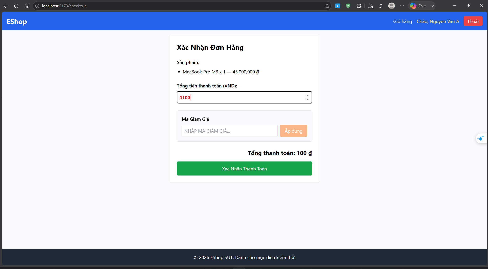
- Minh chứng 2: Người dùng có thể sửa tổng tiền thanh toán
  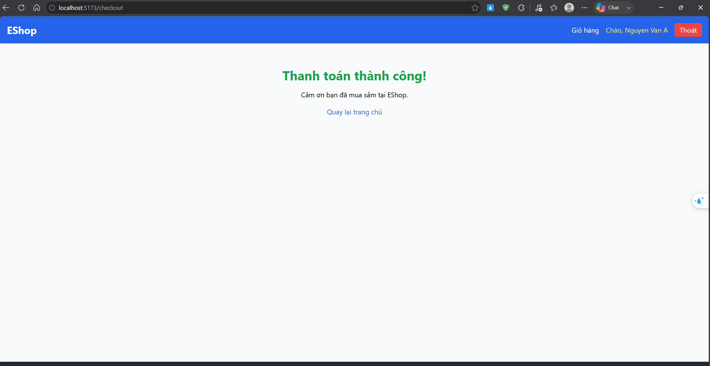

---

#### BUG-FR08-05: Backend API cart và checkout chấp nhận sản phẩm có số lượng hoặc đơn giá bằng 0

#### Mô tả lỗi

API backend không kiểm duyệt thông tin sản phẩm khi thêm vào giỏ hàng (`POST /api/cart`) và khi tiến hành đặt hàng. Hệ thống chấp nhận sản phẩm có số lượng bằng 0 (`quantity: 0`) hoặc đơn giá bằng 0 (`price: 0`) và cho phép hoàn tất đơn hàng với tổng thanh toán bằng 0đ mà không đưa ra bất kỳ cảnh báo hay validation error nào.

#### Điều kiện tiên quyết

- Người dùng đã đăng nhập và có JWT Token hợp lệ để gọi API.

#### Các bước tái hiện

1. Gửi request `POST http://localhost:3000/api/cart` kèm header `Authorization: Bearer <token>` để thêm sản phẩm không hợp lệ (số lượng bằng 0 và đơn giá bằng 0đ) vào giỏ hàng:

   ```json
   {
     "id": 1,
     "name": "Invalid Product",
     "price": 0,
     "quantity": 0
   }
   ```

2. Gửi request `POST http://localhost:3000/api/checkout` kèm header `Authorization: Bearer <token>` để tiến hành đặt hàng:

   ```json
   {
     "total_amount": 0,
     "shipping_address": "123 Le Loi, TP.HCM"
   }
   ```

   _(Lưu ý: Lỗi tương tự xảy ra khi sản phẩm có số lượng = 0 nhưng đơn giá > 0, hoặc đơn giá = 0 nhưng số lượng > 0)._

#### Kết quả mong đợi

- API `POST /api/cart` phải từ chối thêm sản phẩm có số lượng hoặc đơn giá không hợp lệ và trả về lỗi `400 Bad Request`.
- API `POST /api/checkout` phải kiểm tra tính hợp lệ của các sản phẩm trong giỏ và từ chối tạo đơn hàng.

#### Kết quả thực tế

- Cả hai API đều hoạt động thành công và trả về mã trạng thái `200 OK`.
- Đơn hàng được tạo thành công trong DB với tổng tiền bằng 0đ chứa các sản phẩm có số lượng/đơn giá bằng 0.

#### Test Case đối chiếu

- **Mã Test Case:** FR08-BVA-TC10, FR08-BVA-TC16
- **Phương pháp thiết kế:** Boundary Value Analysis

#### Môi trường

- **Hệ điều hành:** Windows 11
- **Trình duyệt / Công cụ:** Postman / API Client
- **Môi trường chạy:** SUT local server (port 3000)

#### Bằng chứng

- Phản hồi `200 OK` nhận được từ API giỏ hàng khi gửi request thêm sản phẩm có số lượng/đơn giá bằng 0. Gọi API checkout thành công và tạo đơn hàng có tổng giá trị bằng 0đ thành công.
- Minh chứng 1: API cart chấp nhận sản phẩm có `price=0` hoặc `quantity=0`
  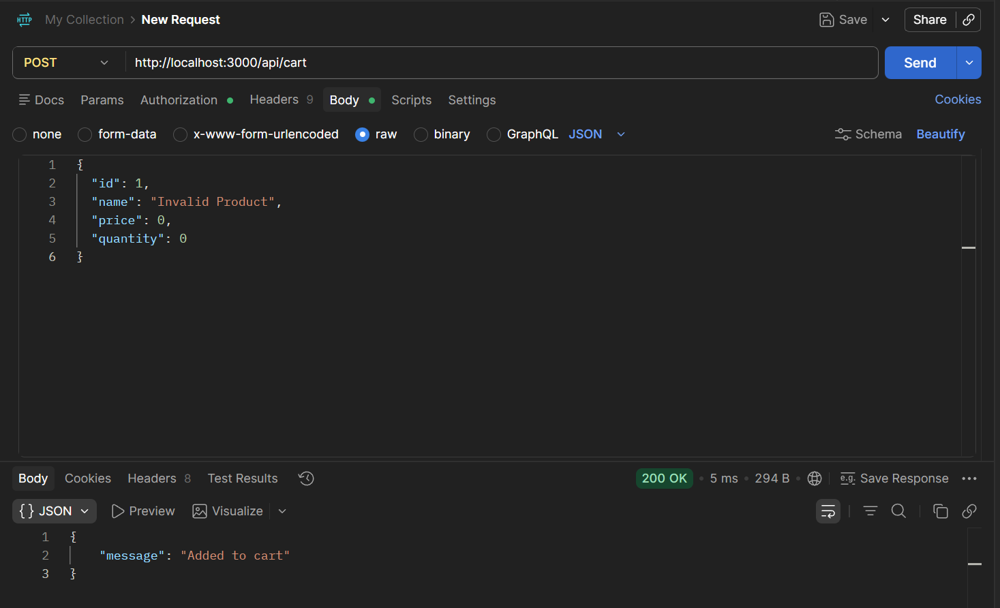
- Minh chứng 2: Checkout với cart item không hợp lệ vẫn thành công
  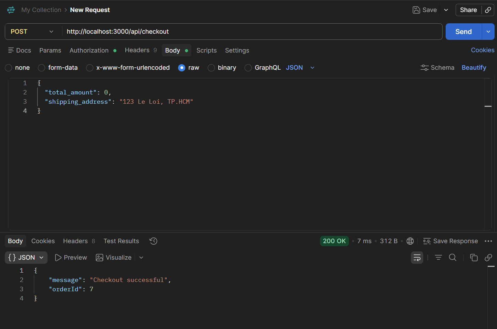
- Minh chứng 3: Order được tạo với tổng tiền bằng 0
  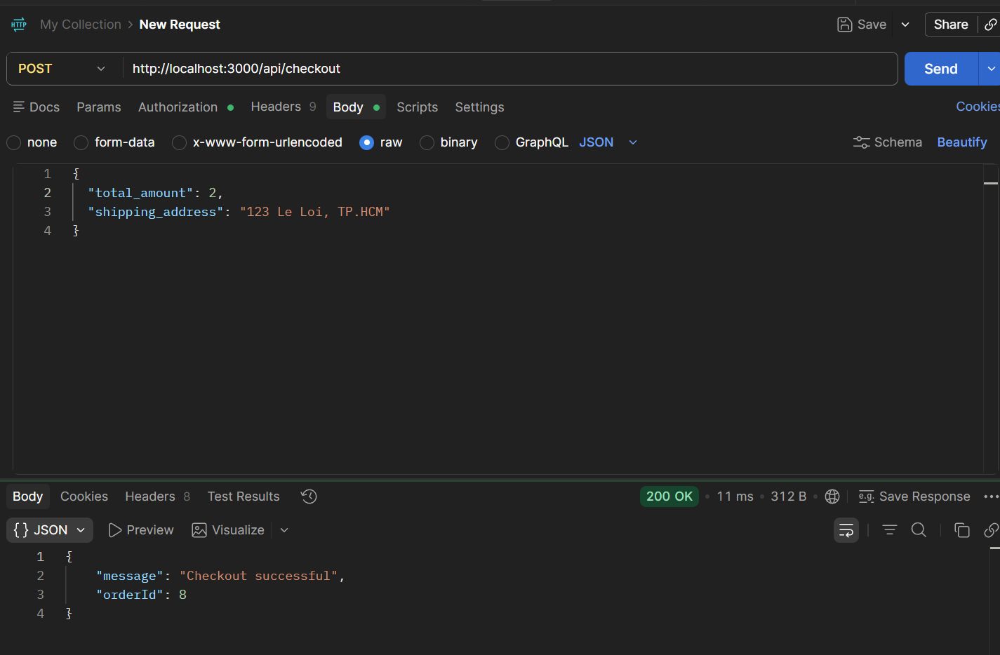

---

#### BUG-FR08-06: Hệ thống cho phép đặt hàng (checkout) với giỏ hàng rỗng

#### Mô tả lỗi

Quy trình nghiệp vụ mua sắm yêu cầu giỏ hàng của khách hàng phải chứa ít nhất một sản phẩm hợp lệ mới được phép thực hiện thanh toán (checkout). Tuy nhiên, API backend checkout chấp nhận việc gửi yêu cầu thanh toán khi giỏ hàng rỗng, tạo đơn hàng thành công trong cơ sở dữ liệu với tổng tiền bằng 0đ.

#### Điều kiện tiên quyết

- Người dùng đã đăng nhập và có JWT Token hợp lệ.
- Giỏ hàng của người dùng hiện đang trống (0 sản phẩm).

#### Các bước tái hiện

1. Gửi trực tiếp request `POST http://localhost:3000/api/checkout` kèm header `Authorization: Bearer <token>` với thông tin thanh toán:
   ```json
   {
     "total_amount": 0,
     "shipping_address": "123 Le Loi, TP.HCM"
   }
   ```
2. Gửi request `GET http://localhost:3000/api/orders/my-orders` kèm header `Authorization: Bearer <token>` để kiểm tra danh sách đơn hàng đã mua.

#### Kết quả mong đợi

- Backend phải kiểm tra trạng thái giỏ hàng trước khi tạo order, từ chối yêu cầu checkout của giỏ hàng rỗng và trả về lỗi `400 Bad Request`.

#### Kết quả thực tế

- API trả về `200 OK` (thông điệp: `"Checkout successful"`) và tạo thành công một đơn hàng mới có `total_amount = 0` trong cơ sở dữ liệu.

#### Test Case đối chiếu

- **Mã Test Case:** FR08-DOM-TC04, FR08-BVA-TC13
- **Phương pháp thiết kế:** Domain Testing & Boundary Value Analysis

#### Môi trường

- **Hệ điều hành:** Windows 11
- **Trình duyệt / Công cụ:** Postman / API Client
- **Môi trường chạy:** SUT local server (port 3000)

#### Bằng chứng

- Phản hồi `200 OK` nhận được từ API checkout với request thanh toán giỏ hàng rỗng, tạo đơn hàng mới có tổng giá trị bằng 0đ thành công.
- Minh chứng 1: Giỏ hàng đang trống trước checkout
  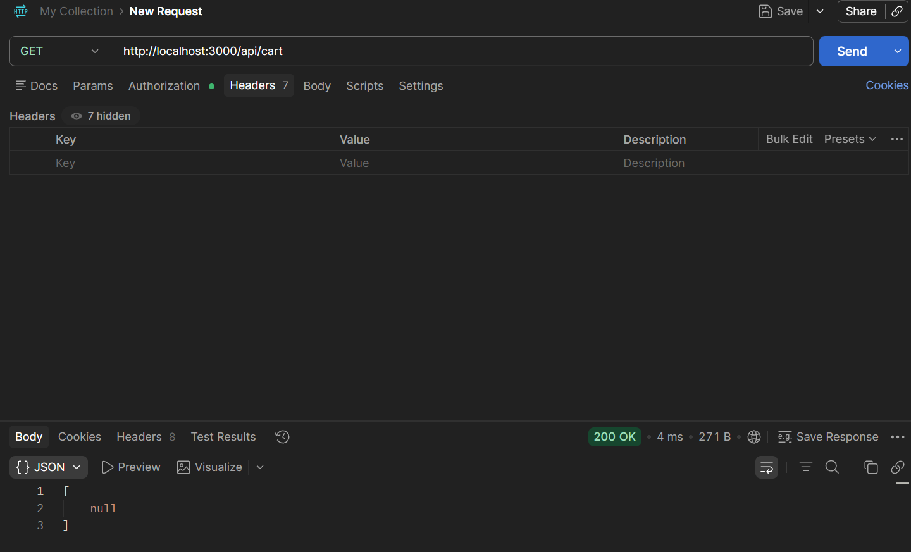
- Minh chứng 2: Checkout giỏ hàng rỗng vẫn trả về thành công
  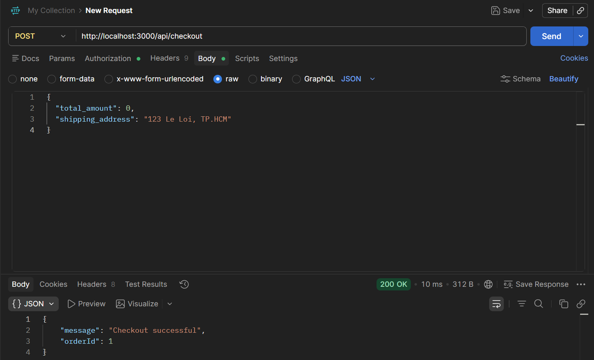
- Minh chứng 3: Order vẫn được tạo với tổng tiền bằng 0
  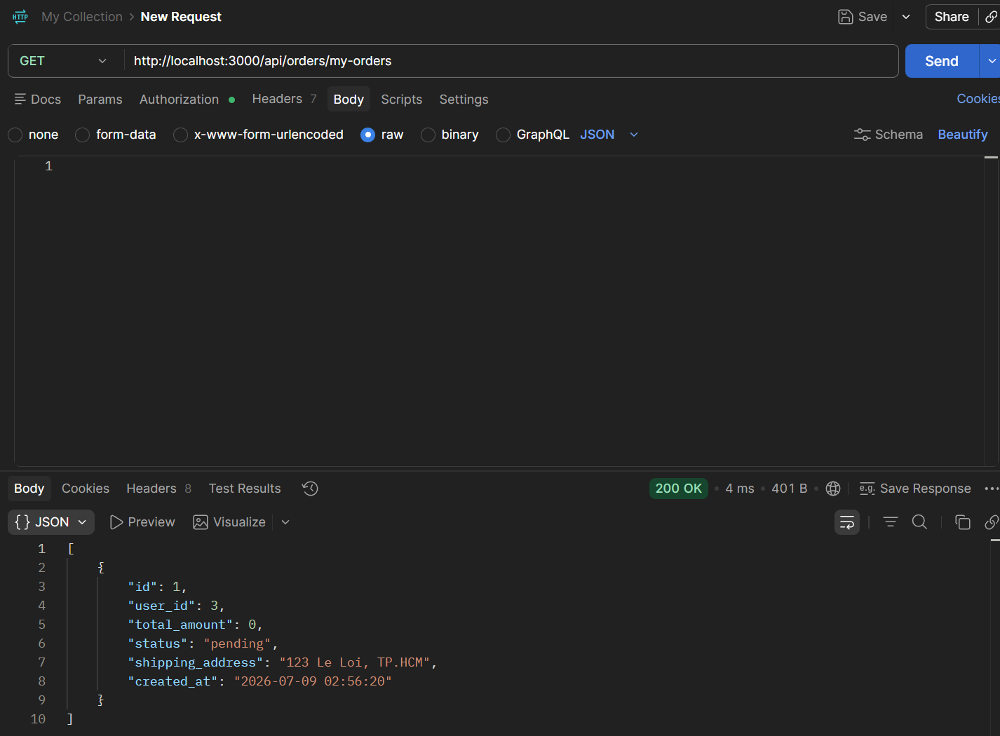

---

### 2.3 FR-15 - Product Management CRUD

#### BUG-FR15-01: API /api/products thiếu xác thực phân quyền và cho phép Guest truy cập CRUD

#### Mô tả lỗi

Các API thay đổi dữ liệu sản phẩm bao gồm `POST /api/products`, `PUT /api/products/:id`, và `DELETE /api/products/:id` hoàn toàn thiếu middleware xác thực (`authenticateToken`), cho phép khách vãng lai (Guest) hoặc người dùng thông thường không có quyền Admin thực hiện Thêm, Sửa, Xóa sản phẩm tùy ý trên hệ thống.

#### Điều kiện tiên quyết

- Backend SUT đang chạy cục bộ và Product APIs truy cập được.
- Có ít nhất một category hợp lệ trong hệ thống để gửi `category_id` khi tạo/cập nhật product.
- Không gửi header `Authorization`, hoặc sử dụng token không hợp lệ/non-admin token.
- Với update/delete, có ít nhất một product test tồn tại để thao tác.

#### Các bước tái hiện

1. Gửi request `POST http://localhost:3000/api/products` không kèm header `Authorization` với body:
   ```json
   {
     "name": "Guest Created Product",
     "price": 150000,
     "description": "Created by Guest",
     "imageUrl": "https://example.com/guest.png",
     "category_id": 1
   }
   ```
2. Gửi request `PUT http://localhost:3000/api/products/1` không kèm header `Authorization` để cập nhật một product đang tồn tại.
3. Gửi request `DELETE http://localhost:3000/api/products/2` không kèm header `Authorization` để xóa một product đang tồn tại.
4. Lặp lại các request trên với token không hợp lệ hoặc non-admin token.

#### Kết quả mong đợi

- Hệ thống từ chối yêu cầu và trả về lỗi `401 Unauthorized` hoặc `403 Forbidden`.
- Dữ liệu sản phẩm trong database không bị thay đổi.

#### Kết quả thực tế

- Tất cả các API trên đều trả về `200 OK` và thực hiện thêm/sửa/xóa thành công sản phẩm trong cơ sở dữ liệu SQLite.

#### Test Case đối chiếu

- **Mã Test Case:** FR15-DOM-TC04, FR15-DOM-TC05, FR15-DOM-TC06
- **Phương pháp thiết kế:** Domain Testing (Xác thực và Phân quyền)

#### Môi trường

- **Hệ điều hành:** Windows 11
- **Trình duyệt / Công cụ:** Postman / API Client / Node.js
- **Môi trường chạy:** SUT local server (port 3000)

#### Bằng chứng

- Guest hoặc user không có quyền Admin gửi `POST`/`PUT`/`DELETE` tới Product APIs vẫn nhận phản hồi `200 OK`. Product được tạo/cập nhật/xóa thành công mặc dù request không có quyền Admin.
- Minh chứng 1: Guest tạo product không token vẫn thành công
  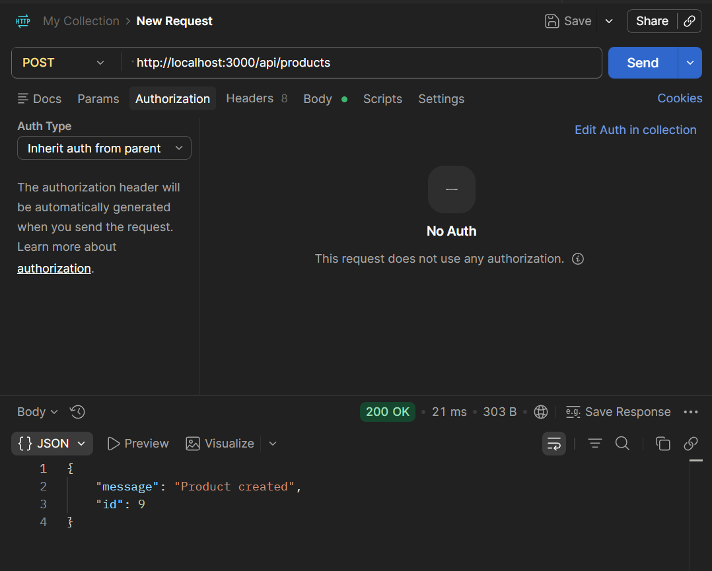
- Minh chứng 2: Guest cập nhật product không token vẫn thành công
  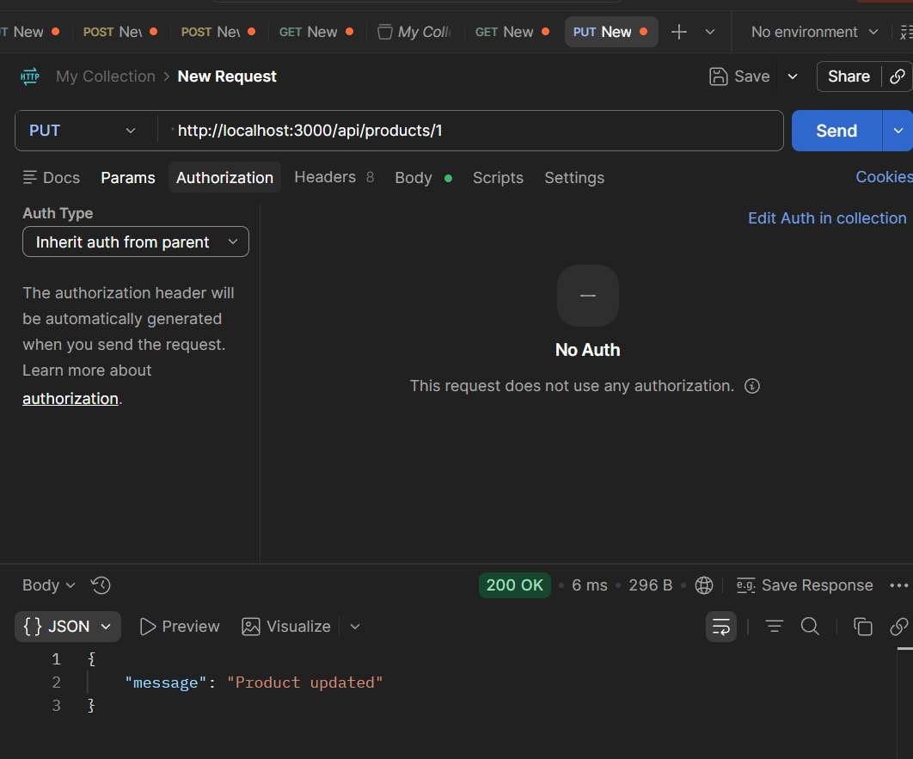
- Minh chứng 3: Guest xóa product không token vẫn thành công
  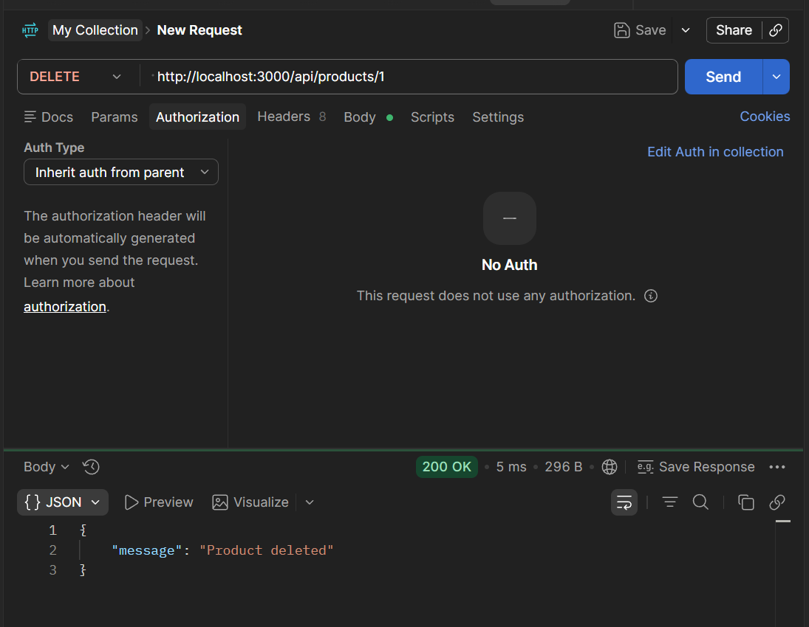

---

#### BUG-FR15-02: API /api/products backend không validate dữ liệu đầu vào khi thêm/sửa sản phẩm

#### Mô tả lỗi

API backend `POST /api/products` và `PUT /api/products/:id` thiếu cơ chế kiểm duyệt dữ liệu đầu vào (input validation). Hệ thống chấp nhận lưu sai kiểu dữ liệu, thiếu các field bắt buộc (`name`, `price`, `category_id`), tên sản phẩm rỗng `""`, tên sản phẩm dài 256 ký tự (vượt mức tối đa 255), đơn giá bằng 0 hoặc số âm `-1` vào database SQLite.

#### Điều kiện tiên quyết

- Backend SUT đang chạy cục bộ và Product APIs truy cập được.
- Admin đã đăng nhập và có JWT Token hợp lệ để gọi API.
- Có ít nhất một category hợp lệ trong hệ thống, ví dụ category lấy từ `GET /api/categories`.
- Với testcase update, cần có ít nhất một product test tồn tại trước khi gửi `PUT /api/products/:id`.

#### Các bước tái hiện

1. Gửi request `POST http://localhost:3000/api/products` kèm header `Authorization: Bearer <admin_token>` với body chứa tên rỗng và đơn giá âm:
   ```json
   {
     "name": "",
     "price": -1000,
     "description": "Invalid input product",
     "imageUrl": "https://example.com/invalid.png",
     "category_id": 1
   }
   ```
2. Gửi request `POST http://localhost:3000/api/products` kèm cùng header admin token với body chứa tên sản phẩm dài 256 ký tự `A...A`.
3. Gửi request `POST http://localhost:3000/api/products` kèm cùng header admin token, thiếu từng field bắt buộc như `name`, `price`, hoặc `category_id`.
4. Gửi request `PUT http://localhost:3000/api/products/<existing_product_id>` kèm cùng header admin token với dữ liệu sai kiểu hoặc thiếu field bắt buộc.

#### Kết quả mong đợi

- Server từ chối request, trả về mã lỗi `400 Bad Request` kèm theo các thông báo lỗi validation (ví dụ: "Name is required", "Price must be greater than 0").

#### Kết quả thực tế

- Server trả về `200 OK` và lưu thành công sản phẩm có tên rỗng, đơn giá âm, tên quá dài, sai kiểu dữ liệu, hoặc thiếu field bắt buộc vào cơ sở dữ liệu.

#### Test Case đối chiếu

- **Mã Test Case:** FR15-DOM-TC10, FR15-DOM-TC11, FR15-DOM-TC12, FR15-DOM-TC13, FR15-DOM-TC14, FR15-DOM-TC15, FR15-DOM-TC16, FR15-DOM-TC17, FR15-BVA-TC03, FR15-BVA-TC05, FR15-BVA-TC06, FR15-BVA-TC07
- **Phương pháp thiết kế:** Domain Testing & Boundary Value Analysis

#### Môi trường

- **Hệ điều hành:** Windows 11
- **Trình duyệt / Công cụ:** Postman / API Client / Node.js
- **Môi trường chạy:** SUT local server (port 3000)

#### Bằng chứng

- API trả `200 OK` và tạo product cho các request thiếu `name`, thiếu `price`, thiếu `category_id`, `name=""`, `name` 256 ký tự, `price=0`, `price=-1`, hoặc sai kiểu dữ liệu.
- Minh chứng 1: API chấp nhận dữ liệu product không hợp lệ
  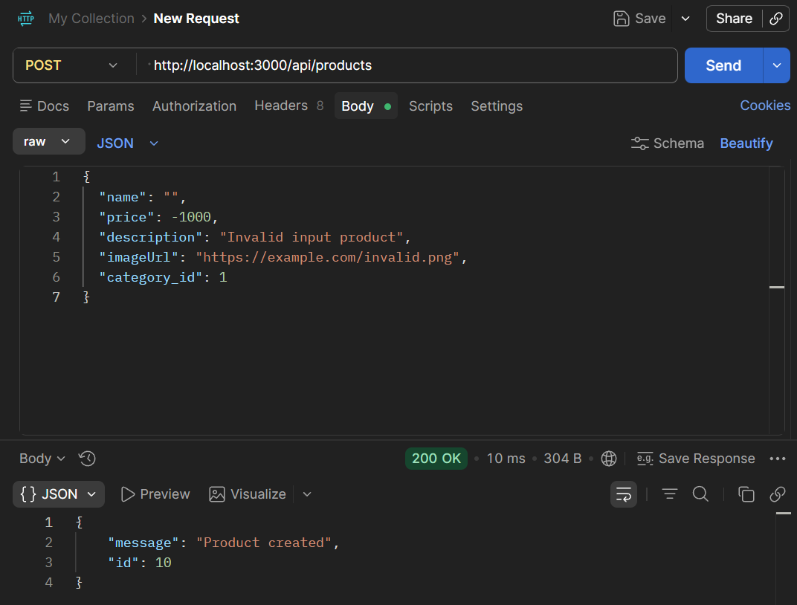
- Minh chứng 2: Product không hợp lệ vẫn được lưu thành công
  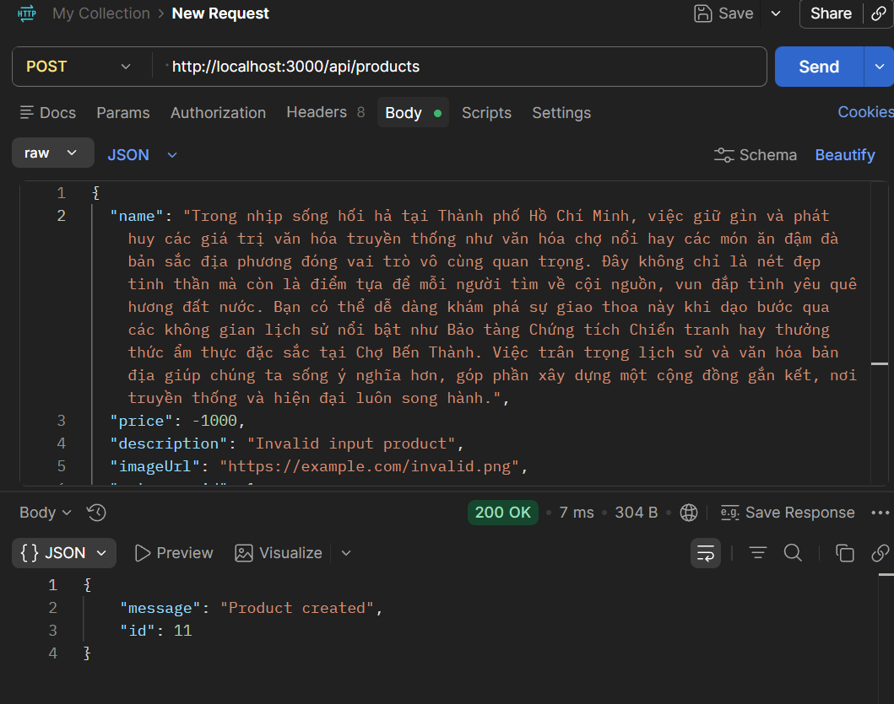

---

#### BUG-FR15-03: Backend chấp nhận imageUrl và category_id không hợp lệ khi thêm/sửa sản phẩm

#### Mô tả lỗi

API backend của Product CRUD không kiểm tra tính toàn vẹn tham chiếu (referential integrity) của `category_id` (chấp nhận một ID danh mục không tồn tại trong bảng categories) và chấp nhận định dạng `imageUrl` không hợp lệ.

#### Điều kiện tiên quyết

- Backend SUT đang chạy cục bộ và Product APIs truy cập được.
- Admin đã đăng nhập và có JWT Token hợp lệ để gọi API.
- Xác nhận `category_id = 999` không tồn tại bằng cách gọi `GET /api/categories` trước khi gửi request tạo/cập nhật product.
- Với testcase update, cần có ít nhất một product test tồn tại trước khi gửi `PUT /api/products/:id`.

#### Các bước tái hiện

1. Gửi request `GET http://localhost:3000/api/categories` để xác nhận không có category nào có ID = `999`.
2. Gửi request `POST http://localhost:3000/api/products` kèm header `Authorization: Bearer <admin_token>` với `category_id` = 999:
   ```json
   {
     "name": "Invalid Category Product",
     "price": 100000,
     "description": "Invalid Category ID",
     "imageUrl": "https://example.com/valid.png",
     "category_id": 999
   }
   ```
3. Gọi `GET http://localhost:3000/api/products` hoặc `GET http://localhost:3000/api/products/<new_product_id>` để kiểm tra product vừa được lưu.

#### Kết quả mong đợi

- Hệ thống từ chối tạo sản phẩm do category không tồn tại, trả về mã lỗi `400 Bad Request` hoặc lỗi vi phạm ràng buộc khóa ngoại (Foreign Key Constraint).

#### Kết quả thực tế

- API trả về `200 OK` và lưu thành công sản phẩm mới với `category_id = 999`.

#### Test Case đối chiếu

- **Mã Test Case:** FR15-BVA-TC10
- **Phương pháp thiết kế:** Boundary Value Analysis

#### Môi trường

- **Hệ điều hành:** Windows 11
- **Trình duyệt / Công cụ:** Postman / API Client / Node.js
- **Môi trường chạy:** SUT local server (port 3000)

#### Bằng chứng

- Dữ liệu sản phẩm trong DB liên kết đến danh mục `999` vốn không hề tồn tại trên hệ thống.
- Minh chứng 1: Category ID không tồn tại trong danh sách category
  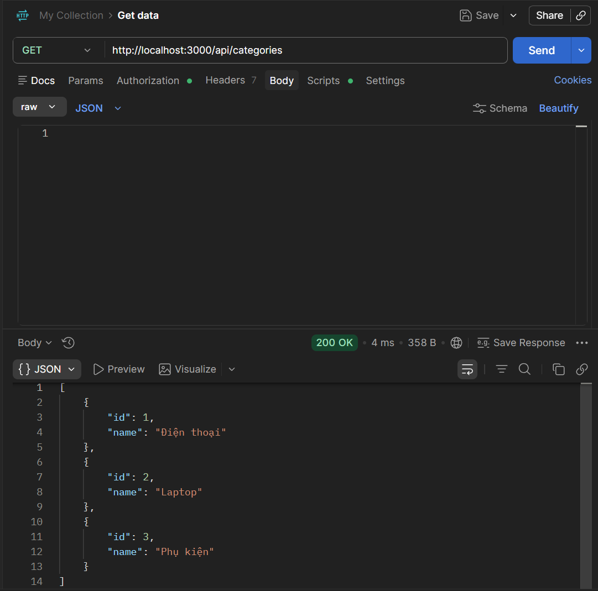
- Minh chứng 2: Product vẫn được tạo với `category_id=999`
  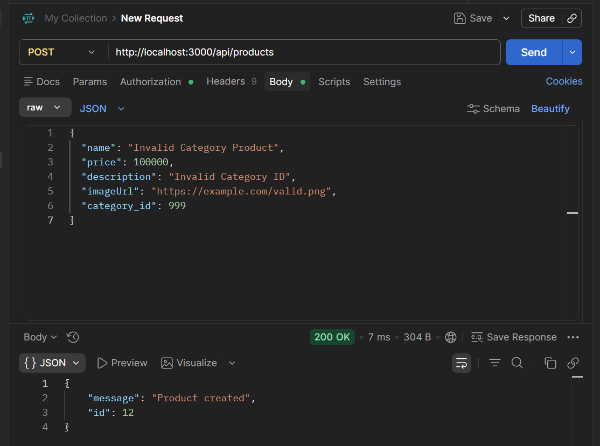

---

#### BUG-FR15-04: API /api/products/:id cập nhật/xóa ID không tồn tại vẫn báo thành công

#### Mô tả lỗi

Khi gửi yêu cầu cập nhật (`PUT`) hoặc xóa (`DELETE`) một sản phẩm bằng ID không tồn tại trên hệ thống (ví dụ: `9999`), API backend không kiểm duyệt sự tồn tại của sản phẩm trước khi thực thi truy vấn và vẫn trả về trạng thái thành công `200 OK`.

#### Điều kiện tiên quyết

- Backend SUT đang chạy cục bộ và Product APIs truy cập được.
- Admin đã đăng nhập và có JWT Token hợp lệ để gọi API.
- Xác nhận không tồn tại sản phẩm nào có ID là `9999`, ví dụ gọi `GET /api/products/9999` hoặc kiểm tra danh sách product trước khi test.

#### Các bước tái hiện

1. Gửi request `GET http://localhost:3000/api/products/9999` hoặc kiểm tra danh sách product để xác nhận product ID `9999` không tồn tại.
2. Gửi request `PUT http://localhost:3000/api/products/9999` kèm header `Authorization: Bearer <admin_token>` với body cập nhật thông tin sản phẩm.
3. Gửi request `DELETE http://localhost:3000/api/products/9999` kèm header `Authorization: Bearer <admin_token>`.

#### Kết quả mong đợi

- Hệ thống trả về lỗi `404 Not Found` kèm thông điệp "Product not found".

#### Kết quả thực tế

- Cả hai API đều trả về trạng thái `200 OK` với thông điệp: `"Product updated"` và `"Product deleted"`.

#### Test Case đối chiếu

- **Mã Test Case:** FR15-DOM-TC07, FR15-DOM-TC08, FR15-DOM-TC09
- **Phương pháp thiết kế:** Domain Testing (Negative Cases)

#### Môi trường

- **Hệ điều hành:** Windows 11
- **Trình duyệt / Công cụ:** Postman / API Client / Node.js
- **Môi trường chạy:** SUT local server (port 3000)

#### Bằng chứng

- API PUT và DELETE trả về `200 OK` thành công mặc dù không có dòng nào được thay đổi trong database.
- Minh chứng 1: Xác nhận product ID không tồn tại
  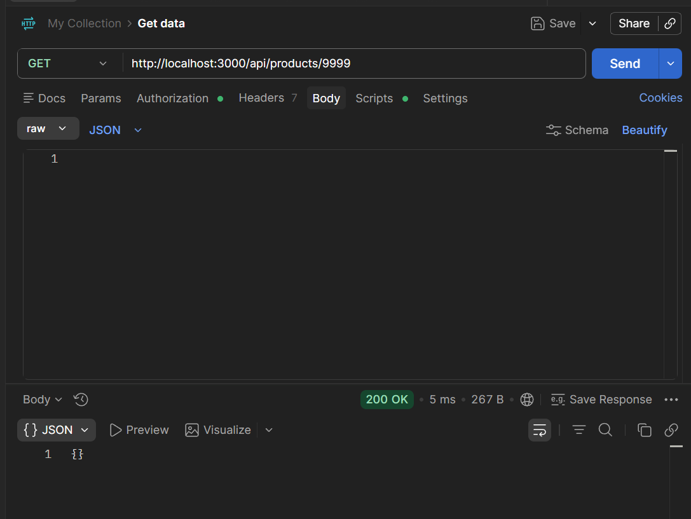
- Minh chứng 2: Update product ID không tồn tại vẫn báo thành công
  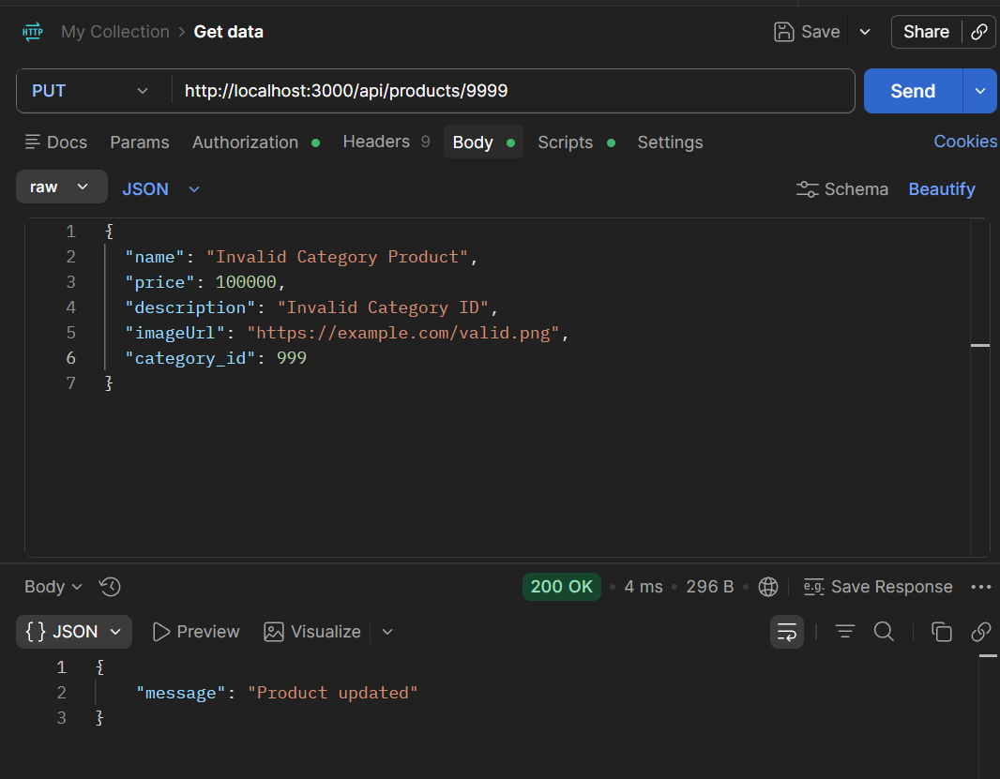
- Minh chứng 3: Delete product ID không tồn tại vẫn báo thành công
  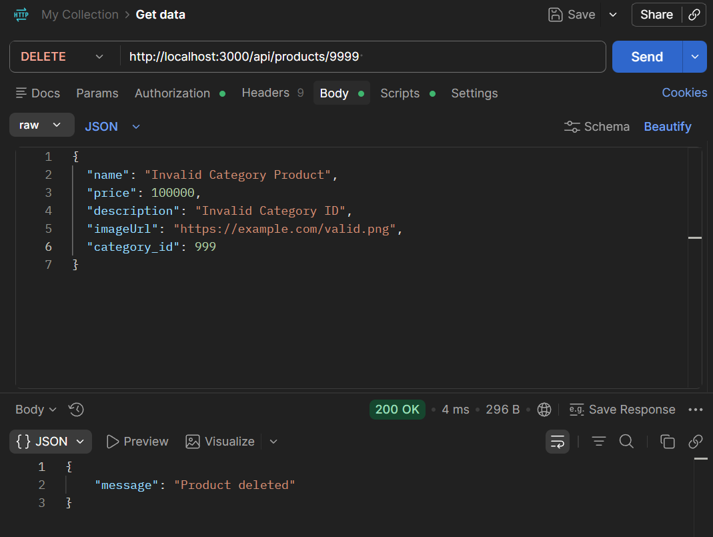

---

#### BUG-FR15-05: Giao diện Admin cập nhật một sản phẩm làm đổi tên tất cả sản phẩm khác

#### Mô tả lỗi

Trên giao diện Web Admin của Product Management, khi Admin cập nhật một sản phẩm bất kỳ và thao tác cập nhật thành công, tên của các sản phẩm khác trong danh sách cũng bị đổi theo. Hành vi này vi phạm rule FR-15: khi sửa một sản phẩm, chỉ sản phẩm đó bị thay đổi, các sản phẩm khác phải giữ nguyên.

#### Điều kiện tiên quyết

- Admin đã đăng nhập vào Web Admin.
- Backend và frontend-admin đang chạy.
- Danh sách sản phẩm có ít nhất hai sản phẩm khác nhau, ví dụ product A và product B.
- Ghi nhận tên ban đầu của product A và product B trước khi thao tác cập nhật.

#### Các bước tái hiện

1. Truy cập màn hình quản lý sản phẩm trên Web Admin.
2. Chọn một sản phẩm bất kỳ, ví dụ product A.
3. Cập nhật một field bất kỳ của product A, chẳng hạn tên, giá, mô tả, ảnh hoặc danh mục.
4. Lưu thay đổi và quan sát lại danh sách sản phẩm sau khi hệ thống báo cập nhật thành công.

#### Kết quả mong đợi

- Chỉ product A được cập nhật theo dữ liệu Admin vừa nhập.
- Tên của các sản phẩm khác, ví dụ product B, phải giữ nguyên như trước khi update.

#### Kết quả thực tế

- Sau khi cập nhật product A thành công, tên của tất cả các sản phẩm khác trên giao diện cũng bị đổi theo.
- API-level isolation test (`FR15-DOM-TC18`) cho thấy product B vẫn giữ nguyên khi kiểm qua API, nên lỗi này được ghi nhận ở tầng giao diện Web Admin hoặc state/rendering của frontend.

#### Test Case đối chiếu

- **Mã Test Case:** FR15-DOM-TC19
- **Phương pháp thiết kế:** Domain Testing / UI Observation

#### Môi trường

- **Hệ điều hành:** Windows 11
- **Trình duyệt / Công cụ:** Web Admin UI
- **Môi trường chạy:** SUT local frontend-admin và backend local server

#### Bằng chứng

- Quan sát thủ công trên giao diện: cập nhật một product bất kỳ thành công nhưng tên các product khác trong danh sách cũng bị đổi theo.
- Minh chứng 1: Danh sách product trước khi cập nhật một product
  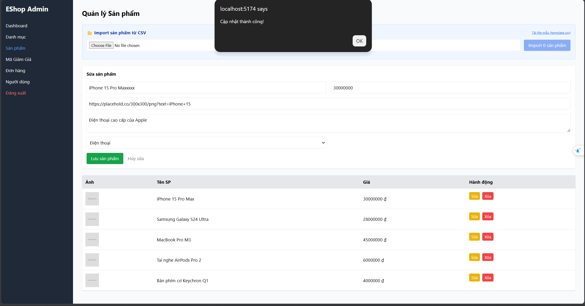
- Minh chứng 2: Sau update, tên các product khác trên giao diện cũng bị đổi
  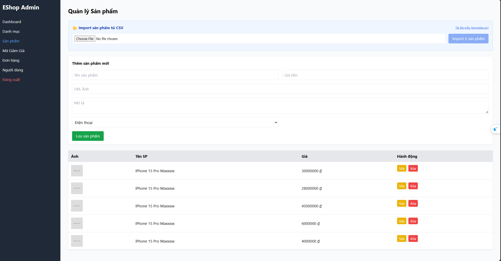

---

### 2.4 FR-06 - Mobile Product Detail View

#### BUG-FR06-01: Mobile product detail không hiển thị danh mục sản phẩm

#### Mô tả lỗi

Theo README/SRS, màn hình chi tiết sản phẩm trên mobile phải hiển thị đầy đủ ảnh lớn, tên, giá, mô tả và danh mục. Tuy nhiên, màn hình Product Detail chỉ hiển thị ảnh, tên, giá và mô tả; không có thông tin danh mục sản phẩm.

#### Điều kiện tiên quyết

- Backend API đang chạy tại `http://172.20.10.13:3000`.
- Frontend Mobile được chạy qua Expo Web tại `http://localhost:19006`.
- Danh sách sản phẩm có ít nhất một sản phẩm tồn tại, ví dụ `iPhone 15 Pro Max`.

#### Các bước tái hiện

1. Mở Mobile app.
2. Từ danh sách sản phẩm, chọn `Xem chi tiết` cho sản phẩm `iPhone 15 Pro Max`.
3. Quan sát các trường thông tin hiển thị trên màn hình detail.

#### Kết quả mong đợi

- Màn hình detail hiển thị đầy đủ ảnh lớn, tên, giá, mô tả và danh mục sản phẩm.

#### Kết quả thực tế

- Màn hình detail không hiển thị danh mục sản phẩm.
- Chỉ thấy ảnh lớn, tên sản phẩm, giá, mô tả và ô nhập số lượng.

#### Test Case đối chiếu

- **Mã Test Case:** FR06-DOM-TC01
- **Phương pháp thiết kế:** Domain Testing / UI Observation

#### Môi trường

- **Hệ điều hành:** Windows 11
- **Trình duyệt / Công cụ:** Chrome Headless mobile emulation / Expo Web
- **Môi trường chạy:** Backend local port 3000, Expo Web port 19006

#### Bằng chứng

- Minh chứng 1: Product detail hiển thị thiếu danh mục sản phẩm
  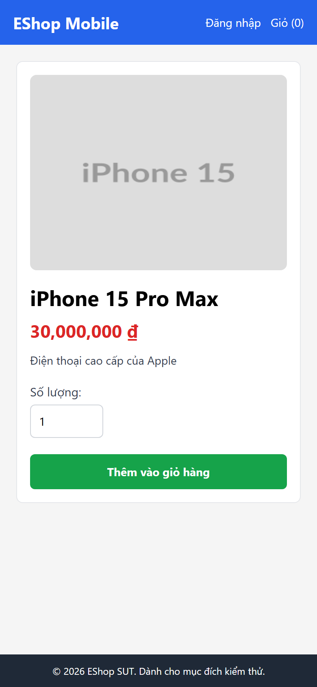

---

#### BUG-FR06-02: Mobile detail chấp nhận quantity=0 và vẫn thêm sản phẩm vào giỏ

#### Mô tả lỗi

Theo README/SRS, ô nhập số lượng trên màn hình chi tiết sản phẩm chỉ được nhận số nguyên dương và tối thiểu là `1`. Tuy nhiên, khi người dùng nhập `quantity=0` rồi bấm `Thêm vào giỏ hàng`, mobile app vẫn thêm sản phẩm vào giỏ thay vì từ chối dữ liệu không hợp lệ.

#### Điều kiện tiên quyết

- Backend API đang chạy tại `http://172.20.10.13:3000`.
- Frontend Mobile được chạy qua Expo Web tại `http://localhost:19006`.
- Người dùng đang ở màn hình chi tiết của một sản phẩm tồn tại.

#### Các bước tái hiện

1. Mở Mobile app.
2. Từ danh sách sản phẩm, chọn `Xem chi tiết` cho sản phẩm `iPhone 15 Pro Max`.
3. Nhập `0` vào ô `Số lượng`.
4. Bấm `Thêm vào giỏ hàng`.
5. Quan sát badge giỏ hàng và trạng thái trên màn hình.

#### Kết quả mong đợi

- Hệ thống từ chối `quantity=0`.
- Sản phẩm không được thêm vào giỏ.
- Giao diện hiển thị lỗi hoặc phản hồi phù hợp cho người dùng.

#### Kết quả thực tế

- Sản phẩm vẫn được thêm vào giỏ.
- Badge giỏ hàng tăng lên `Giỏ (1)`.
- Quantity bị normalize về `1` sau khi thêm, che khuất dữ liệu không hợp lệ ban đầu.

#### Test Case đối chiếu

- **Mã Test Case:** FR06-DOM-TC05, FR06-BVA-TC01
- **Phương pháp thiết kế:** Domain Testing & Boundary Value Analysis

#### Môi trường

- **Hệ điều hành:** Windows 11
- **Trình duyệt / Công cụ:** Chrome Headless mobile emulation / Expo Web
- **Môi trường chạy:** Backend local port 3000, Expo Web port 19006

#### Bằng chứng

- Minh chứng 1: Nhập `quantity=0` trước khi bấm thêm vào giỏ
  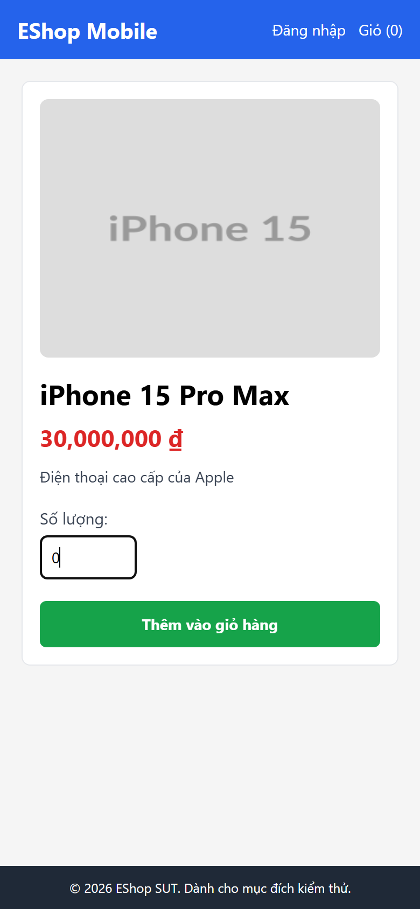
- Minh chứng 2: Sau khi bấm thêm, giỏ hàng tăng lên dù quantity ban đầu bằng 0
  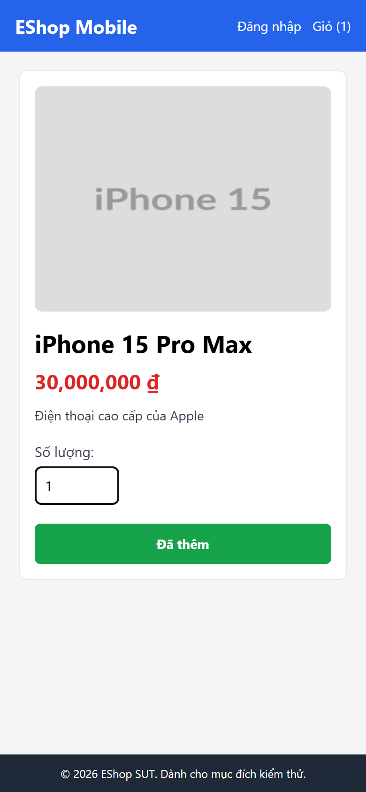

---

#### BUG-FR06-03: Mobile detail chấp nhận quantity không phải số nguyên và vẫn thêm sản phẩm vào giỏ

#### Mô tả lỗi

Theo README/SRS, ô nhập số lượng trên màn hình chi tiết sản phẩm chỉ được nhận số nguyên dương. Tuy nhiên, mobile app vẫn cho nhập chuỗi không phải số nguyên (`abc`) và khi bấm `Thêm vào giỏ hàng`, sản phẩm vẫn được thêm vào giỏ thay vì bị chặn.

#### Điều kiện tiên quyết

- Backend API đang chạy tại `http://172.20.10.13:3000`.
- Frontend Mobile được chạy qua Expo Web tại `http://localhost:19006`.
- Người dùng đang ở màn hình chi tiết của một sản phẩm tồn tại.

#### Các bước tái hiện

1. Mở Mobile app.
2. Từ danh sách sản phẩm, chọn `Xem chi tiết` cho sản phẩm `iPhone 15 Pro Max`.
3. Nhập `abc` vào ô `Số lượng`.
4. Bấm `Thêm vào giỏ hàng`.
5. Quan sát badge giỏ hàng và trạng thái trên màn hình.

#### Kết quả mong đợi

- Hệ thống từ chối giá trị không phải số nguyên dương.
- Sản phẩm không được thêm vào giỏ.
- Giao diện hiển thị lỗi hoặc phản hồi phù hợp cho người dùng.

#### Kết quả thực tế

- App vẫn cho nhập `abc`.
- Sau khi bấm thêm, sản phẩm vẫn được thêm vào giỏ.
- Badge giỏ hàng tăng lên thay vì giữ nguyên.

#### Test Case đối chiếu

- **Mã Test Case:** FR06-DOM-TC06
- **Phương pháp thiết kế:** Domain Testing

#### Môi trường

- **Hệ điều hành:** Windows 11
- **Trình duyệt / Công cụ:** Chrome Headless mobile emulation / Expo Web
- **Môi trường chạy:** Backend local port 3000, Expo Web port 19006

#### Bằng chứng

- Minh chứng 1: Nhập `quantity=abc` trước khi bấm thêm vào giỏ
  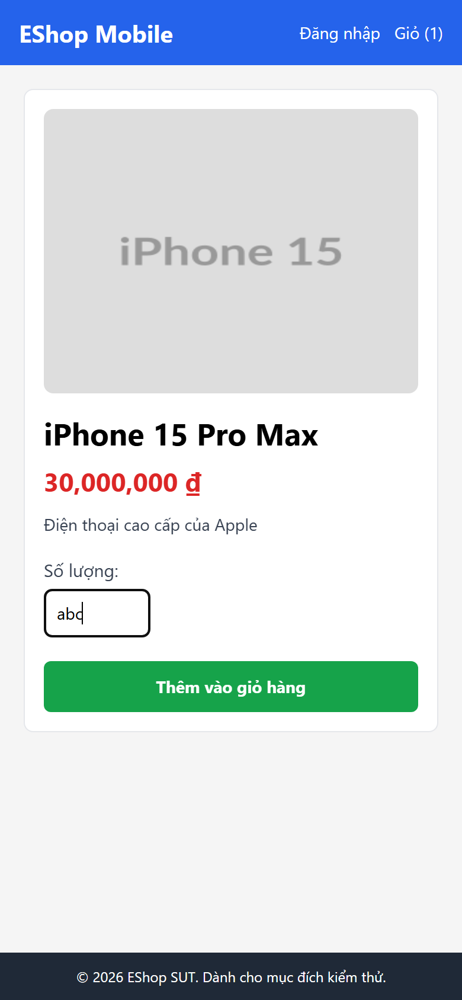
- Minh chứng 2: Sau khi bấm thêm, giỏ hàng vẫn tăng dù quantity không hợp lệ
  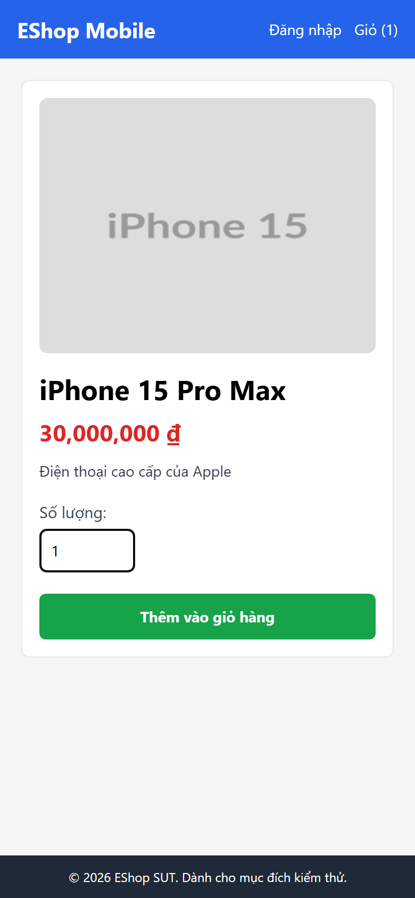

---

#### BUG-FR06-04: Mobile product detail thiếu breadcrumb trang con

#### Mô tả lỗi

Theo GUI requirement FR-23, breadcrumb bắt buộc có ở các trang con, bao gồm Chi tiết sản phẩm. Tuy nhiên, màn hình Mobile Product Detail không hiển thị breadcrumb hoặc ngữ cảnh điều hướng tương đương để người dùng biết đang ở trang con nào.

#### Điều kiện tiên quyết

- Backend API đang chạy tại `http://172.20.10.13:3000`.
- Frontend Mobile được chạy qua Expo Web tại `http://localhost:19006`.
- Người dùng mở chi tiết một sản phẩm tồn tại từ danh sách sản phẩm.

#### Các bước tái hiện

1. Mở Mobile app.
2. Từ danh sách sản phẩm, chọn `Xem chi tiết` cho sản phẩm `iPhone 15 Pro Max`.
3. Quan sát khu vực đầu màn hình và phần nội dung detail.

#### Kết quả mong đợi

- Màn hình detail có breadcrumb hoặc navigation context cho trang con, ví dụ `Trang chủ > Chi tiết sản phẩm`.

#### Kết quả thực tế

- Màn hình detail chỉ hiển thị navbar chung và nội dung sản phẩm.
- Không có breadcrumb hoặc ngữ cảnh trang con.

#### Test Case đối chiếu

- **Mã Test Case:** FR06-DOM-TC13
- **Phương pháp thiết kế:** Domain Testing / GUI Requirement Observation

#### Môi trường

- **Hệ điều hành:** Windows 11
- **Trình duyệt / Công cụ:** Chrome Headless mobile emulation / Expo Web
- **Môi trường chạy:** Backend local port 3000, Expo Web port 19006

#### Bằng chứng

- Minh chứng 1: Product detail không có breadcrumb trang con
  

---
