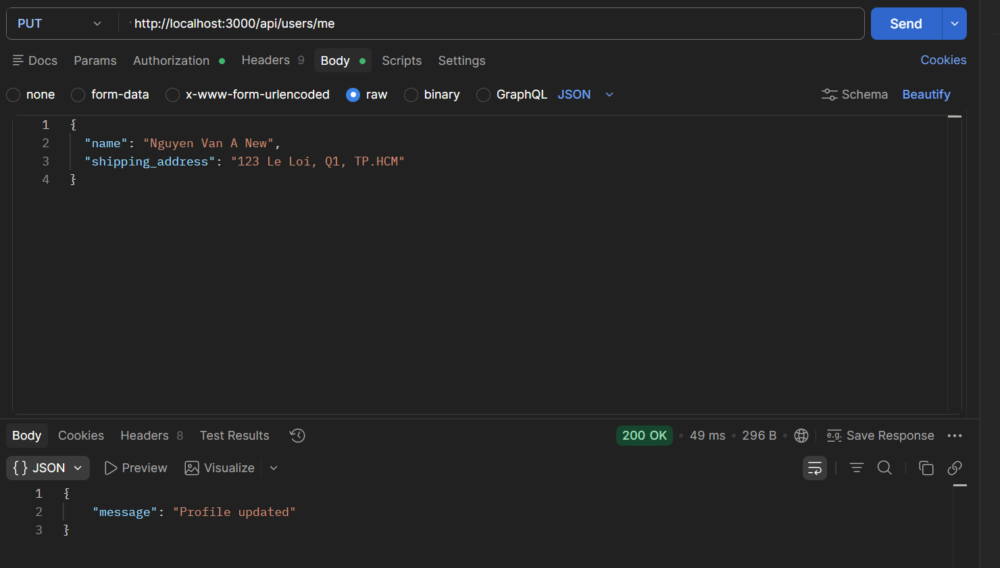
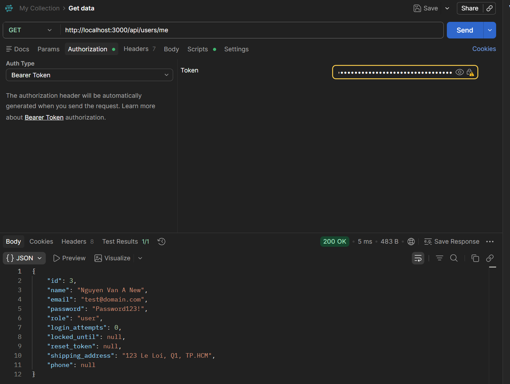
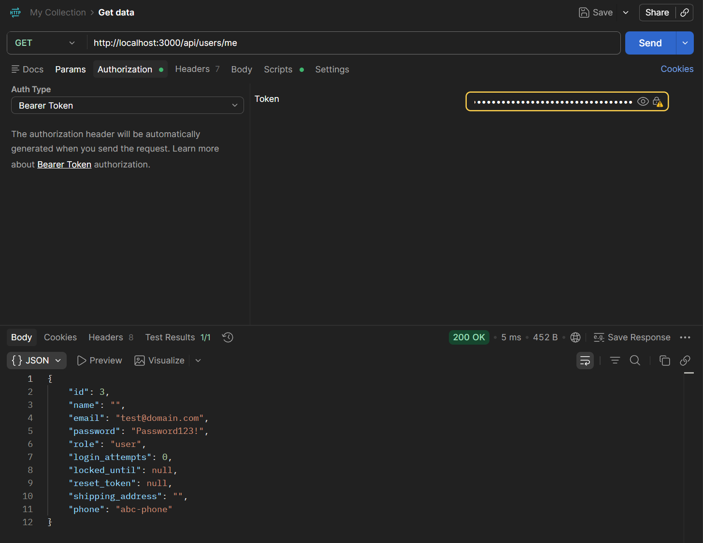

# Danh sách báo cáo lỗi - EShop SUT (HW02)

Tài liệu này tổng hợp toàn bộ các lỗi (bug) phát hiện được trong quá trình kiểm thử tính năng **FR-04 (Personal Profile Management)** trên hệ thống EShop SUT. Phần đầu là bảng tổng hợp danh sách lỗi, phần sau cung cấp chi tiết từng lỗi để đối chiếu. Chi tiết và bằng chứng hình ảnh cụ thể của từng lỗi cũng được quản lý trên mục GitHub Issues.

---

## 1. Bảng tổng hợp danh sách lỗi

| Mã lỗi | Tính năng | Tiêu đề lỗi | Độ nghiêm trọng | Độ ưu tiên | Trạng thái | Test Case đối chiếu | GitHub Issue Link |
| :--- | :--- | :--- | :--- | :--- | :--- | :--- | :--- |
| [BUG-FR04-01](#bug-fr04-01-leo-thang-dac-quyen-qua-mass-assignment) | FR-04 | Leo thang đặc quyền qua thuộc tính role khi cập nhật thông tin cá nhân | Critical | High | Open | FR04-DOM-TC08 | [#24](https://github.com/HCMUS-software-testing/HW02/issues/24) |
| [BUG-FR04-02](#bug-fr04-02-mat-du-lieu-khi-cap-nhat-mot-phan-data-loss-on-partial-update) | FR-04 | Mất dữ liệu - Cập nhật thiếu trường khi cập nhật thông tin cá nhân sẽ ghi đè giá trị cũ bằng NULL | High | High | Open | FR04-DOM-TC07 | [#25](https://github.com/HCMUS-software-testing/HW02/issues/25) |
| [BUG-FR04-03](#bug-fr04-03-thieu-kiem-tra-du-lieu-dau-vao-lack-of-input-validation) | FR-04 | Thiếu kiểm duyệt dữ liệu đầu vào khi cập nhật thông tin cá nhân | Medium | Medium | Open | FR04-DOM-TC09, TC10, TC11, TC12, BVA-TC04, TC05, TC06 | [#26](https://github.com/HCMUS-software-testing/HW02/issues/26) |
| [BUG-FR04-04](#bug-fr04-04-lo-lot-thong-tin-nhay-cam-sensitive-data-exposure) | FR-04 | Lộ lọt thông tin người dùng nhạy cảm khi lấy thông tin cá nhân | High | High | Open | FR04-DOM-TC01 | [#27](https://github.com/HCMUS-software-testing/HW02/issues/27) |
| [BUG-FR04-05](#bug-fr04-05-loi-dinh-dang-regex-o-frontend-chan-so-dien-thoai-hop-le) | FR-04 | Giao diện người dùng chặn cập nhật các số điện thoại Việt Nam hợp lệ bắt đầu bằng số 0 | High | High | Open | FR04-DOM-TC02, BVA-TC03 | [#28](https://github.com/HCMUS-software-testing/HW02/issues/28) |

---

## 2. Chi tiết từng lỗi (Report)

### BUG-FR04-01: Leo thang đặc quyền qua Mass Assignment

#### Mô tả lỗi
Hệ thống API backend chấp nhận thuộc tính `role: "admin"` truyền lên từ client trong thân hàm request (request body) của phương thức PUT cập nhật hồ sơ, dẫn tới việc một tài khoản khách hàng thông thường có thể tự nâng quyền lên Quản trị viên (admin).

#### Điều kiện tiên quyết
- Người dùng đã đăng ký tài khoản thành công với vai trò ban đầu mặc định là `user`.
- Đã đăng nhập và có JWT Token hợp lệ để gọi API.

#### Các bước tái hiện
1. Gửi request `PUT /api/users/me` với header `Authorization: Bearer <token>` và body request chứa trường `role`:
   ```json
   {
     "name": "Nguyen Van A",
     "shipping_address": "123 Le Loi, Q1, TP.HCM",
     "phone": "0912345678",
     "role": "admin"
   }
   ```
2. Gọi lại request `GET /api/users/me` sử dụng token của tài khoản này để lấy thông tin hồ sơ hiện tại.

#### Kết quả mong đợi
- Hệ thống chỉ cập nhật các thông tin cơ bản được cho phép (`name`, `shipping_address`, `phone`), và bỏ qua trường `role` không hợp lệ hoặc từ chối request.
- Quyền hạn tài khoản trong cơ sở dữ liệu phải được giữ nguyên là `user`.

#### Kết quả thực tế
- API trả về mã trạng thái `200 OK` (thông điệp: `"Profile updated"`).
- Khi gọi GET kiểm tra, trường `role` của tài khoản này đã bị thay đổi thành `"admin"`.

#### Test Case đối chiếu
- **Mã Test Case:** FR04-DOM-TC08
- **Phương pháp thiết kế:** Domain Testing

#### Môi trường
- **Hệ điều hành:** Windows 11
- **Trình duyệt / Công cụ:** Postman / API Client / Node.js
- **Môi trường chạy:** SUT local server (port 3000)

#### Bằng chứng và ảnh chụp màn hình
- Minh chứng 1: Gửi request PUT chứa thuộc tính role admin
  
- Minh chứng 2: Kết quả GET profile hiển thị tài khoản đã bị nâng lên admin
  

---

### BUG-FR04-02: Mất dữ liệu khi cập nhật một phần (Data Loss on Partial Update)

#### Mô tả lỗi
Khi thực hiện cập nhật hồ sơ cá nhân qua phương thức PUT, nếu client không truyền đầy đủ tất cả các trường (ví dụ thiếu trường `phone`), API backend sẽ ghi đè giá trị của trường bị thiếu thành `NULL` trong database, làm mất dữ liệu đã có trước đó của người dùng.

#### Điều kiện tiên quyết
- Tài khoản đã đăng nhập và đã điền đầy đủ dữ liệu thông tin cá nhân ban đầu (`name`, `shipping_address`, `phone`).

#### Các bước tái hiện
1. Gửi request `PUT /api/users/me` chỉ chứa thông tin tên và địa chỉ (bỏ trống/không gửi trường `phone`):
   ```json
   {
     "name": "Nguyen Van A New",
     "shipping_address": "123 Le Loi, Q1, TP.HCM"
   }
   ```
2. Gọi request `GET /api/users/me` để lấy thông tin hồ sơ cá nhân hiện tại.

#### Kết quả mong đợi
- Các trường thông tin không được gửi lên trong body request PUT phải được giữ nguyên giá trị cũ trong cơ sở dữ liệu (Partial Update an sau).

#### Kết quả thực tế
- API trả về mã trạng thái `200 OK` cập nhật thành công.
- Tuy nhiên, dữ liệu trường `phone` trong database đã bị ghi đè thành `null`.

#### Test Case đối chiếu
- **Mã Test Case:** FR04-DOM-TC07
- **Phương pháp thiết kế:** Domain Testing

#### Môi trường
- **Hệ điều hành:** Windows 11
- **Trình duyệt / Công cụ:** Postman / API Client / Node.js
- **Môi trường chạy:** SUT local server (port 3000)

#### Bằng chứng và ảnh chụp màn hình
- Minh chứng 1: Gửi request PUT khuyết trường phone khiến API backend cập nhật thành công
  
- Minh chứng 2: Kết quả GET profile cho thấy trường phone đã bị ghi đè thành null
  

---

### BUG-FR04-03: Thiếu kiểm tra dữ liệu đầu vào (Lack of Input Validation)

#### Mô tả lỗi
API backend `PUT /api/users/me` hoàn toàn thiếu cơ chế kiểm tra tính hợp lệ dữ liệu đầu vào. Hệ thống chấp nhận lưu chuỗi rỗng cho các trường bắt buộc như `name`, `shipping_address`, `phone` và lưu các giá trị không đúng định dạng số điện thoại (ví dụ: chữ cái `abc-phone`) vào cơ sở dữ liệu.

#### Điều kiện tiên quyết
- Khách hàng đã đăng nhập và có JWT Token hợp lệ để gọi API.

#### Các bước tái hiện
1. Gửi request `PUT /api/users/me` chứa dữ liệu rỗng và sai định dạng:
   ```json
   {
     "name": "",
     "shipping_address": "",
     "phone": "abc-phone"
   }
   ```
2. Thực hiện request `GET /api/users/me` để kiểm tra thông tin hồ sơ vừa lưu.

#### Kết quả mong đợi
- API backend phải kiểm tra dữ liệu đầu vào, từ chối cập nhật và trả về lỗi `400 Bad Request` cùng danh sách thông điệp lỗi cụ thể khi các trường bắt buộc bị rỗng hoặc sai định dạng.

#### Kết quả thực tế
- API vẫn trả về mã trạng thái `200 OK` (thông điệp: `"Profile updated"`).
- Cơ sở dữ liệu ghi nhận thành công chuỗi rỗng cho tên, địa chỉ và lưu chuỗi ký tự chữ `"abc-phone"` làm số điện thoại.

#### Test Case đối chiếu
- **Mã Test Case:** FR04-DOM-TC09, FR04-DOM-TC10, FR04-DOM-TC11, FR04-DOM-TC12, FR04-BVA-TC04, FR04-BVA-TC05, FR04-BVA-TC06
- **Phương pháp thiết kế:** Domain Testing & Boundary Value Analysis

#### Môi trường
- **Hệ điều hành:** Windows 11
- **Trình duyệt / Công cụ:** Postman / API Client / Node.js
- **Môi trường chạy:** SUT local server (port 3000)

#### Bằng chứng và ảnh chụp màn hình
- Minh chứng 1: Gửi request PUT chứa thông tin rỗng và sai định dạng phone
  
- Minh chứng 2: Kết quả GET profile cho thấy thông tin không hợp lệ được lưu thành công
  

---

### BUG-FR04-04: Lộ lọt thông tin nhạy cảm (Sensitive Data Exposure)

#### Mô tả lỗi
Khi người dùng xem thông tin cá nhân của mình, API backend trả về cả các trường dữ liệu nhạy cảm hoặc mang tính bảo mật nội bộ trong JSON response, gây rủi ro an toàn thông tin nghiêm trọng.

#### Điều kiện tiên quyết
- Người dùng đã đăng ký và đăng nhập thành công vào hệ thống.

#### Các bước tái hiện
1. Đăng nhập để nhận JWT Token.
2. Gửi request `GET /api/users/me` kèm header authorization.
3. Phân tích cấu trúc JSON response nhận về từ server.

#### Kết quả mong đợi
- Response chỉ trả về các thông tin hồ sơ cơ bản cần thiết: `id`, `name`, `email`, `shipping_address`, `phone`.
- Tuyệt đối không được chứa mật khẩu (bằng mọi hình thức mã hóa/hash) và các thông tin nội bộ của hệ thống như bộ đếm đăng nhập sai, reset token.

#### Kết quả thực tế
- JSON response trả về chứa đầy đủ các trường: `"password"` (chứa mật khẩu mã hóa bcrypt hash của người dùng), `"reset_token"`, `"login_attempts"`, `"locked_until"`.

#### Test Case đối chiếu
- **Mã Test Case:** FR04-DOM-TC01
- **Phương pháp thiết kế:** Domain Testing

#### Môi trường
- **Hệ điều hành:** Windows 11
- **Trình duyệt / Công cụ:** Postman / API Client / Node.js
- **Môi trường chạy:** SUT local server (port 3000)

#### Bằng chứng và ảnh chụp màn hình
- Minh chứng 1: Response của API GET profile để lộ các trường nhạy cảm như password hash và reset token
  

---

### BUG-FR04-05: Lỗi định dạng Regex ở Frontend chặn số điện thoại hợp lệ

#### Mô tả lỗi
Trên giao diện Frontend (Web Client), biểu thức chính quy (Regex) dùng để kiểm tra tính hợp lệ của số điện thoại được định nghĩa sai quy tắc logic (`/^[1-9][0-9]{8,9}$/`). Điều này dẫn tới việc ngăn chặn toàn bộ số điện thoại Việt Nam bắt đầu bằng số `0` cập nhật hồ sơ cá nhân.

Hành vi này đồng thời làm phát sinh lỗi liên đới:
1. Nếu người dùng chỉ muốn cập nhật tên hoặc địa chỉ (giữ nguyên số điện thoại bắt đầu bằng 0), hệ thống vẫn báo lỗi số điện thoại không hợp lệ và ép người dùng phải sửa số điện thoại mới cho cập nhật.
2. Ép người dùng nhập số điện thoại không bắt đầu bằng số 0 (ví dụ `1234567890`) thì mới cho lưu.

#### Điều kiện tiên quyết
- Người dùng truy cập và cập nhật thông tin cá nhân trên trang Profile của giao diện Web.

#### Các bước tái hiện
1. Đi tới trang cá nhân (Profile) trên giao diện Web.
2. Nhập số điện thoại Việt Nam hợp lệ bắt đầu bằng số 0 (ví dụ: `0912345678`).
3. Click vào nút "Cập nhật".

#### Kết quả mong đợi
- Hệ thống chấp nhận số điện thoại bắt đầu bằng số 0 hợp lệ và cập nhật thành công mà không hiển thị cảnh báo chặn.

#### Kết quả thực tế
- Trình duyệt hiển thị thông báo alert: _"Số điện thoại không hợp lệ. Vui lòng nhập đúng 9-10 chữ số."_ và chặn toàn bộ tiến trình cập nhật tên hoặc địa chỉ của người dùng.

#### Test Case đối chiếu
- **Mã Test Case:** FR04-DOM-TC02, FR04-BVA-TC03
- **Phương pháp thiết kế:** Domain Testing & Boundary Value Analysis (Exploratory)

#### Môi trường
- **Hệ điều hành:** Windows 11
- **Trình duyệt / Công cụ:** Google Chrome / Web Frontend
- **Môi trường chạy:** SUT frontend-web (port 5173)

#### Bằng chứng và ảnh chụp màn hình
- Minh chứng 1: Nhập số điện thoại bắt đầu bằng số 0 hợp lệ và bị Frontend báo lỗi alert
  
- Minh chứng 2: Hệ thống chỉ chấp nhận lưu khi người dùng nhập số điện thoại không bắt đầu bằng số 0
  
